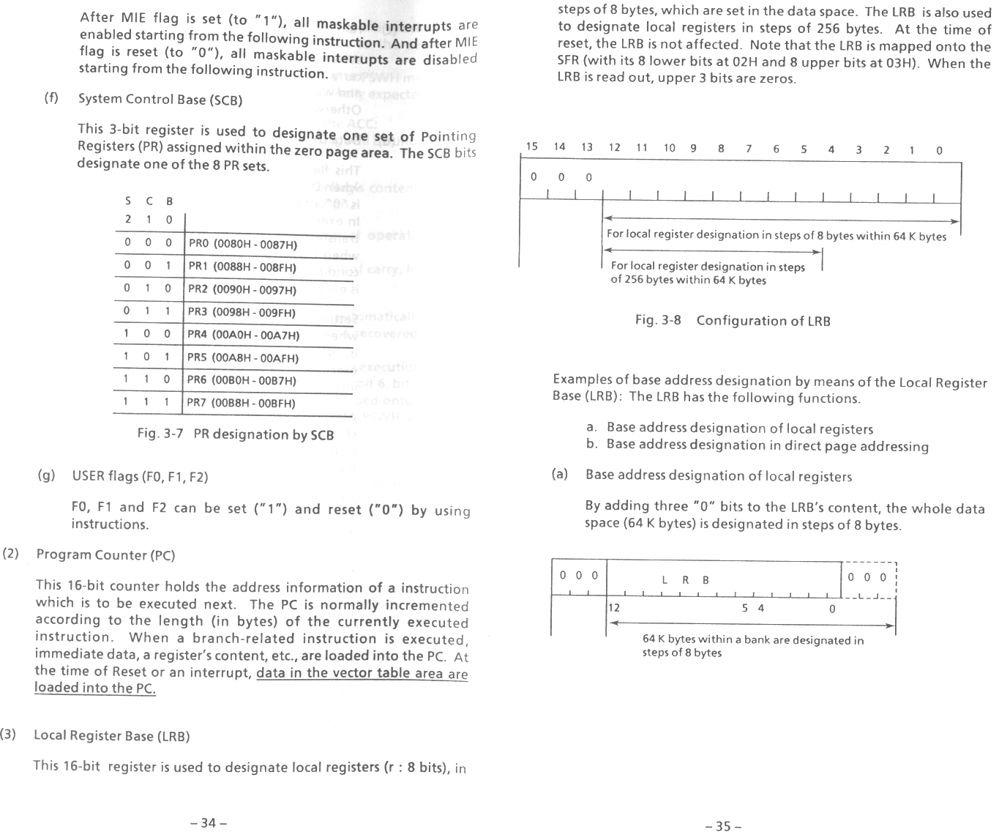
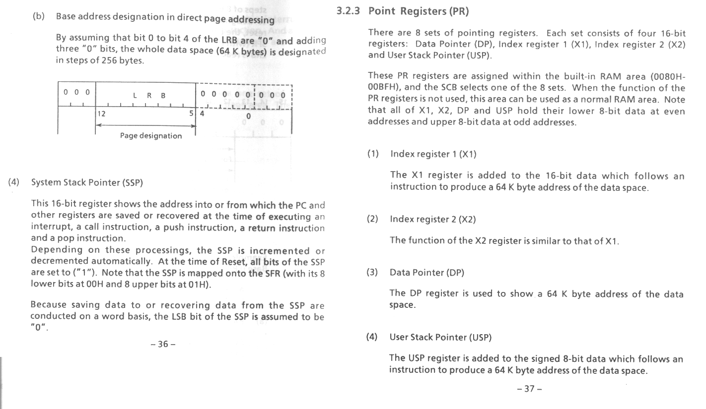

# 66k Assembler Docs

Here you can find all the documentation on the Oki 66K achitecture that we have been able to find. If it isn't attached to this page, you can try looking at the [old location]() <-- no longer up. -- LegoZ81 - 30 Jul 2004 Note: most items are duplicated between the two locations.

<figure>
    
    <figcaption>Page 34-35 of manual: LRB</figcaption>
</figure>

<figure>
    
    <figcaption>page 36-37 of manual: LRB</figcaption>
</figure>
