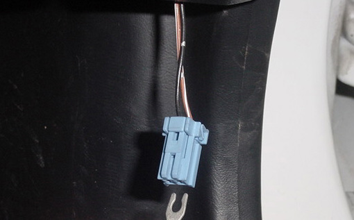

# Diagnostic Trouble Code (DTC) Retrieval and Reference

When a sensor or system on a Honda engine malfunctions, the Engine Control Unit (ECU) illuminates the dashboard Check Engine Light (CEL/MIL) and stores a diagnostic trouble code (DTC) in its memory.

This guide explains how to retrieve these codes and provides a unified reference for engine and transmission errors.

---

## How to Retrieve Diagnostic Codes

The method for retrieving codes depends on your vehicle's OBD generation.

### OBD0 Systems (1988–1991)

OBD0 ECUs display codes via an LED mounted directly on the ECU circuit board:
1.  Turn the ignition key to the ON position.
2.  Locate the ECU (typically under the passenger footwell carpet or seat).
3.  Observe the red LED through the circular viewing window in the ECU's metal case.
4.  **Counting:** Count the flashes of the red LED. A code 9 is represented by 9 quick flashes.

### OBD1 Systems (1992–1995)

OBD1 systems flash the dashboard Check Engine Light (CEL) when the Service Connector is jumped.

1.  **Locate the SCS Connector:** On the passenger side, under the glove box, find a green cover housing a blue 2-pin connector.
2.  **Jump the Connector:** With the ignition OFF, connect the two pins using a paperclip or jumper wire.
3.  **Read the CEL:** Turn the key to the **IGN** position (do not start the engine). The CEL will begin to flash.
4.  **Interpret the Flashes:**
    *   **Long flashes (1.0 sec):** Tens digit (e.g., 2 long = 20).
    *   **Short flashes (0.5 sec):** Units digit (e.g., 1 short = 1).
    *   **Example:** `LONG-LONG-SHORT-PAUSE` is Code 21 (VTEC Solenoid).

### OBD2 Systems (1996–2001)

OBD2 systems utilize a standardized 16-pin DLC (Data Link Connector) under the driver's side dashboard.
*   **Retrieval:** Requires a standard OBD2 scan tool or code reader.
*   **Codes:** Uses alphanumeric codes (e.g., `P0420`), though many OBD2 Hondas still support the "flash" method via the 2-pin SCS connector for basic engine codes.

---

## Master Diagnostic Code Reference

Use the tool below to search for engine (ECU) and transmission (TCU) codes.

::: widget error-codes :::

---

## Troubleshooting Next Steps

1.  **Clear the Memory:** Remove the **BACK UP** fuse (7.5A) in the engine bay fuse box for 30 seconds.
2.  **Confirm the Fault:** Drive the vehicle. If the CEL returns, the fault is "hard" and requires repair.
3.  **Test Wiring First:** Most "sensor" codes are actually caused by frayed wiring or loose connectors, especially in older Honda harnesses.
4.  **Verify VSS:** If you have Code 17 (VSS), your VTEC will not engage and your speedometer may be dead or erratic.

### External Resources
- [Hybrid Garage Technical Reference](http://web.archive.org/web/20250705085711/http://www.hybridgarage.com/tech/codes.html)
- [Honda-Tech Diagnostic Procedures](http://web.archive.org/web/20060818072131/http://honda-tech.com:80/zerothread?id=1171263)
