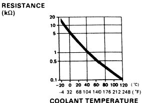

# Engine Coolant Temperature Sensor Reference

The Engine Coolant Temperature (ECT) sensor is a thermistor that measures the temperature of the engine coolant. The ECU uses this data to adjust fuel enrichment, ignition timing, and idle speed based on engine thermal state.

> [!IMPORTANT]
> The following data represents the temperature lookup table for the OBD1 ECT sensor, derived from a 1993 CRX (EDM). Values are mapped from ECU hex data (255 to 0) to degrees Celsius.

## ECT Lookup Table

The table below correlates the raw ECU hex value (255–0) to the corresponding temperature in degrees Celsius.

| ECU Hex Value | Temp (°C) | ECU Hex Value | Temp (°C) | ECU Hex Value | Temp (°C) |
| :--- | :--- | :--- | :--- | :--- | :--- |
| 255–211 | -1 | 140 | 23.5 | 69 | 48.6 |
| 210 | 0 | 139 | 23.9 | 68 | 49.0 |
| 209 | 0.5 | 138 | 24.2 | 67 | 49.5 |
| 208 | 1.0 | 137 | 24.6 | 66 | 50.1 |
| 207 | 1.6 | 136 | 24.9 | 65 | 50.6 |
| 206 | 2.2 | 135 | 25.3 | 64 | 51.2 |
| 205 | 2.9 | 134 | 25.6 | 63 | 51.7 |
| 204 | 3.5 | 133 | 26.0 | 62 | 52.3 |
| 203 | 4.1 | 132 | 26.3 | 61 | 52.8 |
| 202 | 4.7 | 131 | 26.7 | 60 | 53.4 |
| 201 | 5.4 | 130 | 27.0 | 59 | 53.9 |
| 200 | 6.0 | 129 | 27.4 | 58 | 54.5 |
| 199 | 6.5 | 128 | 27.8 | 57 | 55.0 |
| 198 | 7.0 | 127 | 28.1 | 56 | 55.5 |
| 197 | 7.5 | 126 | 28.5 | 55 | 56.0 |
| 196 | 8.0 | 125 | 28.9 | 54 | 56.5 |
| 195 | 8.5 | 124 | 29.3 | 53 | 57.0 |
| 194 | 8.9 | 123 | 29.6 | 52 | 57.5 |
| 193 | 9.4 | 122 | 30.0 | 51 | 58.0 |
| 192 | 9.8 | 121 | 30.3 | 50 | 58.5 |
| 191 | 10.3 | 120 | 30.7 | 49 | 59.0 |
| 190 | 10.7 | 119 | 31.0 | 48 | 59.5 |
| 189 | 11.1 | 118 | 31.3 | 47 | 60.0 |
| 188 | 11.6 | 117 | 31.7 | 46 | 60.5 |
| 187 | 12.0 | 116 | 32.0 | 45 | 61.0 |
| 186 | 12.3 | 115 | 32.3 | 44 | 61.7 |
| 185 | 12.7 | 114 | 32.7 | 43 | 62.4 |
| 184 | 13.0 | 113 | 33.0 | 42 | 63.1 |
| 183 | 13.5 | 112 | 33.4 | 41 | 63.8 |
| 182 | 13.9 | 111 | 33.7 | 40 | 64.5 |
| 181 | 14.4 | 110 | 34.1 | 39 | 65.2 |
| 180 | 14.8 | 109 | 34.4 | 38 | 65.9 |
| 179 | 15.3 | 108 | 34.8 | 37 | 66.6 |
| 178 | 15.7 | 107 | 35.1 | 36 | 67.3 |
| 177 | 16.2 | 106 | 35.5 | 35 | 68.0 |
| 176 | 16.6 | 105 | 35.9 | 34 | 68.7 |
| 175 | 17.1 | 104 | 36.2 | 33 | 69.4 |
| 174 | 17.5 | 103 | 36.6 | 32 | 70.1 |
| 173 | 17.8 | 102 | 36.9 | 31 | 70.8 |
| 172 | 18.2 | 101 | 37.3 | 30 | 71.5 |
| 171 | 18.5 | 100 | 37.6 | 29 | 72.2 |
| 170 | 18.9 | 99 | 38.0 | 28 | 72.9 |
| 169 | 19.3 | 98 | 38.4 | 27 | 73.6 |
| 168 | 19.8 | 97 | 38.8 | 26 | 74.3 |
| 167 | 20.2 | 96 | 39.1 | 25 | 75.0 |
| 166 | 20.6 | 95 | 39.5 | 24 | 75.8 |
| 165 | 21.0 | 94 | 39.9 | 23 | 76.6 |
| 164 | 21.4 | 93 | 40.3 | 22 | 77.5 |
| 163 | 21.8 | 92 | 40.6 | 21 | 78.3 |
| 162 | 22.3 | 91 | 41.0 | 20 | 79.1 |
| 161 | 22.7 | 90 | 41.4 | 19 | 79.9 |
| 160 | 23.1 | 89 | 41.8 | 18 | 80.7 |
| 159 | 23.5 | 88 | 42.1 | 17 | 81.5 |
| 158 | 23.9 | 87 | 42.5 | 16 | 82.4 |
| 157 | 24.2 | 86 | 42.9 | 15 | 83.2 |
| 156 | 24.6 | 85 | 43.3 | 14 | 84.0 |
| 155 | 24.9 | 84 | 43.6 | 13 | 85.2 |
| 154 | 25.3 | 83 | 44.0 | 12 | 86.4 |
| 153 | 25.6 | 82 | 44.4 | 11 | 87.7 |
| 152 | 26.0 | 81 | 44.8 | 10 | 88.9 |
| 151 | 26.3 | 80 | 45.3 | 9 | 90.1 |
| 150 | 26.7 | 79 | 45.7 | 8 | 91.3 |
| 149 | 27.0 | 78 | 46.1 | 7 | 92.6 |
| 148 | 27.4 | 77 | 46.5 | 6 | 93.8 |
| 147 | 27.8 | 76 | 46.9 | 5 | 95.0 |
| 146 | 28.1 | 75 | 47.3 | 4 | 96.7 |
| 145 | 28.5 | 74 | 47.8 | 3 | 98.3 |
| 144 | 28.9 | 73 | 48.2 | 2 | 100.0 |
| 143 | 29.3 | 72 | 48.6 | 1–0 | 101.0 |
| 142 | 29.6 | 71 | 49.0 | | |
| 141 | 30.0 | 70 | 49.5 | | |
