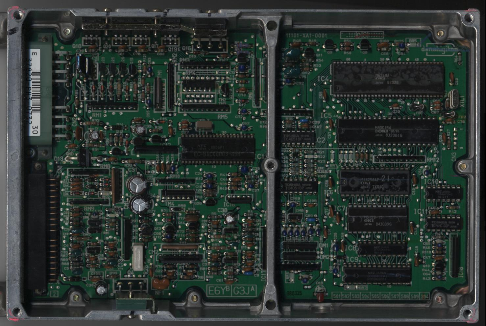
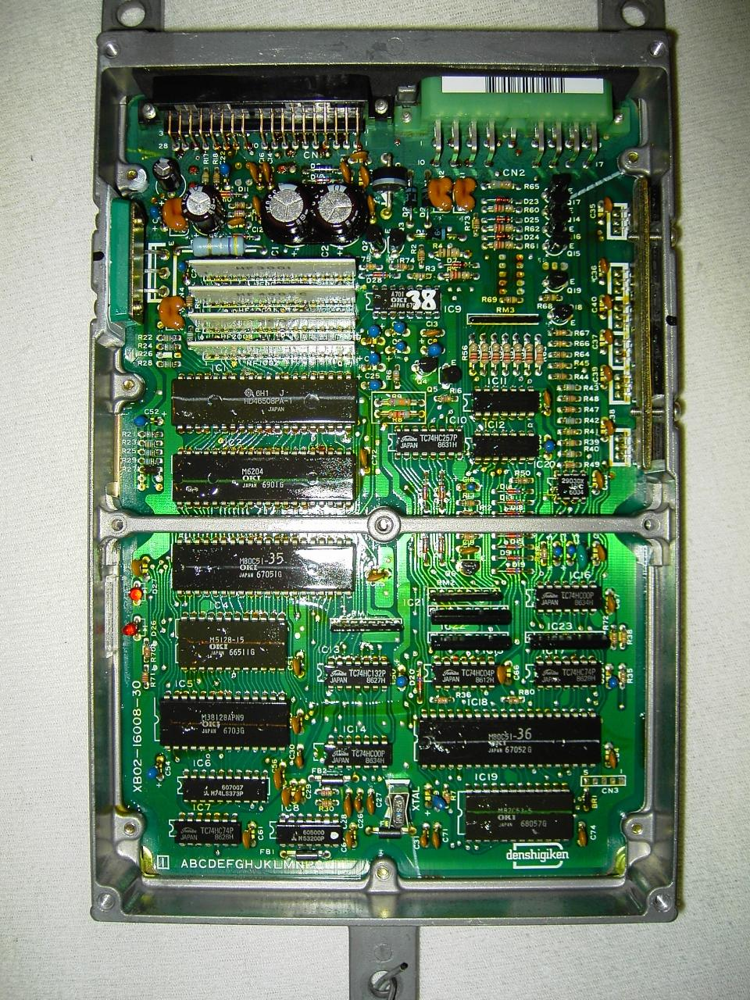
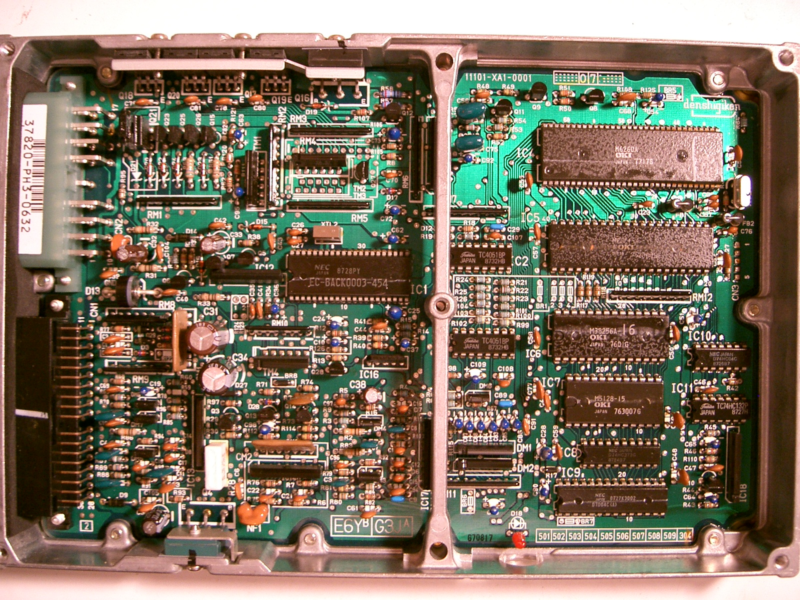
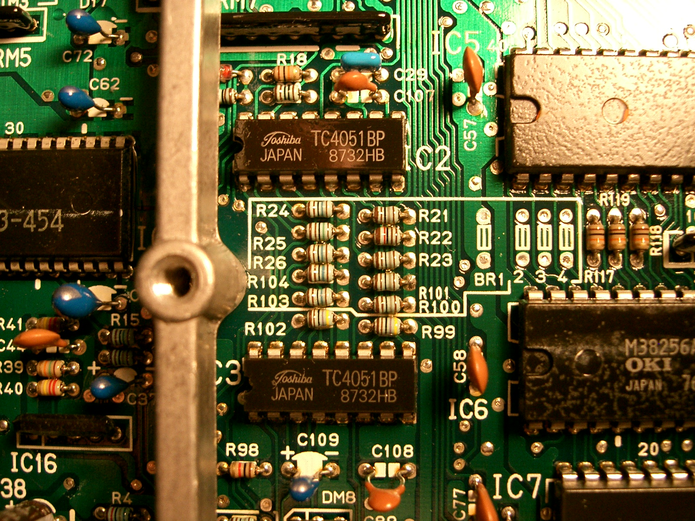
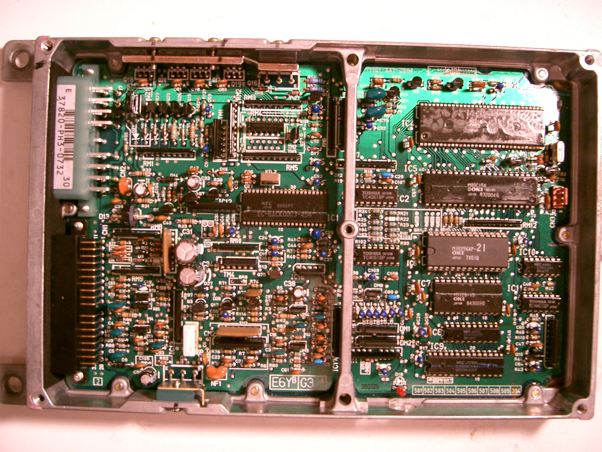
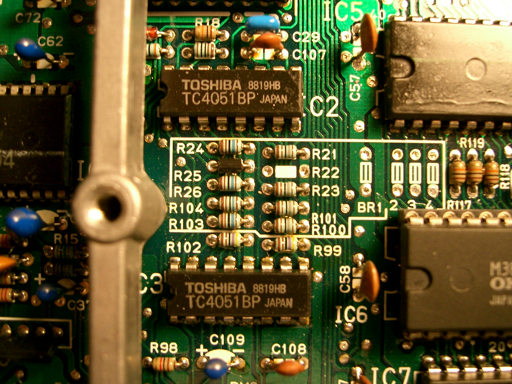
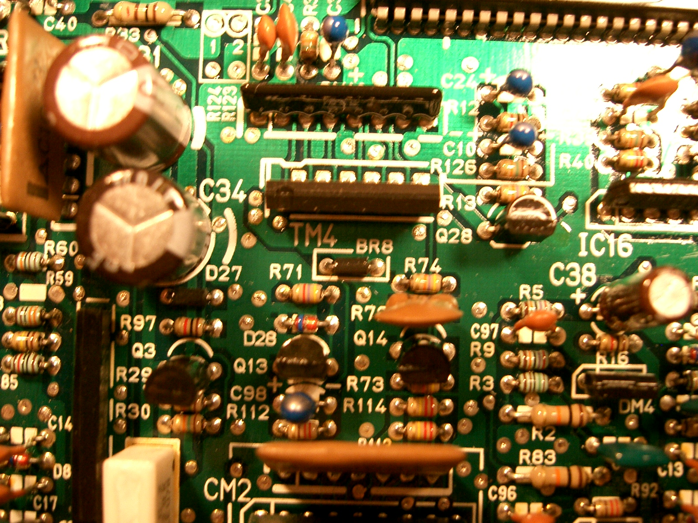

# Honda PH3 ECU Technical Reference

The PH3 ECU was utilized in 1988–1989 Honda Accord models equipped with the B20A engine. It features an Electronic Advance distributor and utilizes an external 27C256 ROM. The architecture is based on the OKI 80C154 processor.

## Hardware Overview

The PH3 is architecturally similar to the PK2 ECU used in 1988–1991 Prelude models. While the boards are nearly identical, the PH3 includes specific modifications for the Accord platform, such as the disabling of the secondary O2 sensor via the BR8 jumper.

### 1986–1987 PH3 Variant
The 1986–1987 Accord B20A variant differs significantly from the 88–89 iteration:
*   **Processor:** OKI 80C514 based.
*   **Memory:** 27C128 ROM.
*   **Architecture:** Utilizes dual OKI processors rather than a single backup processor configuration.
*   **Diagnostics:** Features two onboard diagnostic LEDs.

> [!NOTE]
> The latest PH3 and PK2 ECU boards share approximately 99% of their design and are often cross-compatible regarding program execution.

## Configuration and Jumpers

### BR8 Jumper
The BR8 jumper is responsible for deactivating the O2 sensor B input on the PH3 board. It is connected directly to the sensor pin. In contrast, the PK2 ECU board typically leaves this jumper position blank.

### Options Configuration
The PH3-0732 (Automatic) and PH3-0632 (Manual) variants exhibit different options configurations. While these are often associated with transmission type or emissions standards, the manual PK2 ECU shares the same options configuration as the PH3 automatic unit, suggesting these settings may serve broader functional purposes.

## ECU Visual Reference

```carousel

*88-89 Accord B20A PH3 ECU*
<!-- slide -->

*86-87 Accord B20A PH3 ECU*
```

```carousel

*PH3-0632 Accord ECU (Manual)*
<!-- slide -->

*PH3-0632 Manual ECU (Options Close-up)*
```

```carousel

*PH3-0732 Auto ECU*
<!-- slide -->

*PH3-0732 Auto ECU (Options Close-up)*
```

```carousel

*BR8 Jumper location for O2 sensor B input*
