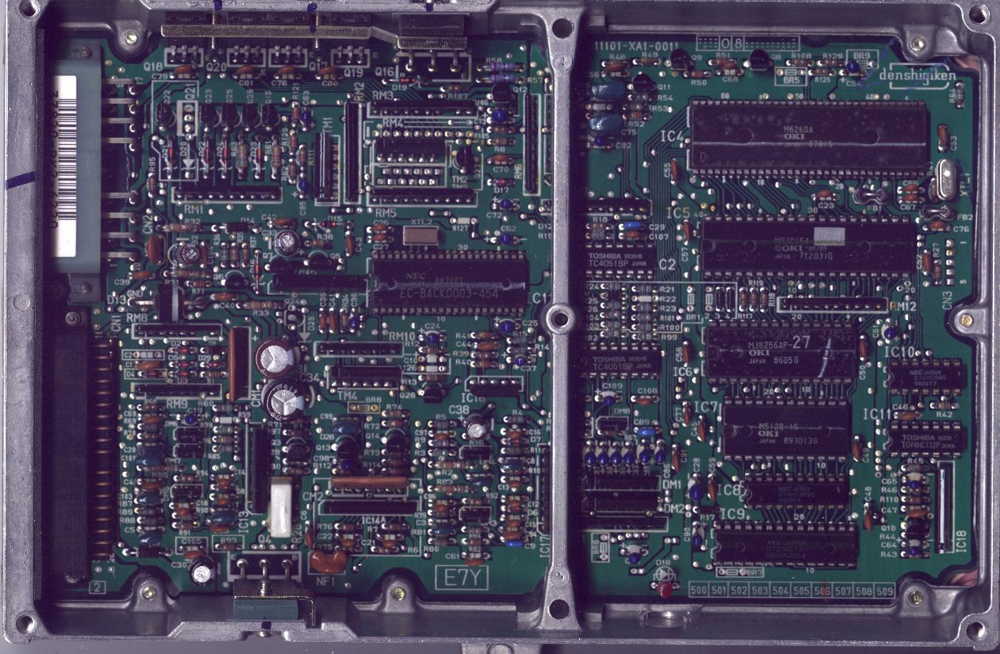
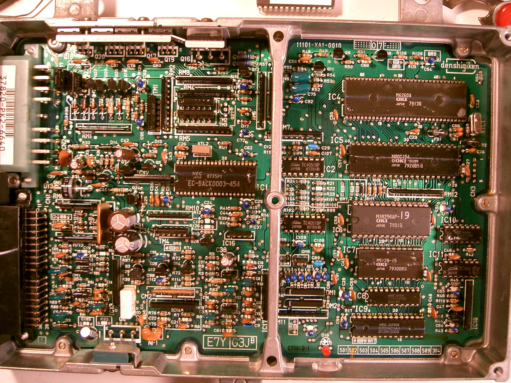
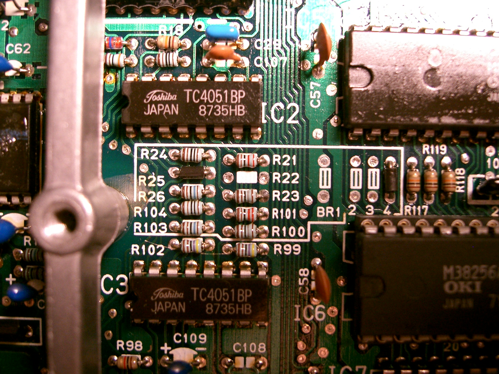
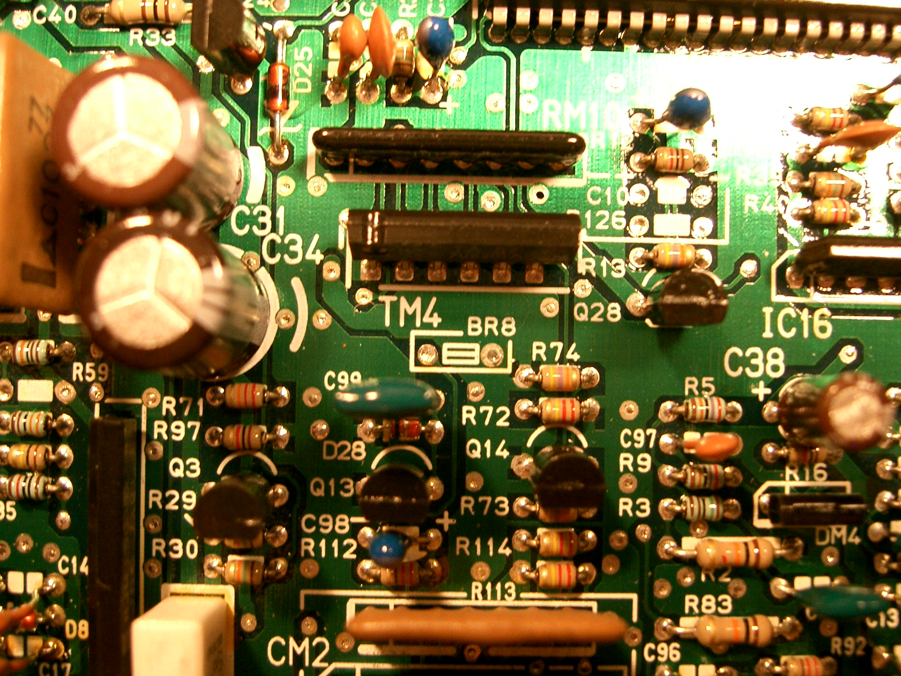

# PK2

Prelude [OBD](/cars/wiring/obd)-0 B20A [ECU](/cars/ecu/ecu). Electronic Advance. External `27C256` [ROM](/cars/tuning/rom). oki `83C154` based

- pk-2 ECU photo.:

---

I posted the Options Close-up for the PK2-6640 manual B20A [ECU](/cars/ecu/ecu). I don't know if these options are related to the transmisson type or emissions. The auto PH3 [ECU](/cars/ecu/ecu) has the same options configuration as this manual [ECU](/cars/ecu/ecu) so I'm not sure what these do yet.

The PK2 and PH3 [ECU](/cars/ecu/ecu)s share almost the same PC board. Theya re 99% similar. So similar in fact that the PH3 code can run on the PK2. The BR8 Jumper seems to control the Secondary O2 sensor input. The PH3 doesn't have this sensor so it's deactivated by BR8. You can see the PH3 section for more details. 

Carotman 
<figure>
 
 <figcaption>pk-2 ECU photo.</figcaption>
</figure>

<figure>
 
 <figcaption>Canadian PK2 [ECU](/cars/ecu/ecu)</figcaption>
</figure>

<figure>
 
 <figcaption>PK2-6640 Options Close-up</figcaption>
</figure>

<figure>
 
 <figcaption>BR8 Jumper that seems to control O2 Sensor B input</figcaption>
</figure>
