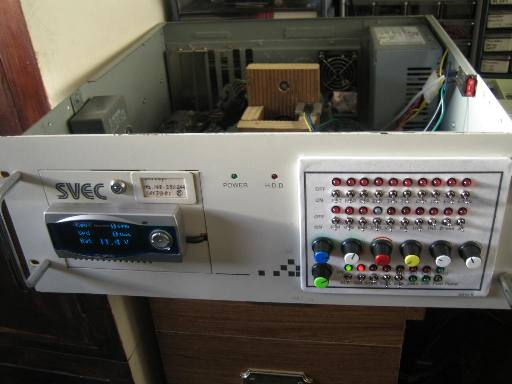
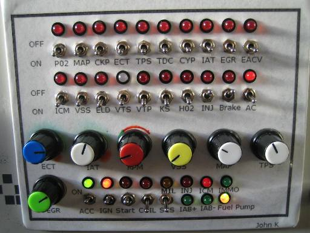
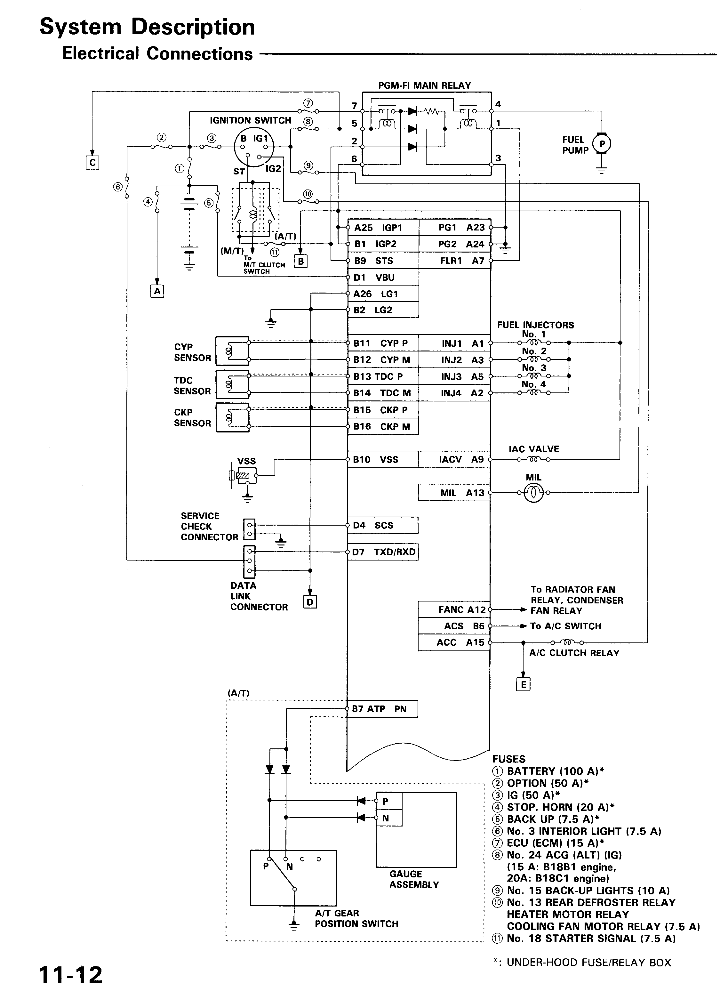
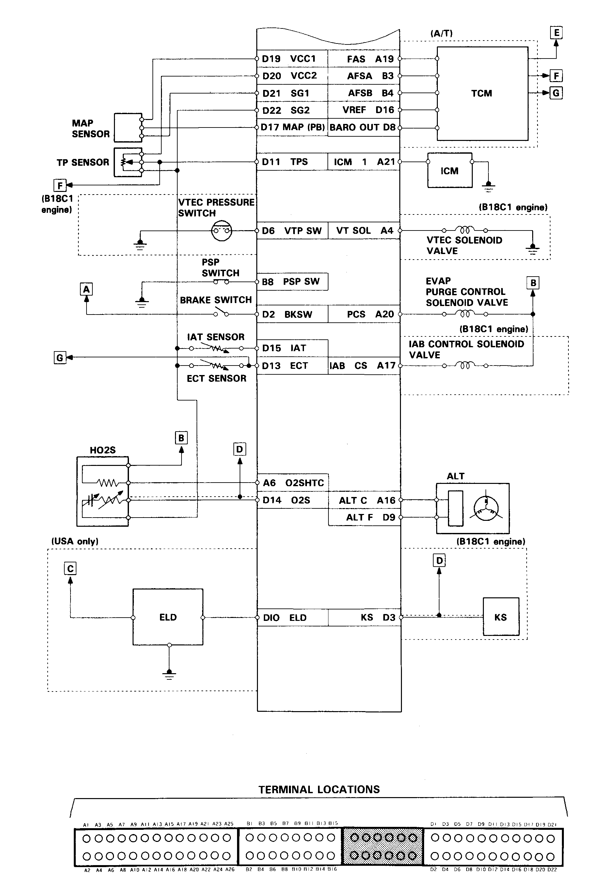

# DIY Engine Simulator for ECU Bench Testing

An **Engine Simulator** (ECU stimulator or bench jig) is an essential tool for hardware developers and tuners. It simulates the electrical loads and sensor signals of a running vehicle, allowing you to operate an ECU on a workbench to test custom firmware, diagnose component-level hardware failures, or verify circuit modifications without risking damage to a vehicle.

This guide details a rack-mountable engine simulator design that utilizes a combination of real automotive components, load-simulating power resistors, and variable signal generators to replicate a complete Honda OBD1 PGM-FI engine harness.

## Simulator Subsystems & Load Components

To prevent the ECU from triggering error codes, the simulator must mimic the electrical behaviors and loads of real solenoids, heaters, and injectors.

### Actuator & Load Simulation

* **Injectors**: Uses four **12Ω 5W power resistors** to simulate injector coil impedance, preventing Code 16 (Fuel Injector System).
* **EACV / IACV**: An actual Idle Air Control Valve is wired into the system to load the ECU's idle control circuit.
* **VTEC Solenoid (VTS)**: A real VTEC solenoid is mounted to the chassis to provide audible confirmation of VTEC engagement.
* **VTEC Pressure Switch (VTP)**: Simulated using a relay coil driven by the VTS output signal, closing the switch to ground upon activation.
* **Oxygen Sensor Heater**: Simulated using three **3.7kΩ 5W resistors** wired in parallel to dissipate heat safely.
* **Fuel Pump**: An inline bi-color LED indicates when the fuel pump relay is primed and running.
* **Main Relay**: A standard Honda 7-pin Main Relay is integrated to distribute power to the board and ECU.

### Sensor Input Simulation

* **Analog Sensors (TPS, MAP, ECT, IAT, EGR)**: Simulated using high-quality variable rotary potentiometers to sweep voltages between `0V` and `5V`.
* **Electric Load Detector (ELD)**: An actual ELD unit is wired in series with the main power distribution lines, allowing the ECU to read real-time current load fluctuations.
* **Knock Sensor**: A real knock sensor is mounted to the metal chassis; tapping the chassis allows for testing of knock board detection routines.

## Distributor & Engine Speed Simulation

Simulating engine speed (RPM) requires synchronized pulse inputs for the **CKP** (Crankshaft Position), **TDC** (Top Dead Center), and **CYP** (Cylinder Position) sensors. This simulator uses a physical OBD1 distributor driven by an electric motor.

### Assembly Details

* **Drive Motor**: A 12V motor salvaged from a cordless drill.
* **Speed Control**: The drill's trigger switch is wired to a rotary potentiometer to vary motor speed (500–9,000+ RPM).
* **Coupling**: The distributor shaft is coupled to the motor using a 15-tooth RC car gear and heavy-duty rubber fuel hose to absorb vibrations.
* **Ignition Coil & ICM**: The Ignition Control Module (ICM) and ignition coil are wired into the distributor housing. 12V power is supplied to the black/yellow lead from the main relay to prevent Code 15 (Ignition Output Signal).

> [!TIP]
> Physical distributors provide excellent mechanical feedback, but they may stall at very low speeds (under 500 RPM) if the motor lacks torque, effectively simulating an engine stall.

## Control Panel Interface

The control panel allows the operator to manipulate sensor inputs and inject faults into the system.

### Control Panel Features

* **Sensor Adjustment Knobs**: Dials for ECT, IAT, RPM, VSS, TPS, MAP, and EGR.
* **Fault Toggles**: SPST switches wired in series with critical sensor lines to trigger specific Diagnostic Trouble Codes (DTCs).
* **Indicator LEDs**: Bi-color LEDs display circuit status (e.g., A/C clutch relay engagement).
* **Ignition Switches**: Emulates standard key positions (Accessory, Ignition, Start). The Start switch automatically engages the distributor drive motor.

## ECU & Harness Interface

The chassis features a modular interface scheme to ensure compatibility across different ECU generations.

* **DB25 Connectors**: Three DB25 ports are mapped to standard OBD1 ECU pins (Plugs A, B, and D).
* **Interchangeable Harnesses**: Custom adapter harnesses (DB25 to OBD0, OBD1, OBD2a, or OBD2b) allow for rapid switching between ECU generations.

## Wiring Schematics

The simulator is wired according to standard OBD1 Civic/Integra PGM-FI pinouts.

| Component | Pinout Reference |
| :--- | :--- |
| **Outputs** | PGM-FI Pinout Part 1 |
| **Sensors/Distributor** | PGM-FI Pinout Part 2 |

