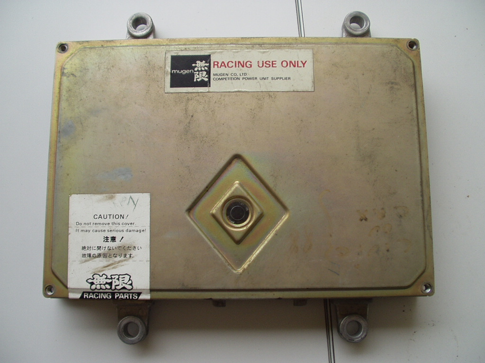
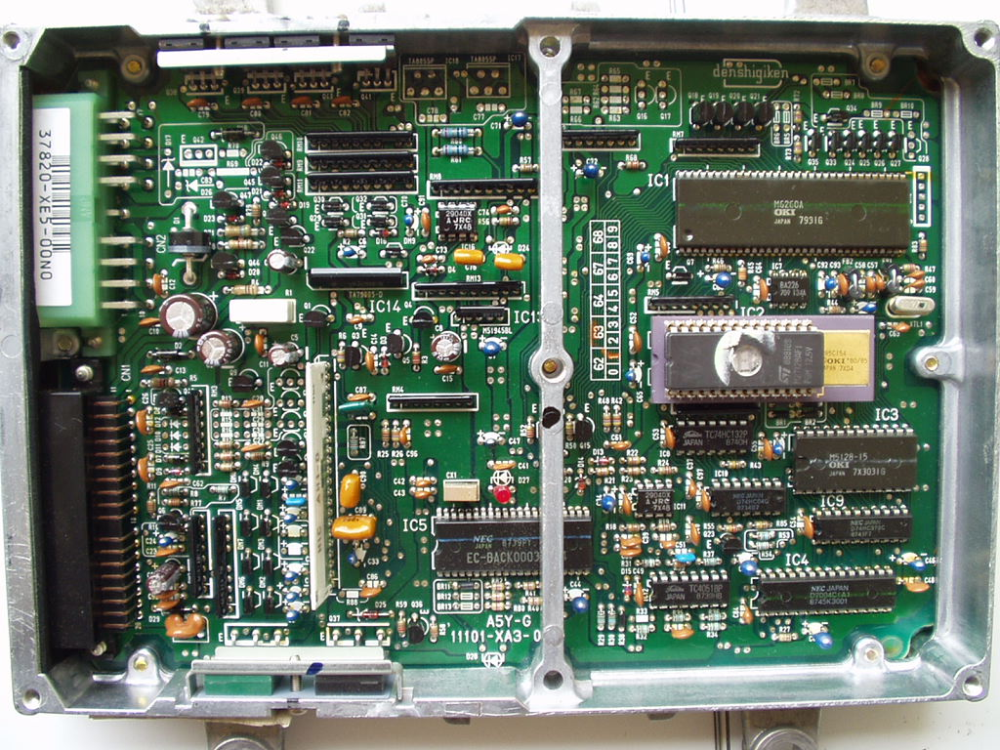

# Mugen XE5 ECU Technical Reference

The XE5 is a specialized race-platform ECU developed for the Honda ZC engine. It is derived from the PM7-0330 hardware architecture. This unit is configured for "race-only" applications, featuring a modified program that disables standard sensor monitoring, including the oxygen (O2) sensor.

> [!IMPORTANT]
> The XE5 is intended for competition use only. Due to the removal of closed-loop feedback and sensor diagnostics, this ECU is not suitable for street-driven vehicles.

## Hardware Overview

The XE5 utilizes the PM7-0330 PCB layout. It is physically distinguished by its specific Mugen-branded casing and internal programming.

```carousel

*External housing of the Mugen XE5 ECU*
<!-- slide -->

*Internal PCB layout of the XE5, based on the PM7-0330 architecture*
```

## ROM Specifications

The XE5 utilizes a specific binary file optimized for high-performance ZC engine operation.

*   **Base Hardware:** PM7-0330
*   **Application:** ZC Engine (Race)
*   **ROM File:** [PM7-MUG.bin](PM7-MUG.bin)

## Diagnostic Notes

*   **Sensor Checks:** Most standard OBD0 sensor checks are disabled in the XE5 firmware.
*   **O2 Sensor:** The O2 sensor input is ignored by the XE5 logic, as the unit is designed to operate in open-loop mode exclusively.
*   **Compatibility:** Ensure the engine harness and sensor configuration match the requirements of the PM7-0330 hardware before installation.
