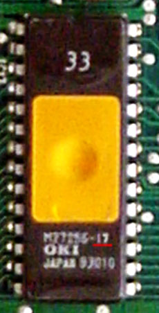

# Sourcing Memory Chips for Honda OBD0 and OBD1 ECUs

Socketing or chipping a 1990–1995 Honda OBD0 or OBD1 ECU requires installing a 32 KB (256-kilobit) parallel memory chip. While several chip types fit the physical DIP-28 socket footprint, they vary significantly in access speeds, erase procedures, and pinout compatibility.

## 1. Supported Chip Technologies

Tuners typically utilize one of three distinct chip technologies for ECU modification:

* **SST 27SF256 (Flash Memory):** The industry standard for Honda tuning. It is electrically erasable and rewriteable, allowing for rapid programming via standard USB burners.
* **27C256 (EPROM):** Erasable Programmable ROM. Windowless versions are one-time programmable (OTP). Windowed versions require ultraviolet (UV) light for erasure, which typically takes 15–20 minutes.
* **AT29C256 (EEPROM):** Electrically Erasable PROM. Compatible with standard sockets and easily rewriteable, though less common than SST flash variants.

> [!TIP]
> The **SST 27SF256** is the recommended choice for most applications due to its reliability and ease of use with modern hardware.

## 2. Speed Specifications (Access Time)

ECU microcontrollers require fast data retrieval to maintain precise fuel injector pulses and ignition timing. 

* **Factory Specification:** Honda mandates memory chips rated at **170 nanoseconds (ns) or faster**. 
* **Recommendation:** While some 200ns chips may function, it is highly recommended to source chips rated at **150ns, 120ns, 90ns, or 70ns** to ensure stability under high-heat and high-RPM conditions.

### Access Speed Suffixes
| Suffix | Speed Rating | Status |
| :--- | :--- | :--- |
| -20 | 200ns | Risky; use only if verified |
| -17 | 170ns | Minimum factory specification |
| -15 | 150ns | Recommended |
| -12 | 120ns | Recommended |
| -9 / -90 | 90ns | Optimal |
| -7 / -70 | 70ns | Optimal |

### Historical Context
Early production runs of the OBD0 Acura Integra PR4 ECU (dated June 1989) shipped with a windowed `27C256-17` (170ns) chip in a factory socket. Because mass-production mask ROMs were not ready in time, Honda utilized these reprogrammable chips to meet initial vehicle delivery targets.

*Factory-socketed windowed EPROM from a 1989 Acura Integra PR4 ECU.*

## 3. Incompatibility Warnings

> [!CAUTION]
> **Avoid the 28C256 EEPROM.** 
> Do not confuse the recommended `27SF256` or `29C256` with the `28C256` EEPROM. Although the `28C256` shares the same 32 KB capacity and 28-pin DIP package, it utilizes a different pin configuration for write control. If installed in a standard `27C256` socket, it will fail to communicate with the ECU and trigger a solid Check Engine Light (CEL). Operation requires significant circuit trace modification.
