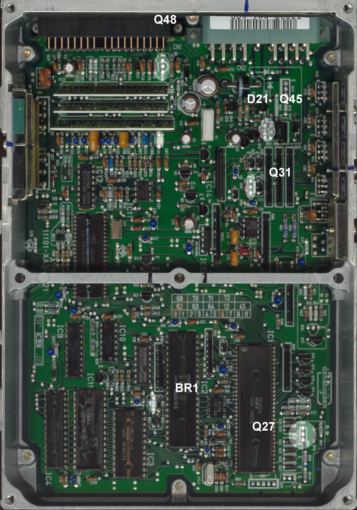

# USDM vs. Canadian OBD0 PM6 ECU Differences and ELD Bypass

The OBD0 PM6 ECU is the factory engine control unit for the 1988–1991 Honda Civic Si and CRX Si. While the fuel and ignition tables stored on the ROM chips are identical, there is a physical hardware difference between ECUs sold in the United States and those sold in Canada regarding the **Electrical Load Detector (ELD)** circuit.

## 1. The Electrical Load Detector (ELD) System

The ELD is a sensor located inside the engine bay fuse box that monitors the electrical current draw from the alternator and battery. The ELD signals the ECU, allowing it to increase engine idle speed or adjust alternator output to prevent battery drain.

* **USDM Civic / CRX:** Equipped with an ELD in the engine fuse box. The USDM PM6 ECU actively monitors this sensor input via pin B14.
* **Canadian Civic / CRX:** These models were not equipped with an ELD. The Canadian-spec PM6 ECU has this sensor monitoring circuit disabled in the hardware.

> [!IMPORTANT]
> If you install a USDM PM6 ECU in a Canadian vehicle, or into a chassis that lacks ELD wiring, the ECU will detect a missing sensor voltage, triggering **Code 20 (Electrical Load Detector)**. While Code 20 does not trigger limp mode, it illuminates the Check Engine Light (CEL) and can interfere with active serial datalogging.

## 2. Hardware Bypass Conversion (BR1 Jumper)

Because the software ROM is identical, the ECU's ELD behavior is dictated by a physical wire jumper on the board labeled **BR1**.

To bypass Code 20 and convert a USDM ECU to Canadian specifications:

1. Open the ECU case.
2. Locate jumper **BR1** on the main circuit board.
3. Desolder and remove the **BR1** jumper wire (or cut the wire), leaving the circuit open.

Once **BR1** is open, the ECU will stop monitoring the ELD input pin, and the Code 20 CEL will be deactivated.

## 3. Board Reference

The following images illustrate the difference between the two board layouts.

```carousel

*Canadian-market PM6-C00 board layout showing open solder pads where the BR1 jumper is omitted.*
<!-- slide -->

*USDM-market PM6-A09 board layout showing the BR1 jumper wire installed near the edge connector.*
