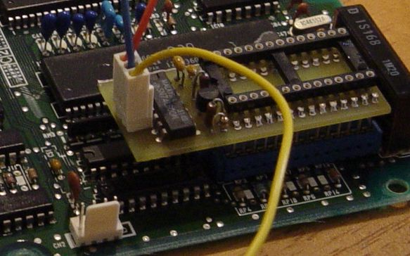

# Easy-RTP v1.0 OBD1 Installation Guide

This guide details the installation of the Easy-RTP v1.0 board into OBD1 ECUs. The process involves interrupting the CPU write-enable circuit and interfacing the RTP board with the required address and write signals.

> [!WARNING]
> This procedure requires severing a factory PCB trace and soldering directly to integrated circuit (IC) pins. Verify all signal paths and pinouts against your specific ECU board revision before applying power.

Ensure the Easy-RTP v1.0 module is fully assembled before beginning the installation.

## Removable Connection Strategy
To maintain the ability to revert to a standard ROM, the installation utilizes a removable plug system. This allows a jumper plug to reconnect the original factory circuit when the RTP board is removed.

*   **Wiring:** Use small-gauge wire (e.g., wire-wrap wire) to accommodate the tight clearances of the ECU housing.
*   **Header:** A right-angle header on the RTP board is recommended to provide sufficient clearance for the ECU case.

```carousel

*Removable connection setup; the severed trace is visible in the background.*
<!-- slide -->

*Close-up of the MCU write-enable trace cut location.*
```

## P28 Installation Procedure

1.  **Isolate Trace:** Locate and sever the MCU `WE` (Write Enable) trace as indicated in the reference imagery.
2.  **Address Line:** Connect the RTP board `A15` wire to MCU Pin 16. This address line is typically unused and is required to address the writable ROM image.
3.  **Write Enable (MCU Side):** Connect the MCU side of the severed `WE` trace (MCU Pin 25) to the `WE in` terminal on the RTP board. Tin both the IC pin and the wire prior to soldering to ensure a secure bond.
4.  **Write Enable (Peripheral Side):** Connect the remaining side of the severed write-enable circuit to Pin 38 of the M82C55A. This configuration ensures the RTP board enables NVSRAM writes only when `A15` is high.
5.  **Verification:** Inspect all solder joints for bridges or cold joints. Confirm the severed trace is fully isolated before applying power.

```carousel

*A15 and MCU-side write-enable connections.*
<!-- slide -->

*Connection to the peripheral side of the severed write-enable circuit at M82C55A Pin 38.*
<!-- slide -->

*Finalized Easy-RTP installation.*
```

## JDM Surface-Mount Pin Reference
For JDM P30-900 ECUs utilizing surface-mount components, use the following pin mapping:

| Signal | Surface-Mount Pin | DIP Pin (Standard) |
| :--- | :--- | :--- |
| **A15** (on M66207) | 17 | 16 |
| **WE/WR** (on M66207) | 27 | 25 |
| **WE/WR** (on 82C55) | 40 | 38 |

## Restoring the Original Path
The installation routes the two halves of the severed write-enable circuit to connections 1 and 3 on the RTP board. When the RTP module is removed, a dummy jumper plug must be installed to bridge these two wires, restoring the original factory circuit for standard ROM operation.

> [!CAUTION]
> Always verify connector numbering and continuity with a multimeter before operation. An incorrectly wired jumper can cause short circuits or leave the write-enable path open, preventing the ECU from functioning.

## Datalogging Interface
Once the hardware is installed, an RS232-to-TTL converter is required for ECU-to-PC communication. Refer to the following resources for interface configuration:

*   {{> datalogging-overview }}
*   {{> serial-communication-guide }}
