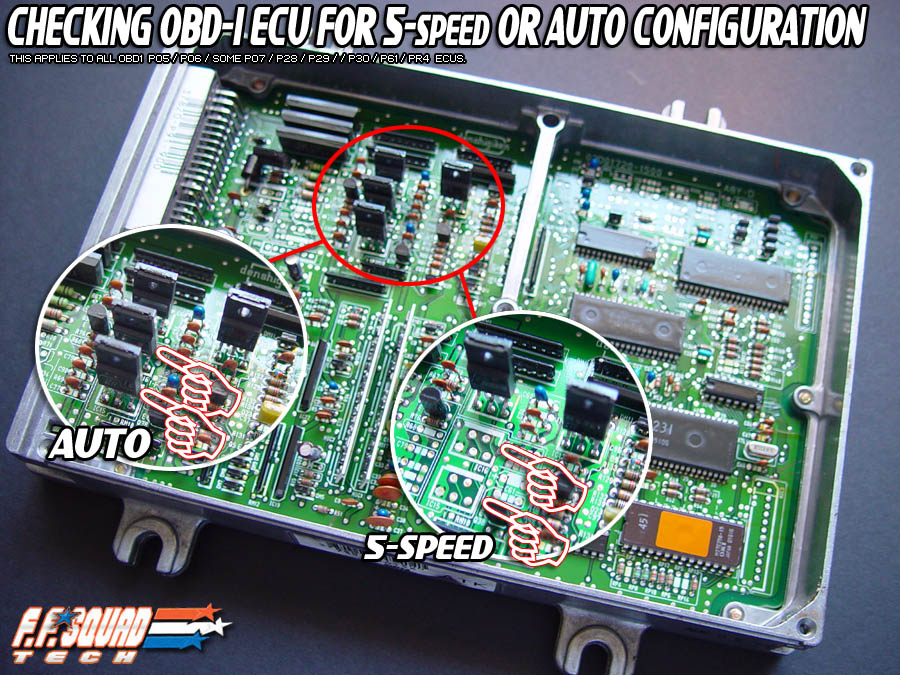
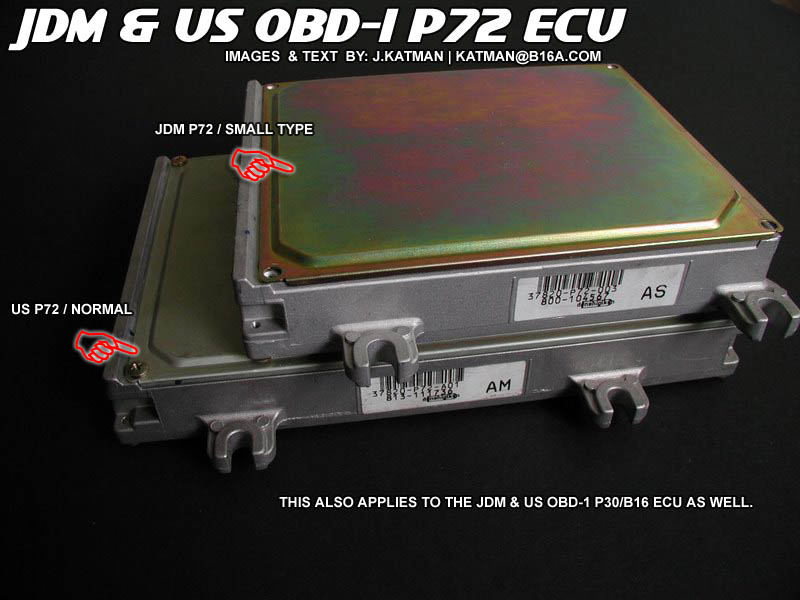

# Honda PGM-FI Engine Control Unit (ECU) Identification

The Engine Control Unit (ECU) is the primary computer responsible for managing fuel delivery, ignition timing, and idle control on Honda PGM-FI engines. Proper identification of ECU hardware is essential for diagnostics, tuning, and engine swaps.

## Transmission Identification
To determine if an ECU is configured for a manual or automatic transmission, inspect the circuit board for specific jumper settings or component population.

```carousel

*Visual comparison of manual and automatic ECU board configurations*
<!-- slide -->

*Comparison of regional ECU board layouts*
```

## Regional Identification
Distinguishing between Japanese Domestic Market (JDM) and United States Domestic Market (USDM) units is primarily achieved through the part number printed on the ECU casing.

> [!IMPORTANT]
> All USDM ECU part numbers follow the format **37820-P??-A##**. If the part number contains an "A" in the suffix, it is a confirmed USDM unit.

### Identification Summary
*   **USDM:** Identified by the "A" suffix in the part number (e.g., 37820-P30-A01).
*   **JDM:** Typically lacks the "A" suffix and may feature different board components or lack specific emissions-related hardware found on USDM counterparts.