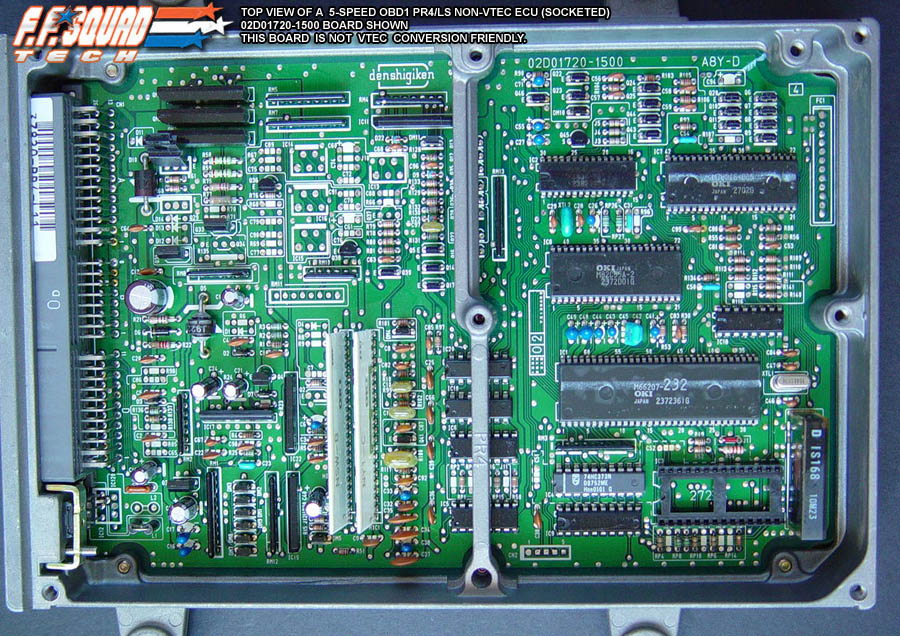
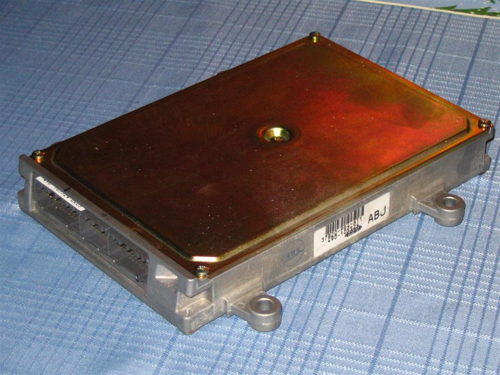

# OBD1 PR4 ECU Hardware Reference

The **PR4** ECU is the standard OBD1 engine control unit used in the 1992–1993 Acura Integra RS, LS, and GS models equipped with the 1.8L non-VTEC B18A1 engine.

> [!NOTE]
> Acura also utilized a PR4 ECU in the 1990–1991 Integra models. These early units are OBD0. If you are modifying a 1990–1991 unit, refer to the [OBD0 PR4](/cars/ecu/obd0pr4) documentation.

## Board Layout and Chipping

The OBD1 PR4 shares a hardware architecture with other OBD1 Honda/Acura ECUs, such as the P28 or P75. It can be modified using standard OBD1 chipping kits to accept custom ROMs.

To chip an OBD1 PR4 ECU, the following components must be populated:

* **28-Pin Socket (`IC3`):** For the custom EPROM/EEPROM chip.
* **`74HC373` Latch (`IC4`):** For address demultiplexing.
* **Resistor `R54` (1k ohm):** Enables external memory addressing (or a jumper wire, depending on board revision).
* **Capacitors `C1` and `C2` (0.1 uF):** For noise filtering on the latch and ROM lines.

## Hardware Visuals

```carousel

*Top view of the OBD1 PR4 PCB showing standard component footprints.*
<!-- slide -->

*Overview of the OBD1 PR4 board assembly.*
<!-- slide -->

*Detailed view of the chipped area with a 28-pin ZIF socket and 74HC373 latch installed.*
<!-- slide -->

*Underside of the PCB showing factory and modification solder points.*
<!-- slide -->

*Close-up of the factory-chipped board layout prior to modification.*
```

## Technical Specifications

> [!IMPORTANT]
> Ensure the `74HC373` latch is oriented correctly according to the PCB silkscreen. Incorrect orientation will result in a "Check Engine Light" (CEL) and a non-starting vehicle.

| Component | Value/Part | Function |
| :--- | :--- | :--- |
| **IC3** | 28-Pin Socket | EPROM/EEPROM interface |
| **IC4** | 74HC373 | Address Latch |
| **R54** | 1k Ohm | Memory Enable |
| **C1, C2** | 0.1 uF | Noise Filtering |
