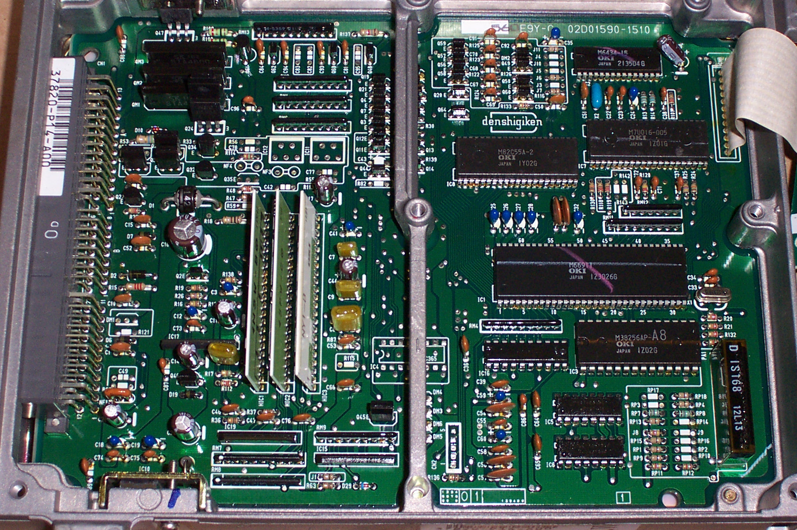
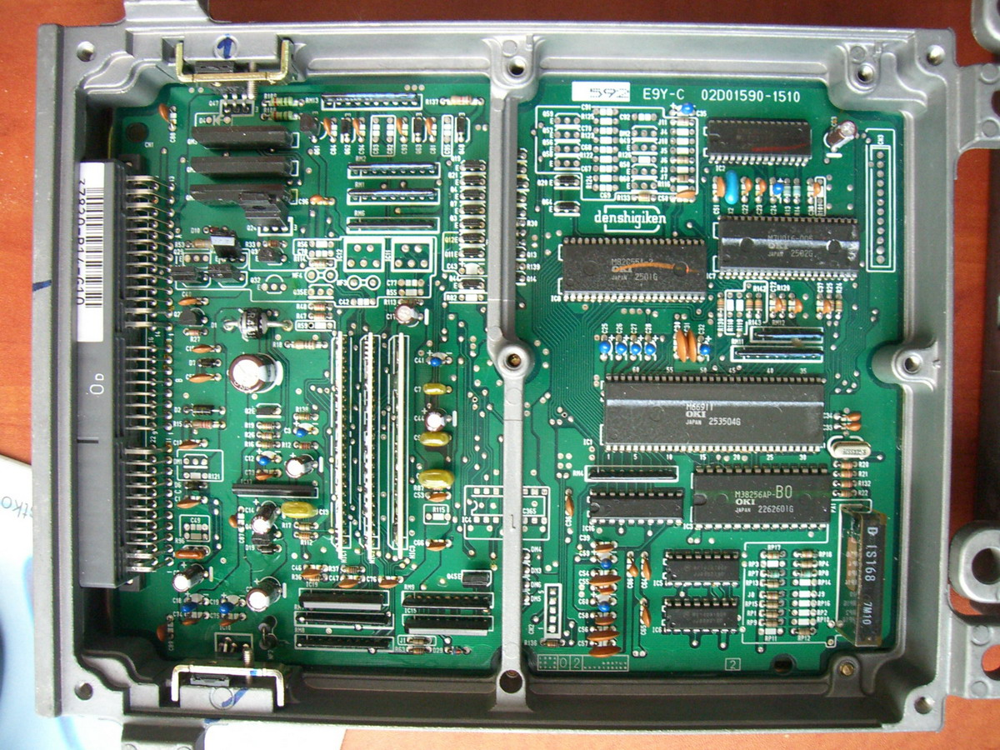
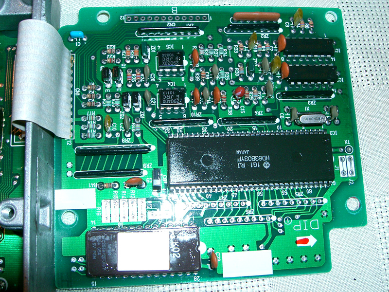

# OBD1 Prelude P14 ECU Guide

The P14 ECU was used by Honda in the 1993–1995 OBD1 Prelude Si (USDM H23A1 DOHC non-VTEC engine). It is a robust platform, though there are several distinct internal board revisions that must be identified when socketing or modifying the board.

## 1. Board Variants & Knock Sensor Configurations

The P14 board exists in two primary configurations based on the presence of the factory knock sensor system:

* **Knock-Equipped Boards:** These revisions populate the knock processing daughterboard slot. The supporting resistor pads at **R118**, **R119**, and **R101** are populated from the factory.
* **Knockless Boards:** These boards lack the knock daughterboard. Resistors **R118** and **R119** are relocated to pads **R142** and **R143**.

> [!NOTE]
> If you are modifying a knock-equipped board to bypass the sensor check, refer to the [Knock Sensor Removal / Bypass](/cars/rom/remove-a-knock-sensor) guide.

## 2. Factory External ROM vs. Romless Boards

While most USDM OBD1 ECUs require adding a logic latch (`74HC373`) and jumper (`J1`) to accept an external ROM, some P14 models (particularly JDM and European knock-equipped revisions) were manufactured with an external ROM from the factory. 

Comparing the factory external ROM board with the standard romless board reveals that the external ROM board is missing resistor **R15**.

## 3. Board Layout Reference

### USDM Prelude Si P14-A10 (Manual Transmission)

```carousel

*Internal view of the USDM P14-A10 manual transmission board.*
<!-- slide -->

*Exterior case labeling of the USDM P14-A10 ECU.*
```

### USDM P14-A00 (4WS and Knock Sensor)

```carousel

*High-resolution shot of the P14-A00 board with 4WS and knock processing circuitry.*
<!-- slide -->

*Detail view of the knock processing daughterboard installed on the P14-A00.*
```

### European and Alternate Revisions

```carousel

*European market P14 manual board layout lacking the knock daughterboard.*
<!-- slide -->

*Alternate P14 board layout populated with a factory external ROM and knock daughterboard.*
```

## 4. Archived Files & Downloads

For tuning and analysis, the following stock ROM image was extracted from the factory external ROM version of the P14:

* [Download the archived P14 Knock ROM BIN](p14_knock.bin) *(32 KB, Stock H23A calibration)*