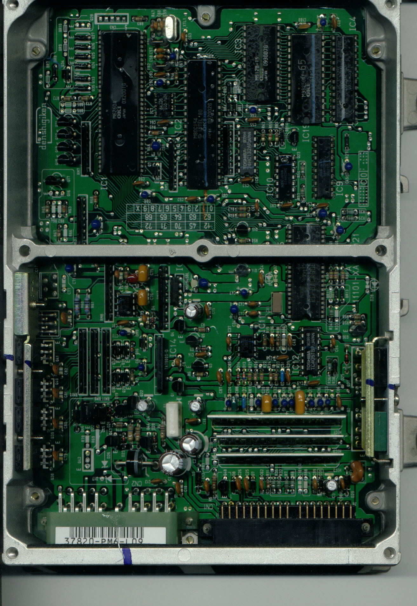
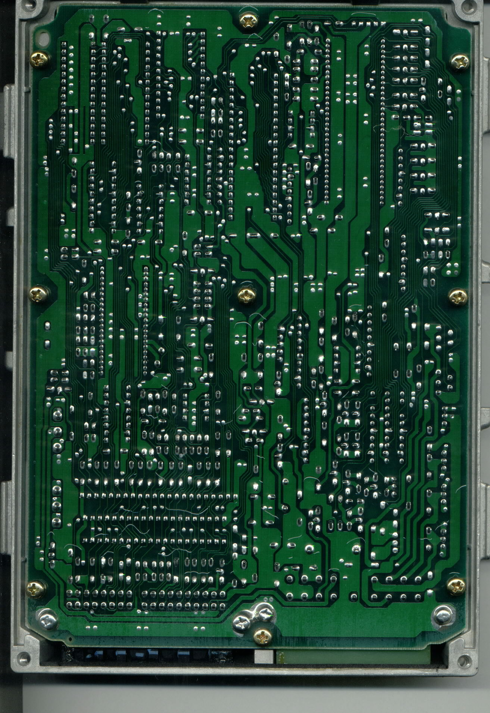

# PM6 ECU (OBD0) Hardware and Code Reference

The PM6 is the factory OBD0 engine control unit (ECU) utilized in 1988–1991 USDM Honda Civic and CRX Si models equipped with the SOHC 1.6L D16A6 engine.

## Microcontroller Architecture

The PM6 ECU utilizes the OKI 83C154 or Intel 80C154 microcontroller family. The ROM code can be extracted, modified, and flashed to standard EPROMs (such as the 27C256) to adjust fuel maps, ignition timing, rev limits, and other engine parameters.

> [!IMPORTANT]
> Ensure the EPROM is correctly seated and the checksum is verified after modification to prevent engine start failures or erratic operation.

## Development Resources

The following development files are available for this ECU:

* **Pm6.asm**: A comprehensive disassembly of the USDM 1991 PM6 stock ROM, with approximately 95% of the original assembly code mapped and commented.

## Board Layout Reference

Use the following images to identify IC locations, capacitors, and resistor packs for repair or modification.

```carousel

*Top side of the PM6 PCB showing IC locations, capacitors, and resistor packs.*
<!-- slide -->

*Rear solder side of the PM6 PCB.*
```

## ECU Pinout

The PM6 uses the standard OBD0 16-pin and 22-pin connector configuration.

{{> obd0-pinout-reference }}

> [!TIP]
> When performing hardware modifications or installing a socket for custom ROMs, always use a high-quality desoldering station to prevent damage to the PCB traces.