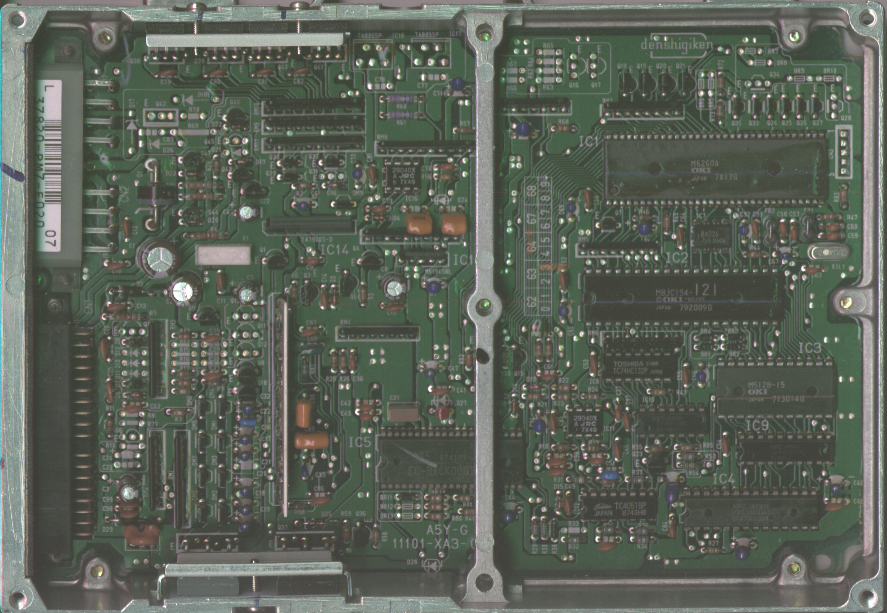
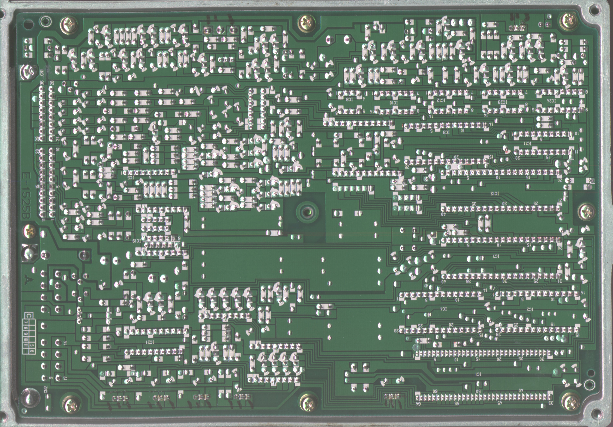
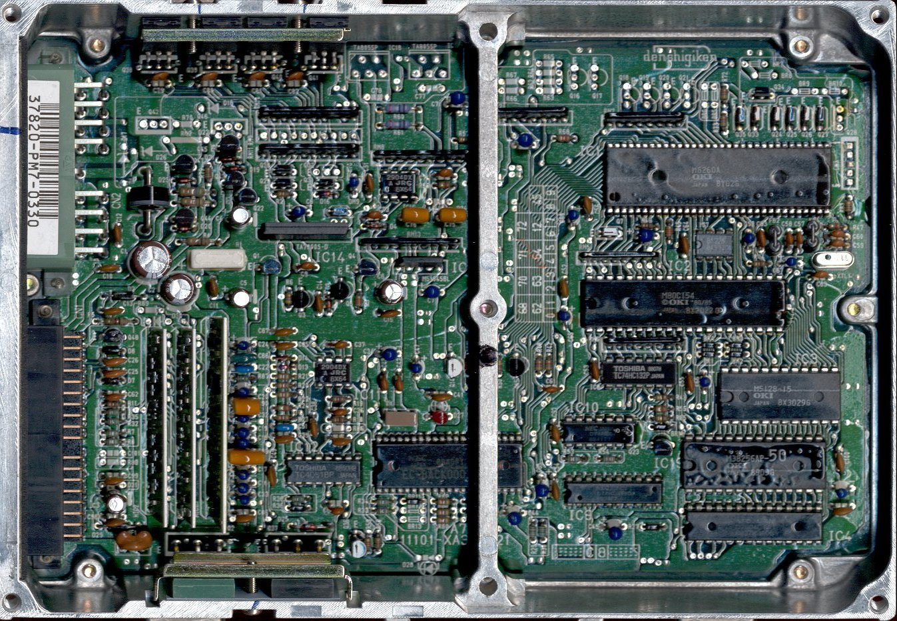

# OBD0 DOHC ZC PM7 ECU Reference

The PM7 ECU is the engine control unit utilized for the 1988–1991 DOHC ZC engines (D16A8, D16A9, and D16Z5) found in European and Japanese market vehicles.

> [!NOTE]
> The PM7 codebase is architecturally similar to the SOHC D16A6 PM6 codebase. Custom ROMs are often cross-compatible between these units, provided sensor configurations are adjusted accordingly.

## Board Revisions

The following board revisions represent the primary hardware variants encountered in the field.

### European PM7-E020
```carousel

*Component side (top view) of the European PM7-E020 board.*
<!-- slide -->

*Solder side (bottom view) of the European PM7-E020 board.*
```

### Alternate PM7 Layouts
```carousel

*Component side (top view) of the JDM PM7-0330 board.*
<!-- slide -->

*Component side (top view) of an early experimental PM7 ECU prototype.*
```

## Stock ROM Binaries

The following files contain the original factory calibration data for the PM7 ECU.

| ROM Version | Application | Size |
| :--- | :--- | :--- |
| [PM7-0330](Pm7-03301989.bin) | JDM 1989 DOHC ZC | 32 KB |
| [PM7-Euro](PM7-euro.bin) | German D16Z5 (125 HP) | 32 KB |

> [!IMPORTANT]
> Ensure the correct checksum is verified after flashing these binaries to an EPROM to prevent engine management errors.