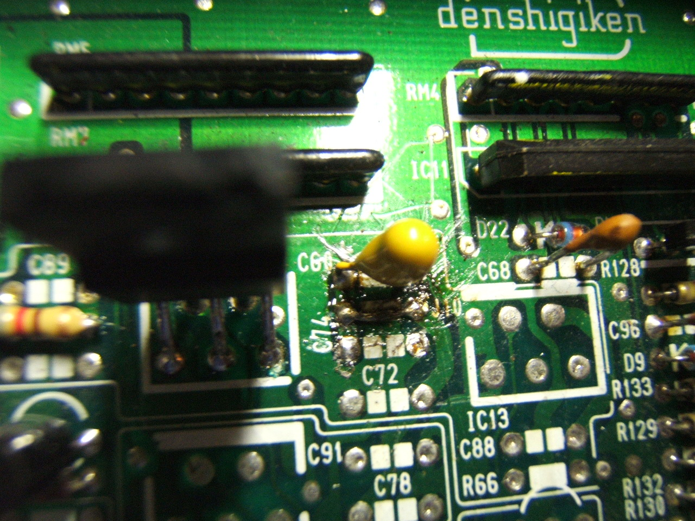
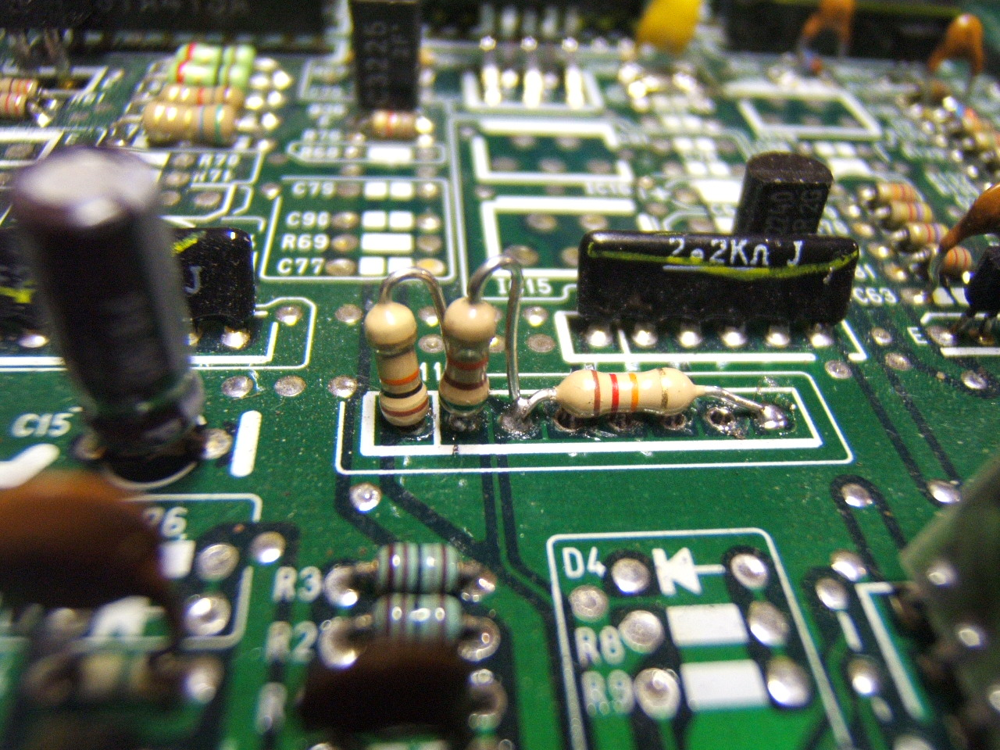
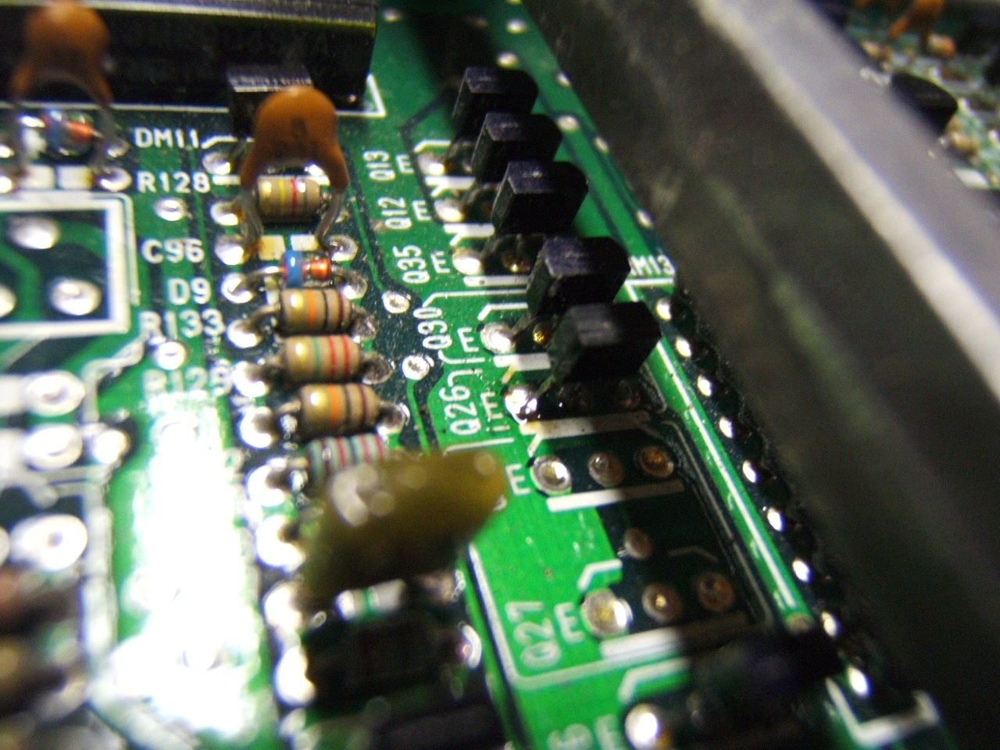
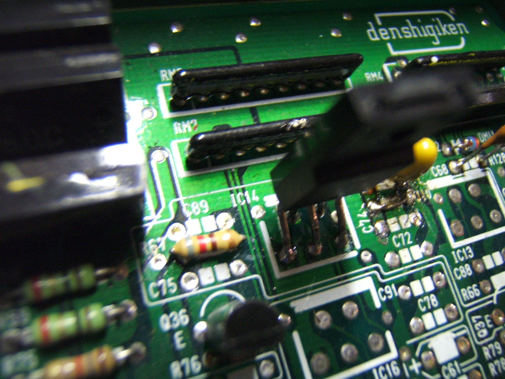
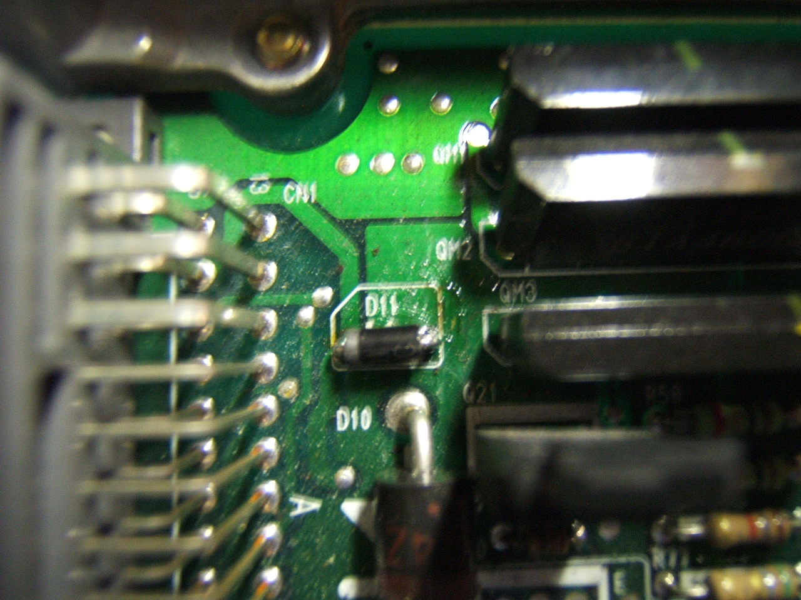
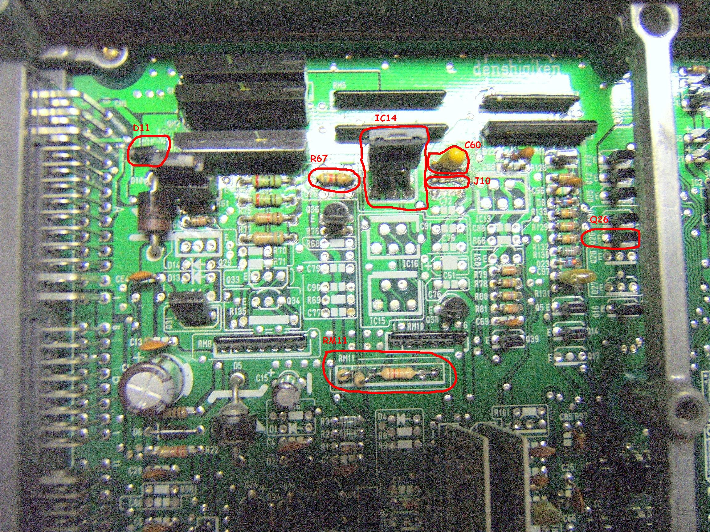

# 02D01720-1500

To convert a "1720" board from non-vtec to VTEC add the following parts: ***Required:***

- `Q26`: [C2785](/cars/electronics/c2785) (*note: I used a `C144` and it worked fine - NPN switching transistor)
- `C60`: 1uF 35v tantalum (marked "1 ... 35" and blue w/+ mark)
- `IC14`: [515 X High Side Switch](/cars/electronics/515x-high-side-switch)
- `J10`: jumper wire
- `R67`: 820 Ohm, 1/8w 5% resistor (1k work fine says Deluded)
- [RM11](/cars/electronics/rm11): weird voltage divider (**this is KEY** but can be replaced. Click link for more info)this could be replace by a 10k 8pin resistor module work really well
- D11: [Clamping Diode](/cars/electronics/clamping-diode)

***Optional:***- `C75`,`C89`,`C72`,`C74`,`C88`: 22pF ceramic (marked "22")
- `IC13`: [515 X High Side Switch](/cars/electronics/515x-high-side-switch) (note)
- `R66`: 820 Ohm, 1/8w 5% resistor (1k work fine says Deluded)

This is Honda's first [OBD1](/cars/electronics/obd1) Civic/Integra VTEC design. It is more complicated than it needs to be - the optional components are overkill. **\#IC13note :** `IC13` is entirely superfluous. You can 100% safely remove it and install `J10` to bypass it. `IC13`+`IC14` are run in series, so if you have both installed you actually increase the probability of failure becuase you have 5x5x to possibly fail, not one. Find the [Parts For ECUs](/cars/electronics/parts-for-ec-us) Here - `C60` and `J10` - Top left of the case: 
     

- Resistor setup in RM11: 
     

- `Q26` NPN Transistor: 
     

- `IC14` 5151S (thanks to Xenocron) AND `R67` Resistor: 
     

- D11 Diode - upper left in the case: 
     

- overview with comment: 
     

| **Attachment:** | **Modify:** | **Size:** | **Date:** | **Who:** | **Comment:** | | :--- | :--- | :--- | :--- | :--- | :--- | |  [DSCF1764.JPG](DSCF1764.JPG) | mod | 466150 | 14 Mar 2007 - 01:41 | defensio | `C60` and `J10` - Top left of the case | |  [DSCF1766.JPG](DSCF1766.JPG) | mod | 467869 | 14 Mar 2007 - 01:43 | defensio | Resistor setup in RM11 | |  [DSCF1765.JPG](DSCF1765.JPG) | mod | 480298 | 14 Mar 2007 - 01:44 | defensio | `Q26` NPN Transistor | |  [DSCF1762.JPG](DSCF1762.JPG) | mod | 475259 | 14 Mar 2007 - 01:45 | defensio | D11 Diode - upper left in the case | |  [DSCF1759\\_modified.JPG](/pgmfi/wiki/media/library/02D01720-1500/DSCF1759_modified.JPG) | mod | 1179213 | 14 Mar 2007 - 02:28 | defensio | overview with comment | |  [DSCF1763.JPG](DSCF1763.JPG) | mod | 468390 | 14 Mar 2007 - 05:10 | defensio | `IC14` 5151S (thanks to Xenocron) AND `R67` Resistor |
