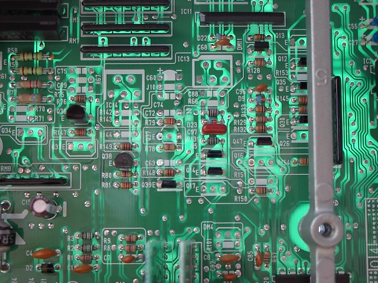

# 02D01980-1500

***Editor's note: the small list does not appear to have the required parts for the [IAB](/cars/electronics/iab)s***Author: eg6ajk Date: 05-24-03 15:10 my parts list seems to be alot smaller: changes to the [ECU](/cars/electronics/ecu) on top of standard external [ROM](/cars/electronics/rom) changes by adding: - `C60`: 1uf 35V tantlum
- D11: 600V 1AM diode
- `IC14`: SK5151S
- `J10`: 0hm resistor/jumper
- `R142`: 10k ohm resistor
- `R143`: 45k ohm resistor (51k ohm is the recommended resistor)
- `R144`: 12k ohm resistor (Can use 10k here)
- `Q26`: C2785/C2458Y tranistor
- `Q37`: C2785/C2458Y tranistor

Removed: - RP17: 0hm resistor
- `J4`: 0hm resistor

EG come, EG go! ***and the original list...***Author: Darksmiles Date: 09-05-03 12:13 Hey Flyrod- I just saw your post about the P75-P72 Use the [USDM GSR P72 w/ knock disabled ROM ](/pgmfi/wiki/media/library/P72/P72NoKnockGoodchksum.bin). Here is my final list for the conversion: ***Add:***- `Q34` - [D1780](/cars/electronics/d1780)
- D11 - [Clamping Diode](/cars/electronics/clamping-diode)
- `IC14` - [515 X High Side Switch](/cars/electronics/515x-high-side-switch)
- `J10` - Jumper
- `R142` - 10k resistor
- `R143` - 51k resistor
- `R144`- 12k resistor (Can use 10k here)
- `Q17` - [A143](/cars/electronics/a143)
- `Q26` - [C2785](/cars/electronics/c2785)
- `R107` - 220 ohm resistor
- `C94` - 4.7uF tantalum electrolytic capacitor
- `R115` - 220 ohm resistor
- `R116` - 220 ohm resistor
- `J5` - jumper
- `J3` - jumper
- `J1` - Jumper

***Remove:***- `R90`
- `C71`
- `J4`

That's it...runs great! Andrew - Picture009.jpg: 
     

| **Attachment:** | **Modify:** | **Size:** | **Date:** | **Who:** | **Comment:** | | :--- | :--- | :--- | :--- | :--- | :--- | |  [p75conversion.jpg](p75conversion.jpg) | mod | 167595 | 30 Mar 2004 - 02:33 | eg6ajk | |
