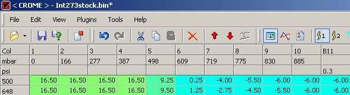

# Absolute Pressure

Absolute Pressure refers to pressure measurements made on a scale where [Absolute Vacuum](/cars/electronics/absolute-vacuum) = 0. *

- [Atmospheric Pressure](/cars/electronics/atmospheric-pressure) is approximately 14.7psi at sea level, measuring absolute pressure.
- 10psi of [Boost](/cars/electronics/boost) is approximately 24.7psi (14.7 psi [Atmospheric Pressure](/cars/electronics/atmospheric-pressure) + 10psi [Boost](/cars/electronics/boost))at sea level, measuring absolute pressure.
- Similarly, 30psi on the tire guage for your car is approximately 44.7psi [Absolute Pressure](/cars/electronics/absolute-pressure)(14.7 psi [Atmospheric Pressure](/cars/electronics/atmospheric-pressure) + 30psi tire pressure).

---

An editor that displays in [Absolute Pressure](/cars/electronics/absolute-pressure) looks like this: Column 10 is approximatly atmospheric pressure, slightly less due either to interpolation or the fact that even at [WOT](/cars/electronics/wot) there will be some vaccuum. Column 1 is somewhat arbitrary, and not true zero aka absolute vaccuum. See also [Map Sensor](/cars/electronics/map-sensor) for the values the OEM [Map Sensor](/cars/electronics/map-sensor) is capable of reading.
