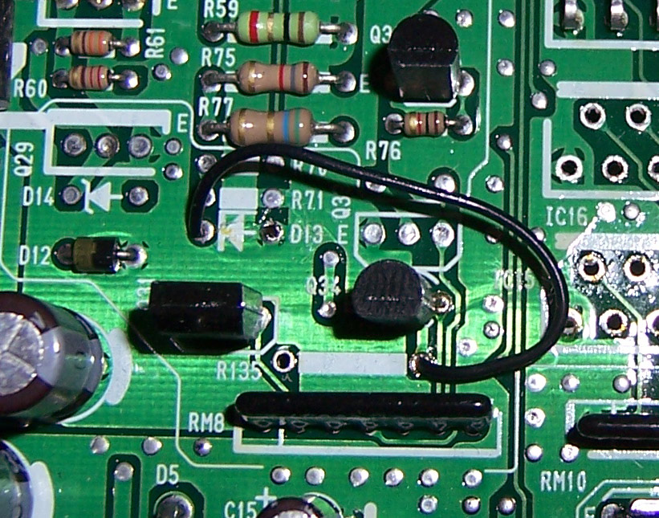
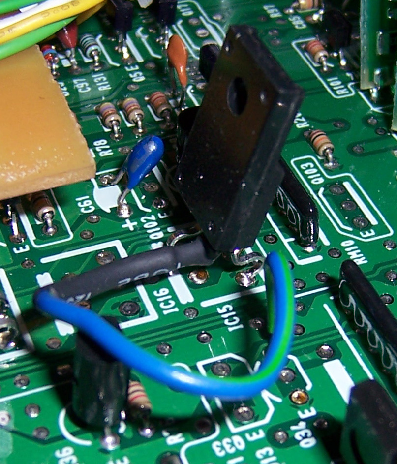
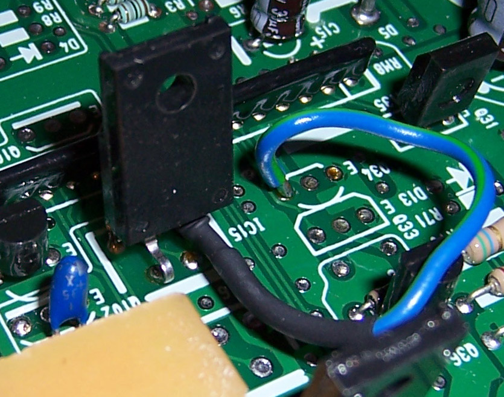

# Adding IAB Control to an OBD1 P28 ECU

The **Intake Air Bypass (IAB)** system controls dual-stage intake manifold runners on engines like the Acura Integra GS-R (B18C1) and Prelude VTEC (H22A). By opening secondary runners at a specific RPM crossover (typically 5,750 RPM), the system optimizes low-end torque and high-end horsepower.

While the Acura P72 ECU controls the IAB solenoid natively, the popular Honda P28 (Civic SOHC VTEC) ECU does not contain the necessary hardware components on the board. This guide details how to modify an OBD1 P28 ECU board to add physical IAB control.

> [!IMPORTANT]
> **Check Your Wiring Protocol First**:
> The hardware modification procedure differs depending on how your vehicle's IAB solenoid is wired. One side of the solenoid always runs to the ECU, but the other side runs to either +12V power (USDM Active-Low) or Ground (JDM/OBD2 Active-High). You must match the modification to your wiring configuration.

---

## 1. USDM OBD1 Active-Low Configuration (ECU Sinks Ground)

This is the standard configuration for USDM OBD1 B18C1 (Integra GS-R) swaps. The IAB solenoid is supplied with constant +12V power under the hood, and the ECU switches Pin **A17** to Ground to activate the runners.

### Components to Remove
* **`R135`** (only present on 11F0/1720 board revisions from automatic ECUs)
* **`R150`** (only present on 1980/LS revision boards)

### Components to Add
* **`Q17`** (A143 PNP digital transistor): Already present on USDM automatic 11F0/1720 boards. If not present, solder a new A143 transistor here.
* **`Q34`** (D1780 or C3225 NPN transistor): Already present on USDM automatic 11F0/1720 boards. If not present, you can salvage a D1780 transistor from the purge control solenoid output (Q31) if you have disabled purge control in software.
* **Jumper Wire**: Solder a jumper wire from the right hole of **`R135`** (the transistor side) to **`D13`** (the diode arrow side).

*Physical jumper wire configuration on the P28 board for active-low IAB control.*

---

## 2. JDM OBD1 / OBD2 Active-High Configuration (ECU Sends +12V)

JDM B18C engines and OBD2 vehicles wire one side of the IAB solenoid directly to Ground. The ECU must output a **+12V signal** on Pin **A19** to activate the solenoid. This requires adding a **High-Side Switch** chip (`515X` / IC15 location) to the board.

### Components to Remove
* **`Q34`** (Cut the control leg of the driver IC15 short, thread the signal wire through the hole, and solder it to the control hole of `Q34`).

### Components to Add
* **`IC15`** (515X High-Side Switch IC): Solder the 515X chip in place at location IC15.
* **`C61`** (1&mu;F 35V Tantalum Capacitor): Solder this capacitor in place to filter the high-side switch supply voltage.
* **`Q17`** (A143 transistor): If not present on your board, add a new A143 transistor.
* **Signal Wire**: Connect a wire from the cut control pin of IC15 to the control pad of Q34.

### Board Modifications (High-Side Switch)

*Overview of the High-Side Switch IC15 chip installation and wiring routing.*

*Close-up view of the signal wire soldered to the control pad of Q34.*

---

## 3. Software & ROM Configuration

Because the standard P28 Civic software has no code parameters to monitor or control IABs, modifying the physical board is only half the battle. You must configure your ROM software to support it:

1. **P72 Codebase**: Burn a modified Acura Integra P72 ROM (which natively supports IABs) onto your chipped EPROM. If your engine does not have a knock sensor, you must use a bin file with the knock sensor routine disabled (otherwise the ECU will trigger Code 23).
2. **Crome ROM Editor**: If using a custom P28 codebase in Crome, you must manually enable the **IAB Plugin** and set the desired RPM activation threshold (usually 5,750 RPM).
