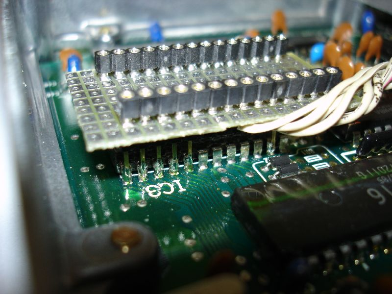
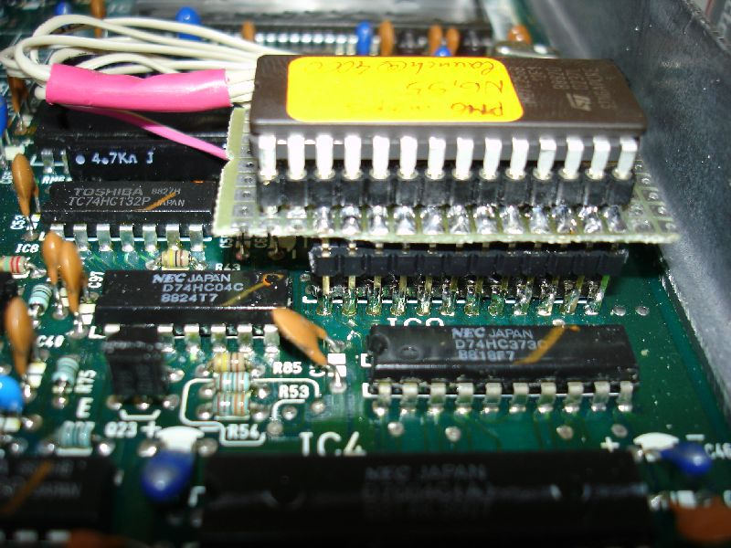

# Chipping 1988-1989 OBD0 ECUs

Most 1990-1991 OBD0 MPFI ECUs use an external 38256-compatible ROM that can be removed
and replaced. Many 1988-1989 ECUs instead use an OKI M83C154 processor with internal
ROM. The archived guide also says all 1988-1991 USDM PM8 HF ECUs use this internal-ROM
design.

This article preserves the three modification approaches and two wiring tables described
by the original pgmfi community.

> **Warning:** Disconnect the ECU from the vehicle before soldering. Verify every
> connection with a continuity tester and check for shorts before applying power.

## Enabling external ROM access

The guide says to connect Pin 31, the M83C154 external-access (`_EA`) pin, to Pin 20
(ground) so the MCU executes code from an external ROM.

> **Warning:** On PM7-B020 boards, the source says MCU Pin 31 must be disconnected from
> the PCB before it is grounded. It reports a solid CEL and intermittent operation when
> that pin remains connected. The source says to consider this on other boards only when
> normal jumpering fails and the socket wiring has no faults.

## Three documented approaches

### 1. Replace the MCU

Replace the 40-pin OKI MCU with an Intel 8051-compatible MCU containing internal ROM.
The archived guide says this requires modifying the program to remove its use of the
`A5` instruction and making further changes for Intel 8051 compatibility. It also
requires a programmer for the replacement MCU.

The source noted in January 2004 that this approach was not finished.

### 2. Install an MCU daughterboard

Replace the 40-pin MCU with a daughterboard containing:

- A socket for the original OKI MCU
- A 74HC373 address latch
- An external EPROM socket
- Hardware that configures `_EA` for external ROM

This approach keeps the original OKI MCU and therefore does not require the same program
changes, but it requires a circuit board, additional components, and more soldering.

### 3. Wire an external EPROM

Install a 28-pin EPROM socket and connect it to the MCU and address latch. The source
describes a direct flywire method and an XRAM piggyback method.

## Flywire mapping

This table is a direct pin mapping from the archived page.

| EPROM pin | M83C154 MCU pin | 74HC373 pin |
| :---: | :---: | :---: |
| 1 | 40 | - |
| 2 | 25 | - |
| 3 | - | 19 |
| 4 | - | 2 |
| 5 | - | 16 |
| 6 | - | 5 |
| 7 | - | 15 |
| 8 | - | 6 |
| 9 | - | 12 |
| 10 | - | 9 |
| 11 | 39 | - |
| 12 | 38 | - |
| 13 | 37 | - |
| 14 | 20 | - |
| 15 | 36 | - |
| 16 | 35 | - |
| 17 | 34 | - |
| 18 | 33 | - |
| 19 | 32 | - |
| 20 | - | 10 |
| 21 | 23 | - |
| 22 | 29 | - |
| 23 | 24 | - |
| 24 | 22 | - |
| 25 | 21 | - |
| 26 | 26 | - |
| 27 | 27 | - |
| 28 | 20 in source table; see note | - |

> **Note:** The archived flywire table lists MCU Pin 20 for EPROM Pin 28, but a later
> clarification on the same page says EPROM Pins 28 and 1 both connect to MCU Pin 40
> (+5 V). Pin 20 is identified as ground elsewhere on the page. Verify the circuit
> before wiring.

## XRAM piggyback mapping

The alternative method mounts the EPROM socket on a small prototyping board above the
external RAM. The source warns that the stacked assembly can cause clearance problems
and does not recommend this method for people new to soldering.

| EPROM pin | M83C154 MCU pin | External RAM pin |
| :---: | :---: | :---: |
| 1 | 40 | - |
| 2 | 25 | - |
| 3 | - | 1 |
| 4 | - | 2 |
| 5 | - | 3 |
| 6 | - | 4 |
| 7 | - | 5 |
| 8 | - | 6 |
| 9 | - | 7 |
| 10 | - | 8 |
| 11 | - | 9 |
| 12 | - | 10 |
| 13 | - | 11 |
| 14 | - | 12 |
| 15 | - | 13 |
| 16 | - | 14 |
| 17 | - | 15 |
| 18 | - | 16 |
| 19 | - | 17 |
| 20 | Connect to EPROM Pin 14 | - |
| 21 | 23 | - |
| 22 | 29 | - |
| 23 | 24 | - |
| 24 | 22 | - |
| 25 | - | 23 |
| 26 | 26 | - |
| 27 | 27 | - |
| 28 | Connect to EPROM Pin 1 | - |

The source clarifies that EPROM Pin 20 connects to EPROM Pin 14 and RAM Pin 12 for
ground, while EPROM Pins 28 and 1 connect to MCU Pin 40 for +5 V. It again says to
connect MCU Pin 31 to MCU Pin 20 to select external ROM.

## Piggyback installation photos

*Daughterboard socket, top view.*

*Daughterboard socket, bottom view.*

*Header pins soldered to the external RAM.*

*Completed XRAM connections.*

*Completed installation stacked on the ECU board.*
