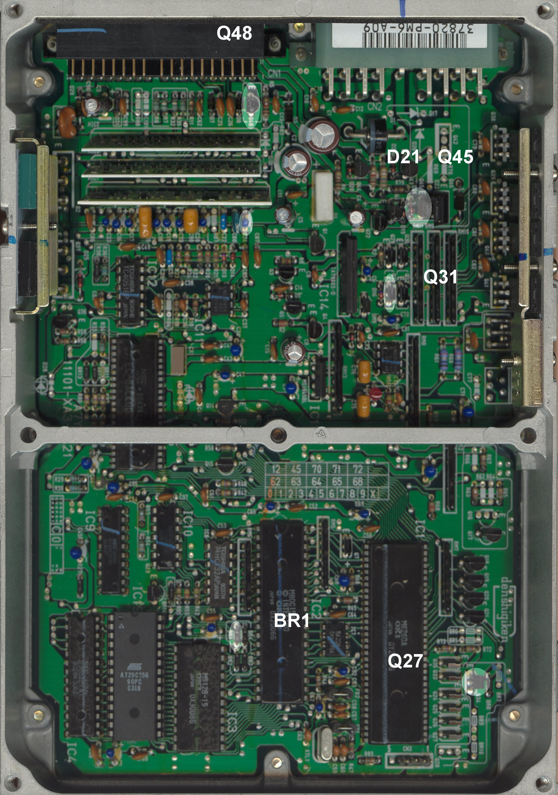

# USDM vs. Canadian OBD0 PM6 ECU Differences (ELD Bypass)

The OBD0 PM6 ECU is the factory engine control unit for the 1988–1991 Honda Civic Si and CRX Si. While the fuel and ignition tables stored on their ROM chips are identical, there is a physical hardware difference between ECUs sold in the United States and those sold in Canada. 

This difference relates to the **Electrical Load Detector (ELD)** circuit.

---

## 1. The Electrical Load Detector (ELD) System

The ELD is a sensor located inside the engine bay fuse box. It monitors the electrical current draw from the alternator and battery (such as headlights, blower motors, and radiator fans). The ELD signals the ECU, allowing it to increase the engine idle speed or adjust alternator output to prevent battery drain.

*   **USDM Civic / CRX:** Equipped with an ELD in the engine fuse box. The USDM PM6 ECU actively monitors this sensor input pin (pin B14 on the OBD0 connector).
*   **Canadian Civic / CRX:** These models were not built with an ELD. The Canadian-spec PM6 ECU has this sensor monitoring circuit disabled in the hardware.

### Mismatch Symptoms (Code 20)
If you install a USDM PM6 ECU in a Canadian vehicle, or into an engine swap chassis that lacks ELD wiring, the ECU will detect a missing sensor voltage. This triggers **Code 20 (Electrical Load Detector)**. While Code 20 does not put the engine into limp mode, it triggers a Check Engine Light (CEL) and can interfere with active serial datalogging.

---

## 2. Hardware Bypass Conversion (BR1 Jumper)

Because the software ROM is identical, the ECU's ELD behavior is dictated entirely by a physical wire jumper on the board labeled **`BR1`**. 

To bypass Code 20 and convert a USDM ECU to Canadian specifications:
1.  Open the ECU case.
2.  Locate jumper **`BR1`** on the main circuit board.
3.  Desolder and remove the `BR1` jumper wire (or cut the wire with wire snips), leaving the circuit open.

Once `BR1` is open, the ECU will stop monitoring the ELD input pin, and the Code 20 CEL will be permanently deactivated.

---

## 3. Board Reference Images

Below are scans comparing the two board layouts:

### Canadian PM6-C00 Board
Note the open solder pads where the `BR1` jumper is omitted:

*Canadian-market PM6-C00 board layout.*

### USDM PM6-A09 Board
Note the populated `BR1` jumper wire installed near the edge connector:

*USDM-market PM6-A09 board layout.*
