# DIY Easy-RTP v1.0 build and installation guide

**Real-Time Programming (RTP)** allows tuners to edit an ECU's fuel and ignition maps in real-time while the engine is running, eliminating the need to shut down the engine, burn a new EPROM chip, and swap it out for every tuning iteration.

The **Easy-RTP v1.0** is a classic DIY EPROM emulator board. It is a single-sided printed circuit board (PCB) designed to house a 28-pin Non-Volatile SRAM (NVSRAM) chip (like the Dallas DS1230Y), interfacing directly with a standard socketed Honda OBD1 ECU.

> **Warning:** This archived design requires board-level soldering and live ECU memory
> changes. Disconnect power while wiring and verify all cuts and jumpers with a
> multimeter before applying power.

*Eagle CAD trace layout diagram for the Easy-RTP v1.0 PCB.*

---

## Parts list

To assemble the Easy-RTP board, you will need the following electronic components:

### Core components
* **NVSRAM IC**: Dallas/Maxim **DS1230Y** (or compatible 32KB 28-pin 600-mil DIP NVSRAM from TI, ST, Simtek, or ZMD).
* **Logic Gate IC**: **74HC00** (Quad 2-input NAND gate) in a standard DIP package.
* **Capacitors**: Two **0.1 uF** ceramic capacitors.
* **Resistors**: Two **10 kohm** resistors.
* **ECU Interface Headers**: Two **1x14 pin headers** (0.1" pitch, machine pin headers recommended for socket reliability).
* **ROM Socket**: One **28-pin DIP Socket** (to hold the NVSRAM chip).

### Optional components for 27C256 emulation

The source says these parts are required when 27C256 emulation is needed for a
programmer that cannot natively program the selected NVSRAM. It reports that a
programmer's 28C256 setting often worked, with blank-check disabled on one tested
programmer.

* **Resistors**: One **10 kohm** and one **100 kohm** resistor.
* **NPN Transistor**: One generic NPN switching transistor (**2N4401** or equivalent).
* **Diode**: One switching diode (**1N4148** or equivalent).

---

## Assembly procedure

To assemble the board, orient the PCB with the traces facing up (bottom view) to install the interface headers, then flip the board (traces on the bottom) to install the remaining components.

1. **Install Interface Headers**: Solder the two 1x14 pin headers from the bottom (trace side). These pins will plug directly into the ECU's 28-pin ROM socket.
2. **Install NVSRAM Socket**: Flip the board over. Solder the 28-pin DIP socket in the top set of holes. Ensure the chip alignment notch faces **Left**.
3. **Install J1 Jumper**: Solder a 3-pin male header or a 3-wire jumper at the **J1** jumper location.
4. **Solder capacitors**: Install the two 0.1 uF capacitors at **C1** and **C2**.
5. **Solder core resistors**: Solder the 10 kohm resistors at **R1** (left) and **R2** (center).
6. **Configure emulation mode**:
   * **Without 27C256 emulation**: Solder a solid wire jumper or a 0-ohm resistor across **D1**. Skip to final step.
   * **With 27C256 emulation**: Solder the **1N4148** diode at **D1**, the NPN transistor at **Q1**, the 10 kohm resistor at **R3** (top), and the 100 kohm resistor at **R4** (bottom).
7. **Install the logic IC and NVSRAM**: Solder the **74HC00** IC in place. Insert the
   **DS1230Y** NVSRAM into its socket.

### Assembly photos

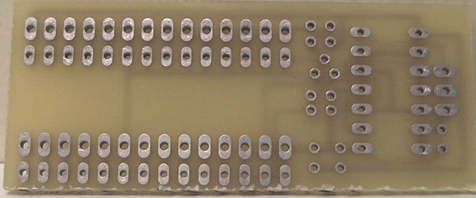
*Top of the raw PCB.*

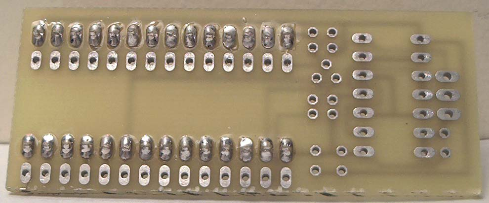
*ECU interface pins inserted from the bottom.*

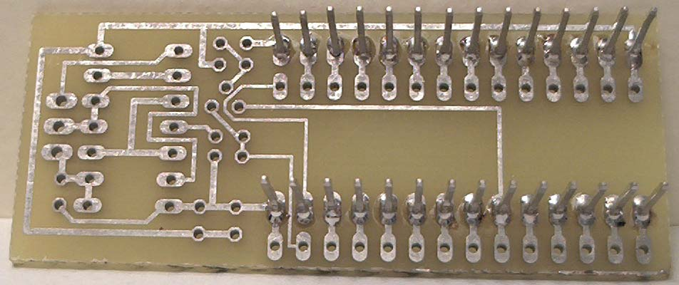
*Interface pins soldered on the trace side.*

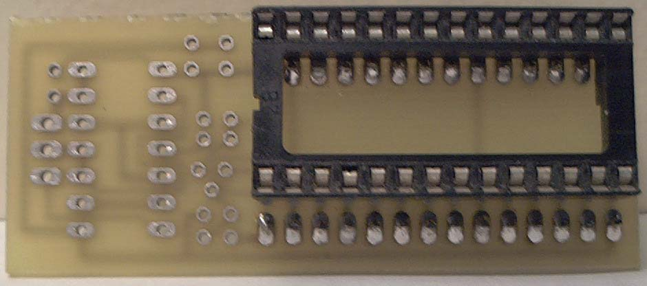
*NVSRAM socket from the component side.*

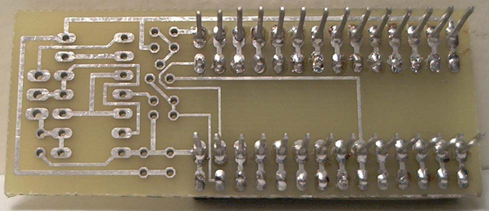
*NVSRAM socket solder joints.*

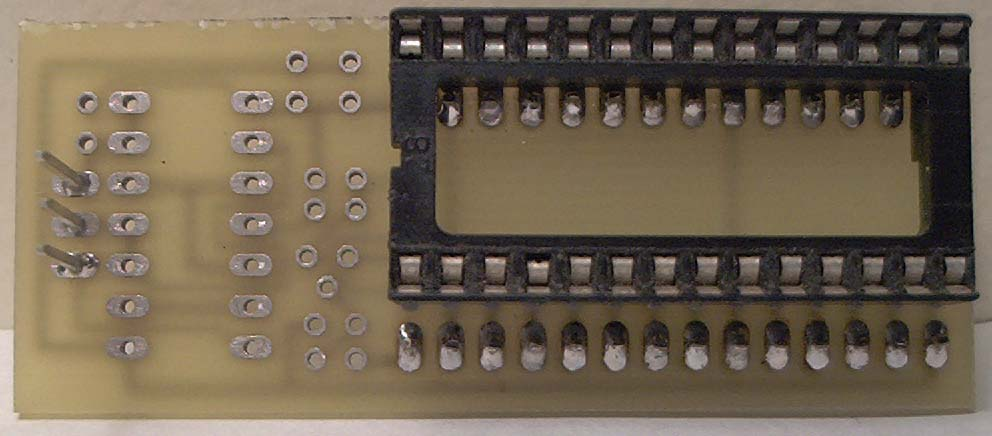
*J1 header installed.*

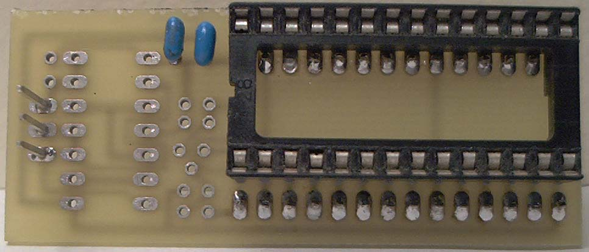
*C1 and C2 installed.*

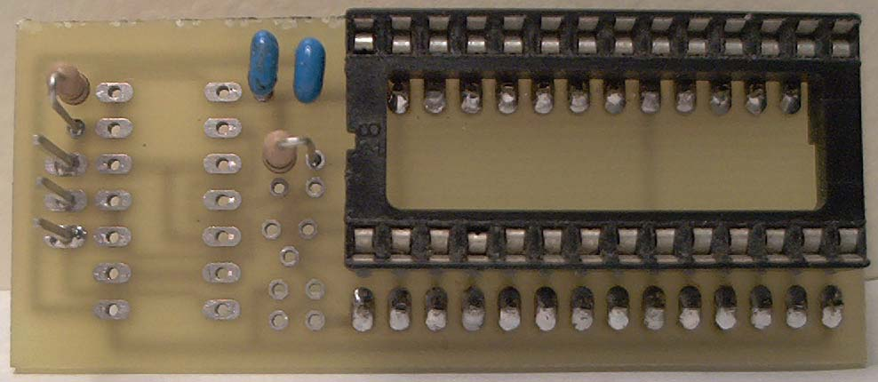
*R1 and R2 installed.*

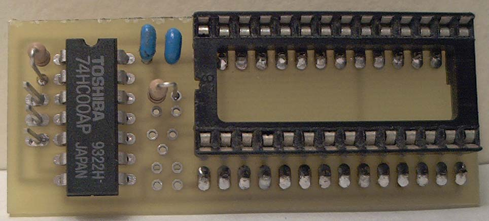
*74HC00 logic IC installed.*

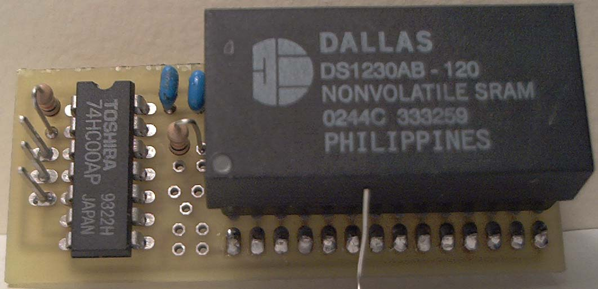
*Completed board with DS1230Y installed.*

---

## OBD1 installation reference

The archived page includes two images documenting an original OBD1 installation and the
location where its designer cut the write-enable line. It does not provide a complete
text pin-by-pin installation procedure. Verify the circuit against the Easy-RTP design
files and the target ECU before reproducing the modification.

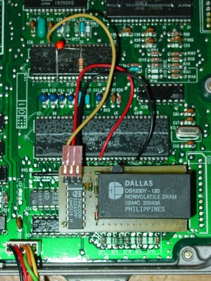
*Completed Easy-RTP module installed piggybacked into a USDM OBD1 ECU.*

*Highlighting the exact location to slice the trace on the bottom of the OBD1 board to isolate the write pin.*

---

## OBD0 modification

To run the Easy-RTP v1.0 board on an OBD0 ECU, you must modify the chip-select and write control signals because OBD0 boards handle ROM addressing differently.

### Additional components
* One **74LS86N** (Quad 2-input XOR gate) IC.
* One **10 kohm** resistor.
* Thin insulated jumper wire.

### Modification steps

> **Warning:** The archived OBD0 instructions depend on three externally hosted marked-up
> images that are not present in the archive. They also call the piggybacked base IC a
> `74LS00`, while the main Easy-RTP parts list specifies a `74HC00`. Verify the circuit
> before attempting this incomplete procedure.

1. **Cut Board Traces**: Cut the control traces marked in red on the PCB layout.
2. **Prepare the XOR gate**: Cut or break off every 74LS86N pin except Pins 4, 5, 6, 7,
   and 14.
3. **Piggyback the XOR gate**: Mount the **74LS86N** IC on the base NAND IC. Solder only
   Pins 4, 7, and 14 to the corresponding pins below.
4. **Connect signal gates**: Bend Pins 5 and 6 upward and make the connections shown in
   the missing source images.
5. **Isolate ECU Pin 16**: Cut the connection to ECU Pin 16 on both sides of the board,
   then reconnect the interrupted original circuit so only the ECU pin remains isolated.
6. **Connect the RTP board**: Connect one RTP wire from its input to isolated ECU Pin 16,
   and connect the other RTP wire to Pin 21 of the ECU's 24-pin M5128 SRAM.

---

## Design files
* [Easy-RTP v1.0 Eagle CAD Files (ZIP)](easyrtpv1-eagle.zip)
* [Easy-RTP v1.0 Board Schematic PDF](rtp_EasyRtpV10-v1.pdf)
