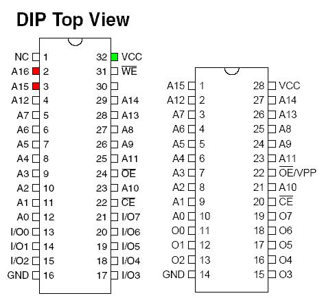

# ECU Hardware

This page describes how the hardware in an [ECU](/cars/electronics/ecu) works, and fun things you can do with it. If you are just wanting to learn how to chip your [ECU](/cars/electronics/ecu), you should look at What You Need instead. If you are looking for detailed information about what is going on inside a particular program, you might want to look at Rom Maps. Honda definitely did not reinvent the wheel in terms of [ECU](/cars/electronics/ecu) technology for `each` new motor they released. `Each` "family" of [ECU](/cars/electronics/ecu) generally shares one or more PCBs that are populated with different components in order to run different motors. This really opens the door for ECUHardware Mods. Additionally, there are design peculiarities that carry over from one family to another. [ECU](/cars/electronics/ecu) Families:

- OBD0 Vacuum Advance [ECU](/cars/electronics/ecu)s from pre-88 cars lacking electronic advance distributors share some common features.
- OBD0 DPFI [ECU](/cars/electronics/ecu)s from 88-91 cars are useless bastards that are 2 injectors short of being useful
- OBD0 MPFI non-vtec [ECU](/cars/electronics/ecu)s from 88-91 are a definite family.
- OBD0 VTEC ECUs like the PW0 and PR3 are a definite family.
- OBD1 Civic Integra ECUs are a definite family.
- OBD1 Prelude Accord [ECU](/cars/electronics/ecu)s are a definite family.
- V6ECUs from the Acura/Rover/Honda Legend V6 cars, NSX and (?) V6 Accord have many common features.
- OBD2 A [ECU](/cars/electronics/ecu)s are quite similar.
- OBD2 B [ECU](/cars/electronics/ecu)s are quite similar.
- OBD2 K [ECU](/cars/electronics/ecu)s are an evolution of OBD2B [ECU](/cars/electronics/ecu)s designed to run K-series motors

If you want to learn about how the Oki 66K MCU works, you should look at 66k Assembler Docs. There are many ECUHardware Mods you can do to change how [ECU](/cars/electronics/ecu) hardware works. Honda often used MCUs that had internal (on-chip) programs. These were often copy protected. There are Mcu Readers to defeat the copy protection. Ever wonder who designed honda's [ECU](/cars/electronics/ecu)s? Kehein Indiana Precision Technology is to blame... It is possible to switch between more than one program on your oversized EEPROM. All you need to do is add a pullup resistor to the extra address lines (A15, A16, Etc.), then to switch them, just add a debounced switch to the address lines to ground them. **Here is a diagram of 28 &amp; 32 pin EEPROMS:**- EEPROM pinouts: 
     

  **Attachment:**  **Modify:**  **Size:**  **Date:**  **Who:**  **Comment:**   [1.32\_pin-2-28PinIC.jpg](1.32_pin-2-28PinIC.jpg)  mod  39713  06 Feb 2007 - 01:39  Jared Karagen  EEPROM pinouts
