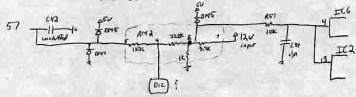
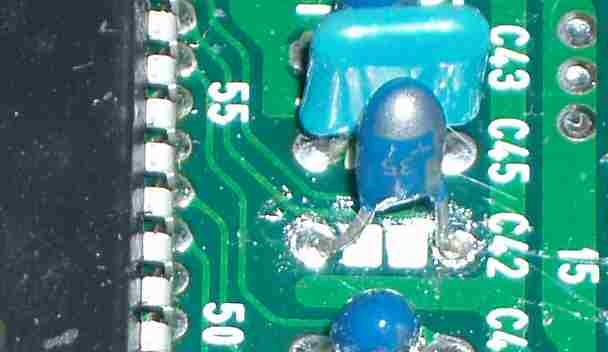

# Logging an external 0-5 V sensor through P30 D12

This archived method uses the undocumented D12 analog input on a USDM OBD1 P30 ECU to record an external 0-5 V signal, such as the output from an EGT amplifier or wideband O2 controller.

> [!WARNING]
> The source only documents direct testing on a USDM P30. It suggests that other USDM OBD1 ECUs should share the circuit and says a USDM P28 appears similar, but leaves that compatibility unconfirmed. JDM P30 ECUs use a different, incomplete D12 circuit.

## D12 analog input

On the documented USDM P30, D12 leads to the `66207`'s AI3 input at Pin 57. The archived schematic identifies the analog-input circuit around that connection.

*Archived schematic of the USDM P30 analog-input section.*

The source describes the logged data as follows:

| Item | Archived description |
| --- | --- |
| Input range | 0-5 V applied at D12 |
| Main logged byte | RAM `0067h` |
| Main-byte scale | Approximately 0.02 V per count, from `00h` at 0 V to `0FFh` at 5 V |
| Additional ADC bits | RAM `0066h` contains the two least-significant bits of the 10-bit ADC result |
| Reported signal loss | About 1% from D12 to AI3 at `66207` Pin 57 |

The author considered the extra two ADC bits unnecessary for EGT logging. The page reports the voltage loss but does not document how it was measured or provide calibration data.

## Optional `C42` filter from the source

The stock USDM ECU documented by the source had no component installed at `C42`. The archived recommendation was to install a `1 uF`, `35 V` tantalum capacitor there to smooth the ADC input, with its positive side facing away from the `66207` and matching the orientation of the other capacitors in that row.

*Archived photo showing the added `C42` capacitor.*

> [!WARNING]
> Capacitor polarity and board layout must be verified on the actual ECU. The archived recommendation was not documented for every P30 board revision or other ECU type.

## JDM P30 difference

The source says the USDM P30 grounds AI5, while the JDM P30 grounds AI3 and routes D12 to AI5 at `66207` Pin 63. The JDM D12 path also has uninstalled components and must be modified before it can be used as described.

See the [archived JDM P30 D12 modification](/cars/electronics/japanese-domestic-market-p30d12-modification) for the circuit changes and its unresolved AI5 software caution.

## Uses described by the source

The archived page discusses these possible uses for D12:

- EGT logging from a thermocouple amplifier with a 0-5 V output.
- Wideband O2 logging while leaving the stock narrowband O2 input unchanged.
- A software-interpreted switch input with a pull-up resistor.

The switch idea was only a programming concept in the source. It would also consume D12, preventing simultaneous EGT or other external-sensor logging.

## Related

- [Honda ECU datalogging overview](/cars/electronics/data-logging)
- [JDM P30 D12 analog-input modification](/cars/electronics/japanese-domestic-market-p30d12-modification)
- [Wideband O2 overview](/cars/electronics/wide-band-o2)
- [Exhaust gas temperature sensor](/cars/electronics/exhaust-gas-temp-sensor)
