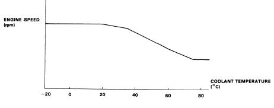

# Idle Air Control Valve

The Idle air control valve, or IACV regulates the car's idle based on the coolant temperature.

- Target idle settings vs. [ECT](/cars/electronics/ect): 
     

Note: this is [ECU](/cars/electronics/ecu) controlled and can be altered.
