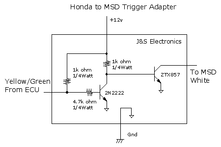

# Ignitor Replacement

It is possible to replace the ignitor in the distributor with a solid state circuit to trigger the input of a MSD/Crane/etc.

---

Dave: Note that the ZTX857 is not an absolute requirement. It's just that it was the same size as the transistor it replaced. You could use any power Darlington NPN that can handle a couple amps. Mirror away. John at jands.com (J&S Safeguard) ---

schematic: 
 
