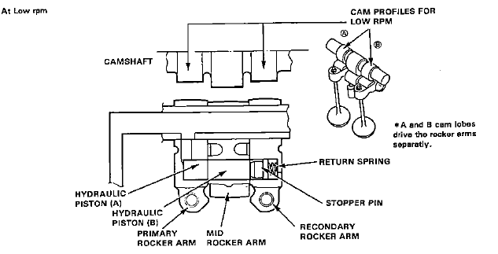

# Low Cam

In a VTEC motor, the [Low Cam](/cars/electronics/low-cam) is used at low [RPM](/cars/electronics/rpm)s. Generally, this Cam Shaft is optimized for fuel economy and a smooth idle. See also: [High Cam](/cars/electronics/high-cam)

- [Low Cam](/cars/electronics/low-cam) of VTEC camshaft: 
     

| **Attachment:** | **Modify:** | **Size:** | **Date:** | **Who:** | **Comment:** | | :--- | :--- | :--- | :--- | :--- | :--- | |  [vteclow.gif](vteclow.gif) | mod | 9775 | 30 Mar 2004 - 08:06 | tekphobia | [Low Cam](/cars/electronics/low-cam) of VTEC camshaft |
