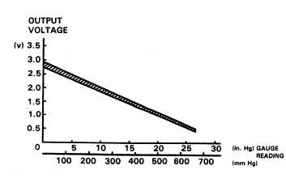
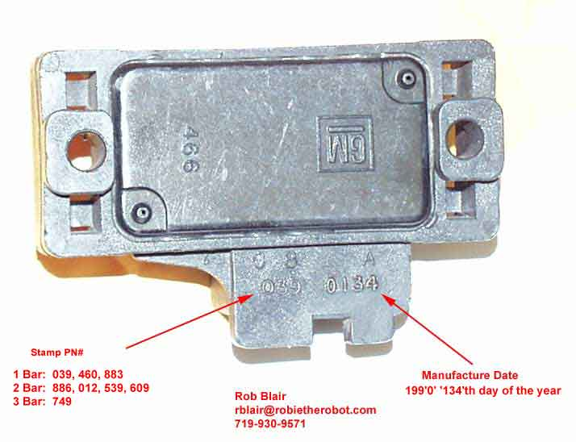
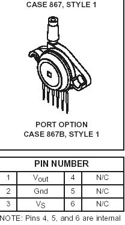
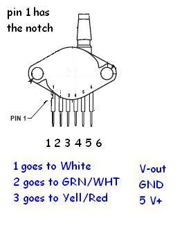

# MAP Sensor

The Manifold Absolute Pressure (MAP) sensor measures absolute pressure inside the intake manifold relative to a perfect vacuum. The ECU uses this data to calculate air mass and determine the appropriate fuel delivery.

## Overview

Unlike mass air flow (MAF) systems which directly measure incoming air volume, Honda PGM-FI systems use a speed-density calculation. By combining intake manifold pressure (MAP) with engine speed (RPM) and intake air temperature (IAT), the ECU estimates the mass of air entering the cylinders.

### Stock Honda MAP Sensor
The factory Honda MAP sensor is a 1.8 bar absolute sensor. It outputs a linear voltage relative to pressure:
*   **Key On, Engine Off (Atmospheric):** ~2.85V
*   **Maximum OBD0 Read Limit:** ~9.25 psi (1.63 bar absolute / ~4.5V)
*   **Maximum OBD1 Read Limit:** ~10.65 psi (1.73 bar absolute / ~4.8V)

Due to its physical diaphragm construction, the sensor cannot achieve the full 5V reference return, which limits its maximum pressure reading. If you plan to run boost levels higher than 9–10 psi, you must upgrade to an aftermarket MAP sensor (e.g., GM 3-Bar or Motorola 2.5-Bar).

## Specifications

### GM MAP Sensors
GM 2-Bar, 2.25-Bar, and 3-Bar MAP sensors can be calibrated by measuring the voltage at atmospheric pressure and at a known boost level to calculate the linear slope.
*   **GM 3-Bar Sensor:** Outputs ~1.6V at atmospheric pressure (key on, engine off).

*GM MAP sensor identification guide.*

### Motorola 2.5 Bar Sensor (MPX4250AP)
*   **Digi-Key Part Number:** `MPX4250AP-ND`
*   **Pigtail Connector Digi-Key Part Number:** `A19034-ND`
*   **Pinout Note:** Pins 4, 5, and 6 are internal connections and should be cut off or left unconnected. Pin 1 is indicated by the notch in the lead.

## Wiring Reference

### GM MAP Sensor Wiring

| Signal | Honda Wire Color | GM Pin |
| :--- | :--- | :--- |
| **+5V Reference** | Yellow/Red | C |
| **Ground** | Green/White (or Green) | A |
| **Signal** | White (or Red/Green) | B |

### Motorola 2.5 Bar MAP Sensor Wiring

| Motorola Pin | Description | Connection |
| :--- | :--- | :--- |
| **Pin 1 (Vout)** | Signal | Connect to stock MAP reference signal wire (White) |
| **Pin 2 (GND)** | Ground | Connect to stock MAP ground wire (Green) |
| **Pin 3 (Vs)** | +5V Power | Connect to stock MAP 5V reference wire (Yellow/Red) |

## Procedure

### Installing an Aftermarket Motorola 2.5 Bar MAP Sensor

1.  **Locate stock wiring:** Turn the key to the ON position (engine off) and use a digital multimeter (DVOM) to identify the stock wires:
    *   **5V Power:** Outputs exactly 5V relative to ground.
    *   **Ground:** Shows continuity to chassis ground.
    *   **Signal:** Outputs the return voltage (approx. 2.85V at atmospheric pressure).
2.  **Splice the wires:** Rather than cutting off the factory connector, splice into the wires just behind the connector. This allows you to revert to the stock MAP sensor easily if needed.
3.  **Prepare the Motorola sensor:** Cut off pins 4, 5, and 6 on the Motorola sensor to prevent them from contacting anything.
4.  **Solder connections:** Connect Pin 1 (Vout) to the stock MAP signal wire, Pin 2 (GND) to the ground wire, and Pin 3 (Vs) to the 5V power wire.
5.  **Protect connections:** Slide heat shrink tubing or wrap electrical tape securely around all pins to insulate them from moisture and shorts.
6.  **Run vacuum line:** Connect a vacuum hose from a source on the intake manifold to the sensor nipple.
7.  **Secure the sensor:** Mount the new MAP sensor securely in the engine bay.
8.  **ECU Calibration:** You must update your ECU's ROM/BIN file with a calibration suited for the 2.5 Bar sensor using a BIN editor (like Crome or Uberdata) before running the engine.
