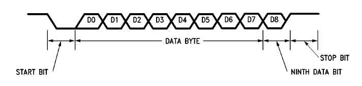

# Multiprocessor Mode

MULTIPROCESSOR COMMUNICATIONS In applications where multiple controllers jointly perform a task, the master controller must be able to communicate selectively with individual slaves. To do this, the master first identifies the target slave (or slaves) with an address byte and then transmits a block of data. The target slaves must be able to identify their own address before receiving any data bytes. The serial port on the 8051 provides a 9-bit mode to facilitate multiprocessor communication. The 9th bit allows the controller to distinguish between address and data bytes. In this mode, a total of 11 bits are received or transmitted: a start bit (0), 8 data bits (LSB first), a programmable 9th bit, and a stop bit (1). See Figure below. The 9th bit is set to 1 to identify address bytes and set to 0 for data bytes. A typical data stream is seen below: ADDRESS BYTE / DATA BYTE / DATA BYTE / . . . D8 e1 D8 e0 D8 e 0 Initially the slave is set up to only receive address bytes. Once it receives its own address, the slave reconfigures itself to receive data. On the 8051 serial port, an address byte interrupts all slaves for an address comparison. On the 83C51FA, however, Automatic Address Recognition allows the addressed slave to be the only one interrupted; that is, the address comparison occurs in hardware, not software. With this feature, the master controller can establish communication with one or more slaves without all the slaves having to respond to the transmission. 

| **Attachment:** | **Modify:** | **Size:** | **Date:** | **Who:** | **Comment:** | | :--- | :--- | :--- | :--- | :--- | :--- | |  [mpcomm.jpg](mpcomm.jpg) | mod | 24229 | 03 Jun 2005 - 10:05 | hondainfo | |
