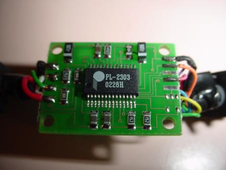
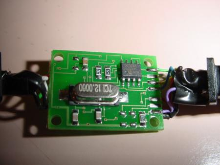
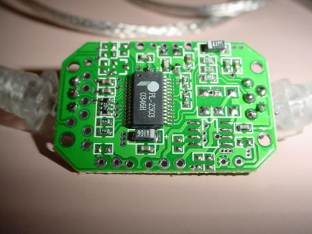
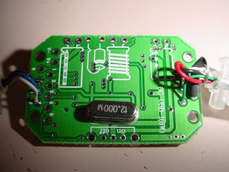

# DIY Datalogging Cable via Nokia FBUS Modification

Datalogging from an OBD1 Honda ECU requires converting the 5V Transistor-Transistor Logic (TTL) serial signal from the ECU's `CN2` header into a standard USB signal that a laptop can read. 

A classic and highly cost-effective method to achieve this is modifying a legacy Nokia FBUS mobile phone data cable (originally sold for Nokia 3200, 5100, and 6100 series phones). These cables contain a **Prolific PL-2303 USB-to-TTL serial transceiver** chip embedded inside the USB plug housing, which provides a high-speed, jitter-free connection for tuning suites.

---

## 1. CN2 Header Pinout & Safety Warning

The OBD1 Honda ECU sends and receives serial data on the **CN2** header port (located on the right side of the ECU board). 

> [!CAUTION]
> Pin 5 on the CN2 header carries raw 12V battery voltage. Never connect this pin to your USB adapter or laptop. Doing so will instantly destroy the serial adapter chip, your laptop's USB port, and potentially the laptop itself.

| CN2 Pin | Function | Connection |
| :---: | :--- | :--- |
| **Pin 1** | Ground (GND) | Connect to Cable Ground |
| **Pin 2** | ECU Transmit (TX) | Connect to Cable Receive (RX) |
| **Pin 3** | +5V Logic Power | *Unconnected* (USB port supplies power) |
| **Pin 4** | ECU Receive (RX) | Connect to Cable Transmit (TX) |
| **Pin 5** | +12V Power | **DO NOT CONNECT** |

---

## 2. Wiring Mappings

To modify the cable, cut off the proprietary Nokia phone plug end and expose the internal wires. Because manufacturers used different wire configurations, you must identify your cable type.

### Option A: RadioShack USB Cable (Part #170-0787)
This cable uses a more complex internal circuit board but provides highly stable communication:
*   **Brown Wire:** Ground. Connect to the wire shielding and solder to **Pin 1 (GND)** on the CN2 connector.
*   **Orange Wire:** Cable RX. Solder to **Pin 2 (ECU TX)** on the CN2 connector.
*   **Red Wire:** Cable TX. Solder to **Pin 4 (ECU RX)** on the CN2 connector.

| RadioShack Board Layout |
| :---: |
|  |
| *Top view of the RadioShack cable PCB with the housing removed.* |
|  |
| *Bottom view of the RadioShack cable PCB showing pin traces.* |

---

### Option B: Generic / eBay USB Nokia Cable
These generic cables feature a smaller, simpler PCB inside the USB plug:
*   **Black Wire:** Ground. Connect to the wire shielding and solder to **Pin 1 (GND)** on the CN2 connector.
*   **White Wire:** Cable RX. Solder to **Pin 2 (ECU TX)** on the CN2 connector.
*   **Blue Wire:** Cable TX. Solder to **Pin 4 (ECU RX)** on the CN2 connector.

| Generic eBay Board Layout |
| :---: |
|  |
| *Top view of the generic USB-to-TTL serial adapter board.* |
|  |
| *Bottom view showing wire solder points on the generic board.* |

---

## 3. Software Configuration

1.  **Remove `J12` Jumper:** To enable full-duplex serial communication on the OBD1 ECU, you must desolder and remove the **`J12`** jumper on the main ECU board.
2.  **Driver Installation:** Do not install Nokia phone software. Instead, download and install the generic **Prolific PL-2303 USB-to-Serial driver** directly from Prolific's official website or support archives.
3.  **Com Port Setup:** Connect the cable, identify the assigned COM port number in Windows Device Manager, and set your tuning software (e.g., Crome, Hondata, TurboEdit) to use that COM port at **38400 baud** (or the rate required by your specific ROM codebase).
