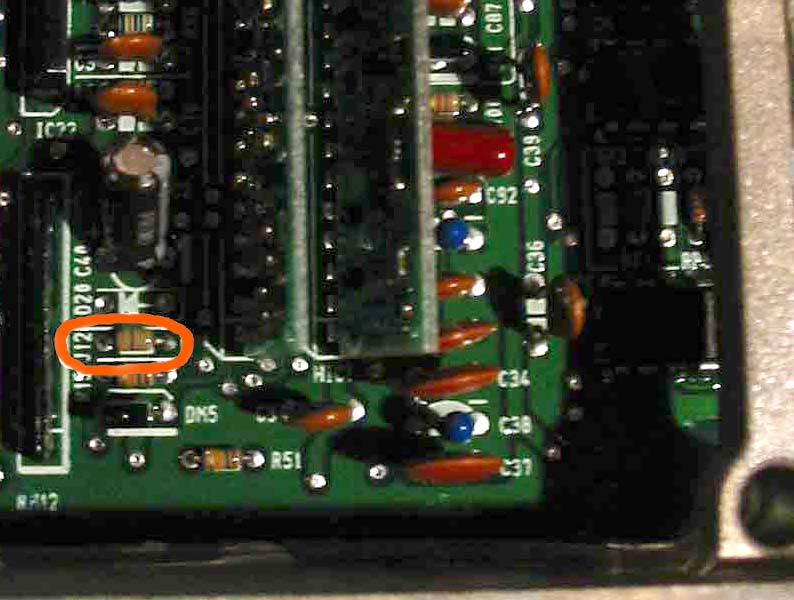

# OBD1J12

In its stock configuration, an [OBD1](/cars/electronics/obd1) car has a diagnostic connector under the dash which is wired to the [ECU](/cars/electronics/ecu)'s serial port. The [ECU](/cars/electronics/ecu)'s serial port is also wired to [CN2](/cars/electronics/obd1cn2). This diagnostic connector works in half-duplex, meaning there is only one wire which is used for receiving and transmitting by both the diagnostic tool and the [ECU](/cars/electronics/ecu), and thus only one device can transmit at once. J12, when removed, disconnects the receive line from the transmit line, so the serial port can work in full-duplex mode, meaning both devices can send to one another simultaneously through [CN2](/cars/electronics/obd1cn2). This, of course, breaks the stock diagnostic connector under the dash. However, the benefit of full-duplex mode is more reliable [Data Logging](/cars/electronics/data-logging). Some programming work is in progress to take advantage of this to log data at a much higher sample rate without clobbering any commands sent to the [ECU](/cars/electronics/ecu). On a [JDM](/cars/electronics/jdm) P30 (Small Sqaure) [ECU](/cars/electronics/ecu) it is the J4. picture of [OBD](/cars/electronics/obd)1 J12: (12/4/03 - Lego Z)
 
