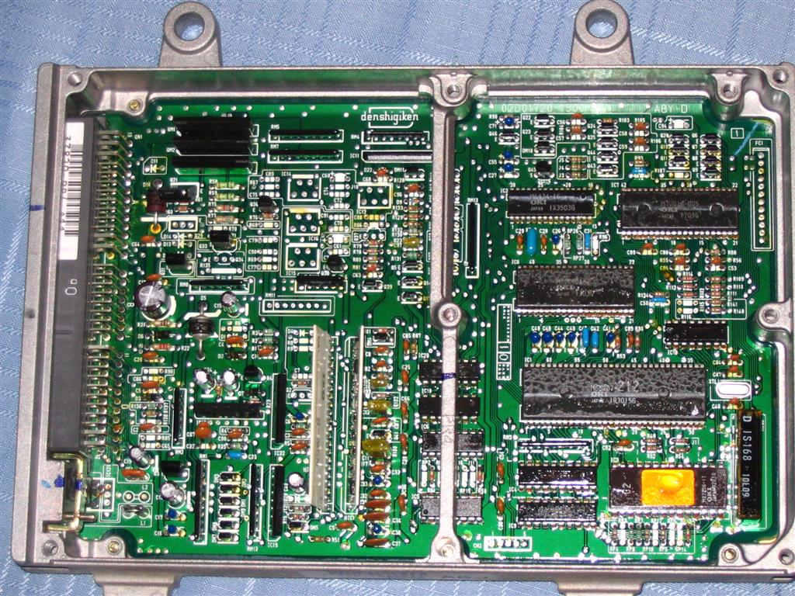
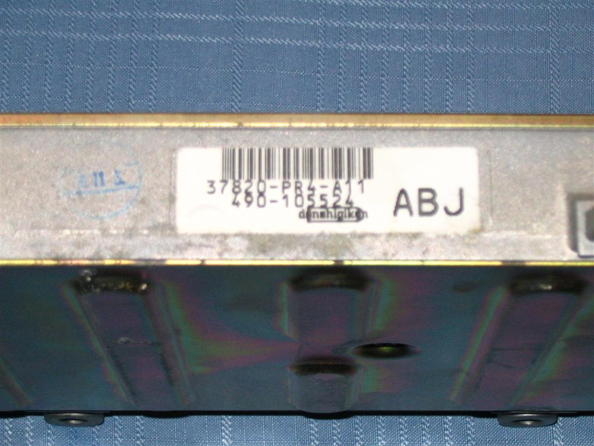
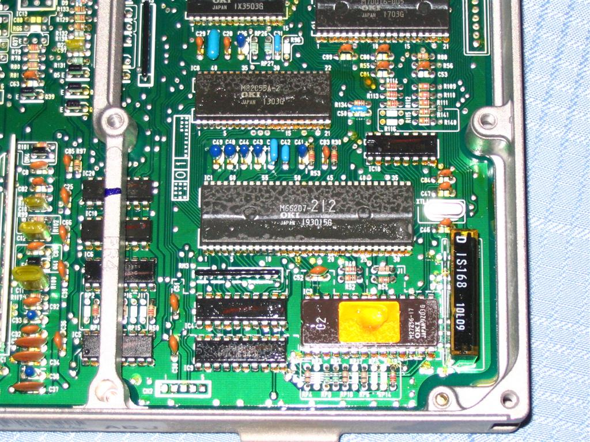

# OBD1 PR4 ECU Hardware & Reference

The **PR4** ECU is the standard OBD1 engine control unit used in the 1992–1993 Acura Integra RS, LS, and GS models equipped with the 1.8L non-VTEC B18A1 engine. 

> **Note:**
> Acura also utilized a PR4 ECU in the 1990–1991 Integra models. However, those early models are OBD0. If you are modifying a 1990–1991 unit, please refer to the [OBD0 PR4](/cars/electronics/obd0pr4) documentation.

## Board Layout and Chipping

The OBD1 PR4 shares a very similar hardware layout with other OBD1 Honda/Acura ECUs of its era (such as the [P28](/cars/electronics/p28) or [P75](/cars/electronics/p75)). As a result, it can be chipped using standard OBD1 chipping kits to accept custom ROMs (such as Crome, UberData, or Neptune).

To chip an OBD1 PR4 ECU, the following component locations must be populated:
*   **28-Pin Socket (IC3):** For the custom EPROM/EEPROM chip.
*   **74HC373 Latch (IC4):** For address demultiplexing.
*   **Resistor R54 (1k ohm):** To enable external memory addressing (or a jumper wire depending on board revision).
*   **Capacitors C1 and C2 (0.1 uF):** For noise filtering on the latch and ROM lines.

Below are hardware scans of the OBD1 PR4 board for reference:

### 1. Board Top View
The main layout of the OBD1 PR4 showing the standard component footprints:

### 2. General Board Assembly
A wider overview of the OBD1 PR4 board assembly:

### 3. Chipped Section Closeup
Detailed look at the chipped area with a 28-pin ZIF/IC socket and the 74HC373 latch installed:

### 4. Board Rear Layout
The underside of the PCB showing factory and modification solder points:

### 5. Factory Assembly Verification
Close-up of a stock OBD1 board footprint prior to modification or showing factory jumper/resistor configuration:

