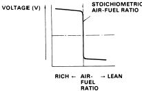
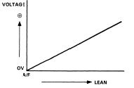

# Oxygen (O2) Sensor

The Oxygen (O2) sensor measures the oxygen content of the exhaust gases. The ECU uses this reading to determine if the engine is running rich or lean, and adjusts fuel delivery in closed-loop mode to maintain stoichiometric balance.

## Overview

Honda has used several styles of oxygen sensors over different generations:
*   **1-Wire Sensor (OBD0 / Early OBD1):** A simple unheated narrowband sensor. It relies solely on exhaust heat to reach its operating temperature (about 315°C / 600°F).
*   **4-Wire Sensor (OBD1 / OBD2):** Contains an internal heating element powered by the car's electrical system to heat the sensor quickly and maintain stable readings even at idle or light loads.
*   **5-Wire Wideband Sensor (L1H1 / LAF):** Used on lean-burn engines (such as the 1992–1995 Civic VX and 1996–1998 Civic HX). Unlike narrowband sensors, it can measure air-fuel ratios (AFR) across a wide range (from extremely lean to rich).

### Narrowband Output Characteristics
Standard 1-wire and 4-wire sensors are narrowband (lambda) sensors. They are designed to detect only one specific ratio: stoichiometric (**14.7:1 air-fuel ratio**).
*   **Stoichiometric (14.7:1):** Outputs exactly **0.45V**.
*   **Rich (AFR < 14.7):** Output swings high (up to ~0.9V–1.0V).
*   **Lean (AFR > 14.7):** Output swings low (down to ~0.1V).

Because the voltage output curve is extremely steep around the 14.7:1 mark, the sensor acts like a binary switch (rich/lean). The ECU cannot determine *how* rich or *how* lean the engine is running from a narrowband sensor; it only knows which side of stoichiometry it is on.

*Typical sharp-switching output voltage curve of a narrowband lambda sensor.*

*Linear output voltage curve of a wideband O2 sensor.*

## Wiring Reference

### Converting 1-Wire to 4-Wire O2 Sensor
When doing an OBD1 swap on an older chassis (like an EF Civic or DA Integra), you often need to wire a 4-wire heated O2 sensor to the new OBD1 ECU (e.g., P28 or P30) to prevent Heater Circuit trouble codes (Code 41).

| O2 Sensor Pin / Wire (4-Wire) | Function | Connection Point |
| :--- | :--- | :--- |
| **White** | Signal | Connect to ECU pin **D14** (O2 Signal) |
| **Green** | Sensor Ground | Connect to ECU pin **D22** (SG2 / Sensor Ground) |
| **Black (Heater)** | +12V Power | Connect to a switched 12V source (e.g., Yellow/Black wire at the distributor or main relay) |
| **Black (Heater)** | Heater Control | Connect to ECU pin **A6** (Heater Ground control) |

## Related

*   [MAP Sensor](/cars/electronics/map-sensor)
*   [Throttle Position Sensor (TPS)](/cars/electronics/tps-sensor)
*   [ECU Trouble Codes](/cars/electronics/ecu-trouble-codes)
