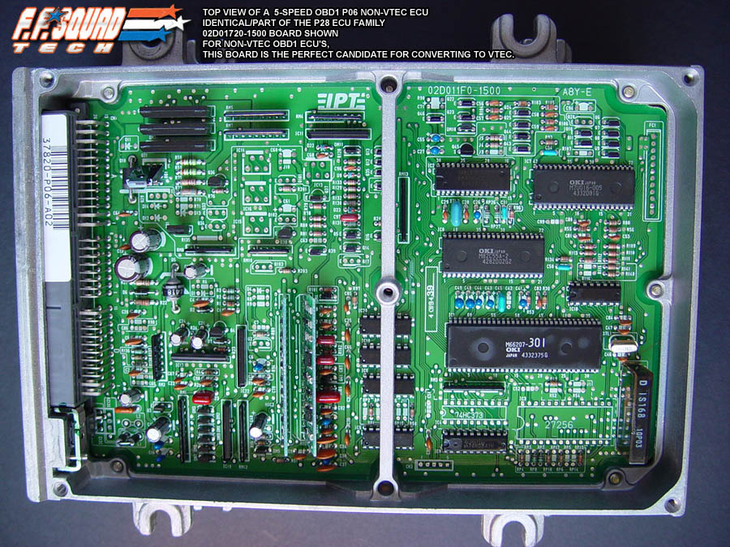

# P06

P06 92-95 [OBD](/cars/electronics/obd)1 Civic DX (D15B [SOHC](/cars/electronics/sohc) non-vtec) (Thanks Katman!)

- Thanks Katman: 
     

| **Attachment:** | **Modify:** | **Size:** | **Date:** | **Who:** | **Comment:** | | :--- | :--- | :--- | :--- | :--- | :--- | |  [P06top.jpg](P06top.jpg) | mod | 213594 | 25 Feb 2004 - 20:28 | blundar | Thanks Katman |
