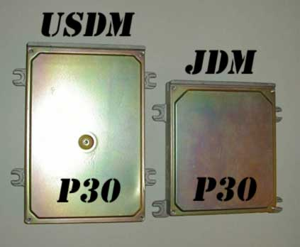

# OBD1 Honda P30 ECU Reference Guide

The P30 Engine Control Unit (ECU) is a highly sought-after OBD1 Honda ECU. Originally equipped in 1992–1995 Honda Civic SiR/SiR-II (JDM) and Del Sol VTEC (USDM/JDM) models with the DOHC VTEC B16A engine, it is the primary development codebase for most custom Honda tuning systems.

## Overview
Because the P30 contains native code routines for DOHC VTEC operation and knock sensing, its ROM structure (specifically the JDM `J11` board with `203` ROM code) has served as the baseline for many tuning programs like Crome. This guide maps out the critical memory addresses for both RAM (runtime values) and ROM (EEPROM calibration parameters) in the P30.

### Board Identification & Variations
- **JDM Small Case:** Utilizes an external ROM board socketed directly from the factory.
- **USDM Big Case:** Standard form-factor, requires socketing to add external EEPROMs.
- **EDM Big Case (P30-G01):** Sourced from the UK-spec Civic VTi, utilizes an internal ROM chip but has solder pad locations available to mount an external EEPROM.

*Comparison of JDM (small case) and USDM/EDM (large case) P30 ECU circuit boards.*

## ECU Connector Pin References
When verifying inputs and wiring, all ECU connector pin references must conform to the standard OBD1 Honda pinout mapping. Refer to the [OBD1 ECU pinout schematics](/cars/electronics/obd1-pinout) for details.

## RAM Address Mapping
Below is the memory map of active RAM addresses used for datalogging, diagnostics, and sensor feedback:

| Location | Bytes | Description | Notes |
| :--- | :---: | :--- | :--- |
| **00A3** | 1 | MAP Sensor | Manifold Absolute Pressure analog input (0V-5V, scaled `0x00`-`0xFF`) |
| **00A4** | 1 | PA Sensor | Barometric Pressure (atmospheric pressure sensor) |
| **00A5** | 1 | Previous MAP | MAP sensor reading from previous clock cycle |
| **00A7** | 1 | MAP Value | Used for lookup scalar calculations |
| **00AB** | 1 | Previous RPM | Engine speed reading from previous clock cycle |
| **00AC** | 2 | Current RPM | Engine speed (OBD1 16-bit RPM value) |
| **00B4** | 1 | VSS Sensor | Vehicle Speed Sensor value in km/h |
| **00B8** | 1 | Current TPS | Throttle Position Sensor analog input (0V-5V) |
| **00BA** | 1 | Previous TPS | TPS reading from previous clock cycle |
| **00C0** | 1 | IAT Sensor | Intake Air Temperature sensor reading |
| **00C1** | 1 | ECT Sensor | Engine Coolant Temperature sensor reading |
| **00C2** | 1 | O2 Sensor | Oxygen Sensor signal |
| **00C3** | 1 | IACV Duty | Idle Air Control Valve output duty cycle |
| **00C4** | 1 | ELD | Electrical Load Detector reading |
| **0111.1** | 1b | VTEC Solenoid Feedback | Indicates if the VTEC solenoid circuit is active |
| **0123.3** | 1b | Overheat Indicator | Set to 1 if IAT exceeds 150°F (65°C) |
| **0116.3** | 1b | Auto/Manual Jumper | Hardware jumper check. 1 = Automatic, 0 = Manual transmission |
| **011F.1** | 1b | VTEC Flag Active | Active status flag used to switch fuel/ignition map tables |
| **011F.2** | 1b | VTEC Line Active | Output state for ECU VTEC solenoid pin (A4) |
| **0128.0** | 1b | VTEC VSS Status | 1 if VTEC vehicle speed check has passed, 0 otherwise |
| **0210.3** | 1b | PSP Switch Input | Power Steering Pressure switch status. 1 if grounded |
| **0210.5** | 1b | VTEC Solenoid Feedback | Active VTEC hardware loop check |
| **0210.7** | 1b | SCS Switch Input | Service Connector Switch (diagnostic jumper). 1 if grounded |
| **0211.0** | 1b | Starter Signal | 1 if starter motor circuit is active |
| **0211.1** | 1b | VTEC Pressure Switch | VTEC Oil Pressure switch status. 0 if grounded (active pressure) |
| **0211.2** | 1b | A/C Switch Input | Air Conditioning switch request. 1 if active (grounded) |
| **0220.0** | 1b | A/C Clutch Output | A/C clutch relay control. 0 activates compressor clutch |
| **0220.1** | 1b | Purge Solenoid Output | Canister purge control output (PCS) |
| **0220.3** | 1b | Fan Relay Output | Cooling fan relay control (FANC) |
| **0222.1** | 1b | VTEC Solenoid Output | VTEC solenoid power relay control (VTS) |
| **0227.6** | 1b | Knock Enable Flag | Set to 1 if knock sensor control routine is active |
| **0392** | 1 | Raw TPS | Unscaled TPS sensor reading (OBD1 8-bit scale) |
| **03C0** | 1 | Raw IAT | Unscaled Intake Air Temperature value |
| **03C1** | 1 | Raw Baro | Unscaled Barometric pressure sensor value |
| **03C5** | 1 | Raw IACV | Unscaled IACV control value |
| **03C6** | 1 | Raw ELD | Unscaled Electrical Load Detector value |
| **03C8** | 1 | Raw ECT | Unscaled Engine Coolant Temperature value |

## ROM Address Mapping
Below are the hex address offsets within the 28-pin EEPROM chip for the standard P30 `203` JDM codebase:

| Location | Bytes | Description | Notes |
| :--- | :---: | :--- | :--- |
| **0652** | 3 | Injector Test Bypass #1 | Change to `03 5F 06` to bypass injector test routine |
| **11B6** | 1 | VTP/VTS Error Removal | Set to `0x30` to bypass VTEC pressure/solenoid checks |
| **11CA** | 1 | VTEC Coolant Temp Check | Minimum temp for VTEC. `0x44` enables, `0xFF` disables check |
| **1580** | 3 | Injector Test Bypass #2 | Change to `03 9A 15` to bypass injector test routine |
| **1831** | 1 | Speed Limiter Parameter | Max speed value. `0xB9` = 180 km/h (112 mph); `0xFE` = 254 km/h (158 mph) |
| **1832** | 2 | Speed Limiter Bypass | Change conditional jump (`CD 0A`) to two NOPs (`00 00`) to disable limiter |
| **208D** | 3 | O2 Heater Check Bypass | Change to `03 C7 20` to disable O2 heater sensor check |
| **2855** | 2 | Checksum Bypass | Change conditional check (`C9 10`) to relative jump (`CB 10`) to disable checksum |
| **2B75** | 2 | Target Idle RPM | Target idle speed (uses little-endian 16-bit RPM format) |
| **3C6E** | 2 | IAC Error Bypass | Change to `C9 00` to disable Idle Air Control Valve diagnostics |
| **6001** | 1 | VTEC System Enable | `0xFF` enables VTEC functionality, `0x00` disables |
| **6002** | 1 | Knock Sensor Enable | `0xFF` enables knock diagnostics, `0x00` disables |
| **6003** | 1 | O2 Heater Sensor Enable | `0xFF` enables heater check, `0x00` disables |
| **6004** | 1 | Barometric Sensor Enable | `0xFF` enables baro check, `0x00` disables |
| **6005** | 1 | Oxygen Sensor Enable | `0xFF` enables closed-loop O2 sensor feedback, `0x00` disables |
| **6006** | 1 | Injector Test Circuit | `0xFF` disables diagnostics, `0x00` enables |
| **6009** | 1 | EGR System Enable | `0xFF` enables, `0x00` disables |
| **600B** | 1 | Speed Limiter (Normal) | `0x00` enables speed cut, `0xFF` disables |
| **6010** | 1 | VTEC VSS Check | Minimum speed for VTEC. `0x00` enables check, `0xFF` disables. See [Disable VTEC VSS check](/cars/electronics/disable-vtec-vss-check-p30-203) |
| **6011** | 1 | Debug/Test Mode | `0xFF` enables test mode routines, `0x00` disables |
| **6375** | 2 | Low Cam RPM Limiter Reset | Engine speed where ignition cut recovery occurs (low cam) |
| **637B** | 2 | Low Cam RPM Limiter Cut | Engine speed where ignition cut limit occurs (low cam) |
| **6381** | 2 | High Cam RPM Limiter Reset | Engine speed where ignition cut recovery occurs (high cam/VTEC) |
| **6387** | 2 | High Cam RPM Limiter Cut | Engine speed where ignition cut limit occurs (high cam/VTEC) |
| **6432** | 2 | VTEC Point #1 | VTEC crossover RPM parameter #1 |
| **6434** | 2 | VTEC Point #2 | VTEC crossover RPM parameter #2 |
| **6436** | 2 | VTEC Point #3 | VTEC crossover RPM parameter #3 |
| **6438** | 2 | VTEC Point #4 | VTEC crossover RPM parameter #4 |
| **7000** | 10 | MAP Load Scale | MAP pressure scaling columns index (10 columns) |
| **700A** | 20 | Low Cam RPM Scale | Low cam RPM scaling index (20 rows) |
| **701E** | 20 | High Cam RPM Scale | VTEC RPM scaling index (20 rows) |
| **7032** | 200 | Low Cam Fuel Table | 10x20 base fueling lookup map |
| **70FA** | 10 | Low Cam Fuel Coeff | Low cam multiplier coefficients |
| **7104** | 200 | High Cam Fuel Table | 10x20 VTEC fueling lookup map |
| **71CC** | 10 | High Cam Fuel Coeff | High cam multiplier coefficients |
| **71D6** | 100 | Limp Mode Fuel Table | 10x10 backup/limp home fueling lookup map |
| **724E** | 200 | Low Cam Ignition Map | 10x20 low cam ignition advance map |
| **7316** | 200 | High Cam Ignition Map | 10x20 VTEC ignition advance map |
| **73DE** | 100 | Limp Mode Ignition Map | 10x10 backup/limp home ignition advance map |
| **744C** | 200 | Low Cam Target Lambda | Closed-loop target air-fuel ratio lookup table |
| **7514** | 200 | High Cam Target Lambda | Closed-loop target air-fuel ratio lookup table |
