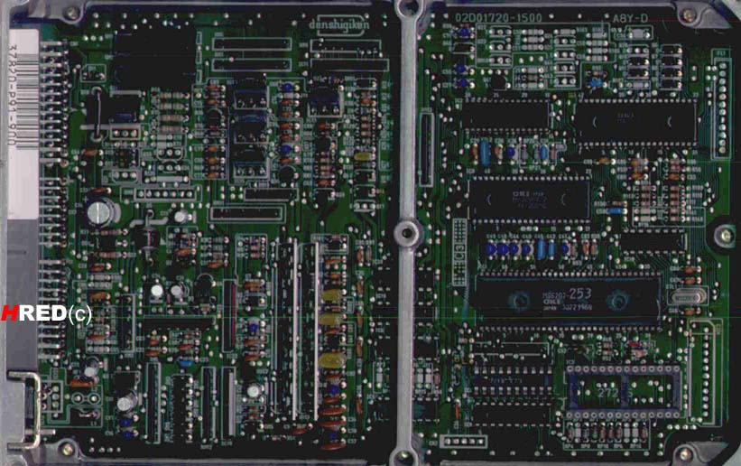

# P91

P91 92-95 [OBD1](/cars/electronics/obd1) [JDM](/cars/electronics/jdm) Civic Coupe (SOHC VTEC 1.6) How to identify: Scan (Thanks Katman):%%% 

- HRED's picture of a P91-900: 
     

| **Attachment:** | **Modify:** | **Size:** | **Date:** | **Who:** | **Comment:** | | :--- | :--- | :--- | :--- | :--- | :--- | |  [P91-900253.jpg](P91-900253.jpg) | mod | 98148 | 16 Mar 2004 - 19:18 | blundar | HRED's picture of a P91-900 |
