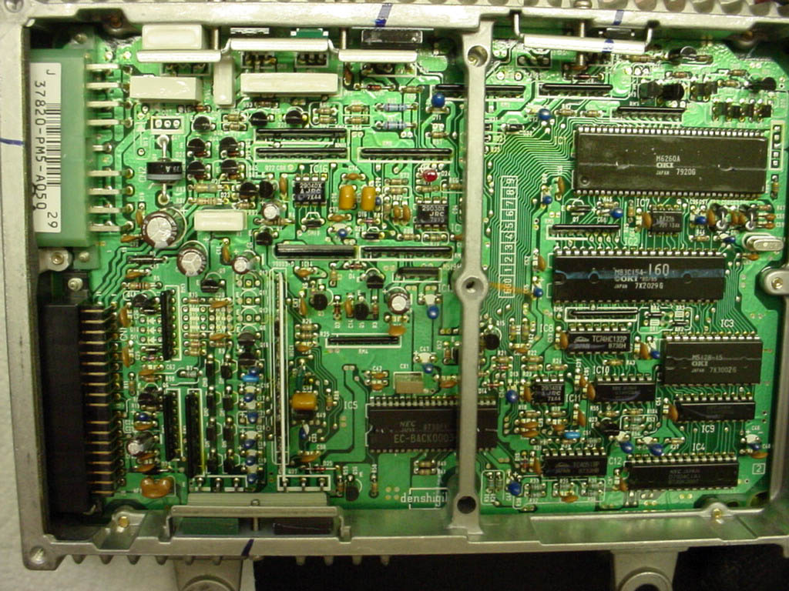

# PM5

PM5 88-91 Civic base model/CRX DX ([DPFI](/cars/electronics/dpfi) D15b) There were two distinct styles of this [ECU](/cars/electronics/ecu). One features an 83C154 [MCU](/cars/electronics/mcu), one features a 66201 [MCU](/cars/electronics/mcu). Presumably 88-89 vs 90-91 ?

- PM5 dx [ECU](/cars/electronics/ecu), "old" 83C154 style, thanks TJ: 
     

| **Attachment:** | **Modify:** | **Size:** | **Date:** | **Who:** | **Comment:** | | :--- | :--- | :--- | :--- | :--- | :--- | |  [PM5dxTJ.jpg](PM5dxTJ.jpg) | mod | 207404 | 22 Jul 2004 - 16:33 | blundar | PM5 dx [ECU](/cars/electronics/ecu), thanks TJ | |  [PM5-230.jpg](PM5-230.jpg) | mod | 70958 | 22 Jul 2004 - 16:34 | blundar | closeup of [ROM](/cars/electronics/rom) area on 90-91 PM5 | |  [pm5-230\\_rom.gif](/pgmfi/wiki/media/library/PM5/pm5-230_rom.gif) | mod | 343664 | 20 Mar 2005 - 18:32 | 1net | one more 90-91 PM5 ( chips readable) | |  [DSC00474.JPG](DSC00474.JPG) | mod | 2382041 | 08 Jul 2005 - 14:52 | 1net | 90-91 PM5 (image is great for comparing P04 & PM5) |
