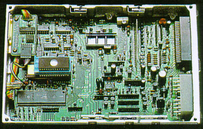

# OBD0 ZC PM7 ECU Guide

The PM7 ECU was the primary engine control unit used in the 1988–1991 DOHC ZC engines (such as the D16A8, D16A9, and D16Z5) found in European and Japanese market Civics and CRXs (e.g., the CRX 1.6i-16). 

From a software standpoint, the PM7 codebase is nearly identical to the SOHC D16A6 PM6 codebase. Because of this architectural similarity, tuned custom ROMs from one ECU can be run on the other with minor adjustments to sensor configurations.

---

## 1. Board Revisions and Scans

Below are component and solder side layout scans for different revisions of the PM7 board:

### European PM7-E020
This revision was commonly found in European-spec DOHC CRXs:

*Component side (top view) scan of the European PM7-E020 board.*

*Solder side (bottom view) scan of the European PM7-E020 board.*

---

### Alternate PM7 Layouts

*Top view component side of the JDM PM7-0330 board.*

*Top scan of an early, experimental PM7 ECU prototype.*

---

## 2. ROM Binaries & Downloads

For analysis and tuning, you can download the stock ROM calibration BIN files:

*   [Download the JDM PM7-0330 Stock ROM](Pm7-03301989.bin) *(32 KB, Stock 1989 JDM DOHC ZC calibration)*
*   [Download the European PM7 Stock ROM](PM7-euro.bin) *(32 KB, German D16Z5 DOHC ZC 125 HP calibration)*
