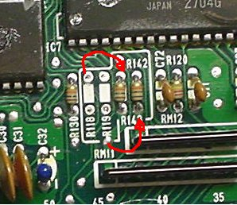

# Remove A Knock Sensor

Removing the knock detection is simple: Resolder R118 and R119 into R142, 143. Then, Remove R101 (optional). Finally, remove the knock board itself.

- no_knock.jpg: 
     

Here's what a knockless P14 looks like: [ CLick Here!](/pgmfi/wiki/media/library/P14/euro_p14_manual_board_no_ks_356.jpg)**Originaly posted by prelude-driver**here is how it works, R101 is a current limit to a signal on the KS, you need it with KS but you can leave it in because it does not go anywhere else. R118/119 are current limiters on the clock & data signals to the KS, if you remove the KS you must remove them because of the next resistors. R142/143 are pullup resistors for the clock & data lines, you dont use them if you have a KS because there are pullups on the KS itself, but if the KS is removed then you must fit these to stop the lines from floating. they are 10k btw. | **Attachment:** | **Modify:** | **Size:** | **Date:** | **Who:** | **Comment:** | | :--- | :--- | :--- | :--- | :--- | :--- | |  [no\\_knock.jpg](/pgmfi/wiki/media/library/RemoveAKnockSensor/no_knock.jpg) | mod | 31356 | 26 Jan 2006 - 05:00 | synoptic | |
