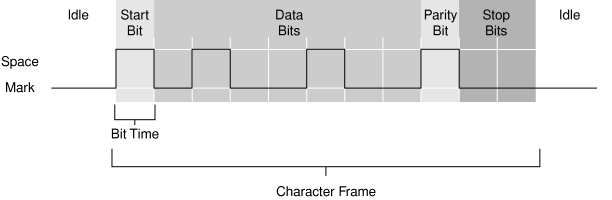

# Honda ECU Serial Datalogging (CN2 TTL Header)

Serial communication is the primary mechanism used to transmit runtime diagnostics (sensor readings, engine speed, and error codes) from a Honda ECU to a laptop running tuning software (such as Crome, Hondata, or Neptune). 

On OBD1 Honda ECUs (like the [P28](/cars/electronics/p28) or [P30](/cars/electronics/p30)), this communication is handled through a physical 4-pin or 5-pin male pin header designated as **CN2**, located on the right side of the main circuit board.

---

## 1. Critical Voltage Warning: TTL vs. RS-232

> **Caution:**
> The Honda ECU serial port uses **TTL (Transistor-Transistor Logic)** levels. TTL signals operate strictly at low voltages: **0V (logic low)** and **5V (logic high)**. 
>
> Standard computer serial ports and cheap DB9 cables use **RS-232 voltage levels**, which range from **-12V (logic low)** to **+12V (logic high)**. Connecting a standard RS-232 cable directly to the ECU's CN2 header will immediately destroy the ECU's internal OKI microcontroller. 
>
> Always use a dedicated TTL-to-USB converter interface (such as a Moates Extreme OBD1 cable or a standard FTDI/CP2102 USB-to-TTL board) to bridge the connection.

---

## 2. CN2 Header Pinout

On USDM OBD1 motherboards, the CN2 port consists of 5 pins. However, only 4 pins are used for serial datalogging. Note that Pin 1 is typically marked on the board by a square solder pad or a small number "1" print:

| Pin Number | Signal Name | Description |
| :--- | :--- | :--- |
| **Pin 1** | **TX** | Transmit (data sent *from* the ECU *to* the computer) |
| **Pin 2** | **RX** | Receive (data sent *from* the computer *to* the ECU) |
| **Pin 3** | **VCC** (+5V) | 5V power supply output from the ECU (typically left **disconnected** when using self-powered USB adapters) |
| **Pin 4** | **GND** | Signal Ground (must connect to the USB adapter ground pin to establish a common reference) |
| **Pin 5** | **NC** | Not Connected (often absent or blank) |

---

## 3. Serial Communication Parameters

To establish a successful link between the ECU and your datalogging software, your virtual COM port drivers and tuning software must be configured to match the ECU's communication parameters:

- **Baud Rate:** **38,400 bps** (Standard for custom OBD1 protocols like Crome Pro and Hondata; some legacy stock diagnostics operate at **9,600 bps**)
- **Data Bits:** **8**
- **Parity:** **None**
- **Stop Bits:** **1**
- **Flow Control:** **None**

*A typical 11-bit serial communication frame, showing start, data, parity, and stop bits.*

---

## 4. USB-to-TTL Adapter Configuration

To connect the CN2 port to a modern laptop:
1. Solder a 4-pin header into the CN2 location on your ECU board.
2. Connect the **GND** pin of your USB-to-TTL adapter to the ECU's **GND** pin (Pin 4).
3. Connect the adapter's **RX** pin to the ECU's **TX** pin (Pin 1) - *cross-connection*.
4. Connect the adapter's **TX** pin to the ECU's **RX** pin (Pin 2) - *cross-connection*.
5. Leave the 5V line **disconnected** to prevent ground loops, as the USB adapter is powered by the laptop.
6. Install the FTDI or Silicon Labs CP210x drivers on your laptop and select the corresponding COM port in your tuning program.

For details on selecting and troubleshooting the connection hardware, see the [USB to serial converter hardware guide](/cars/electronics/second-gen-usb-to-serial-converter). For software plugins, refer to the [Crome setup guide](/cars/electronics/crome-faq).
