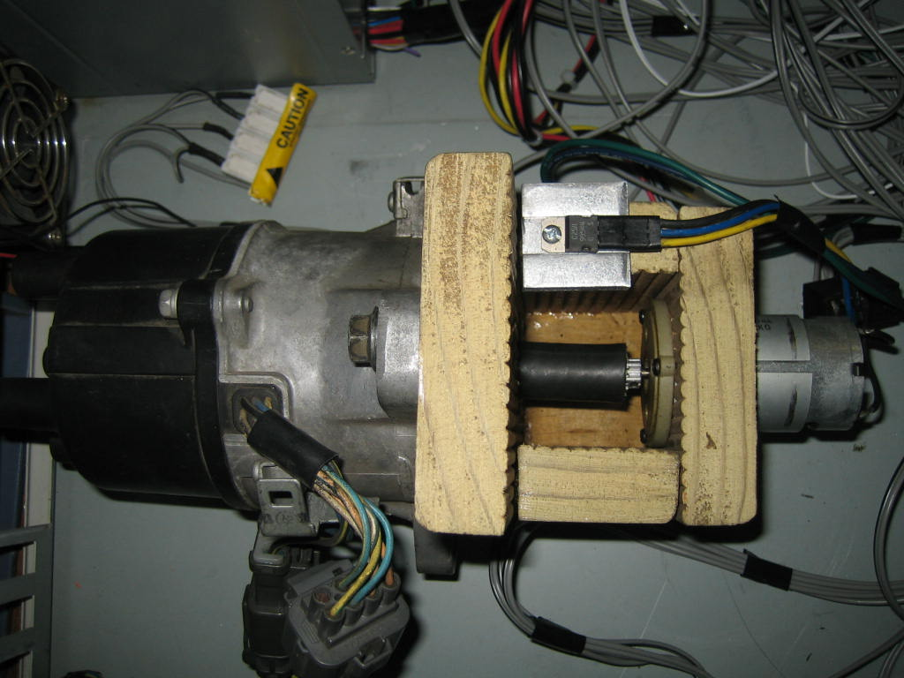
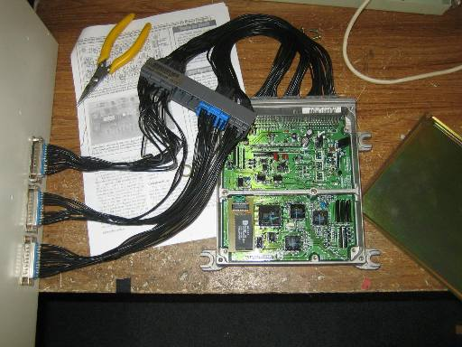
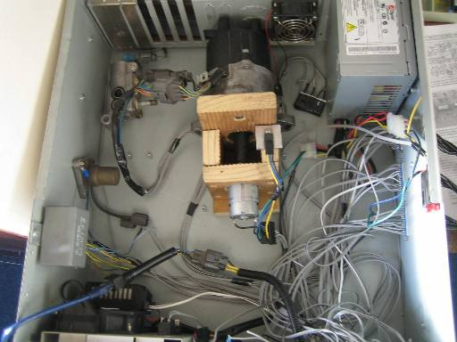
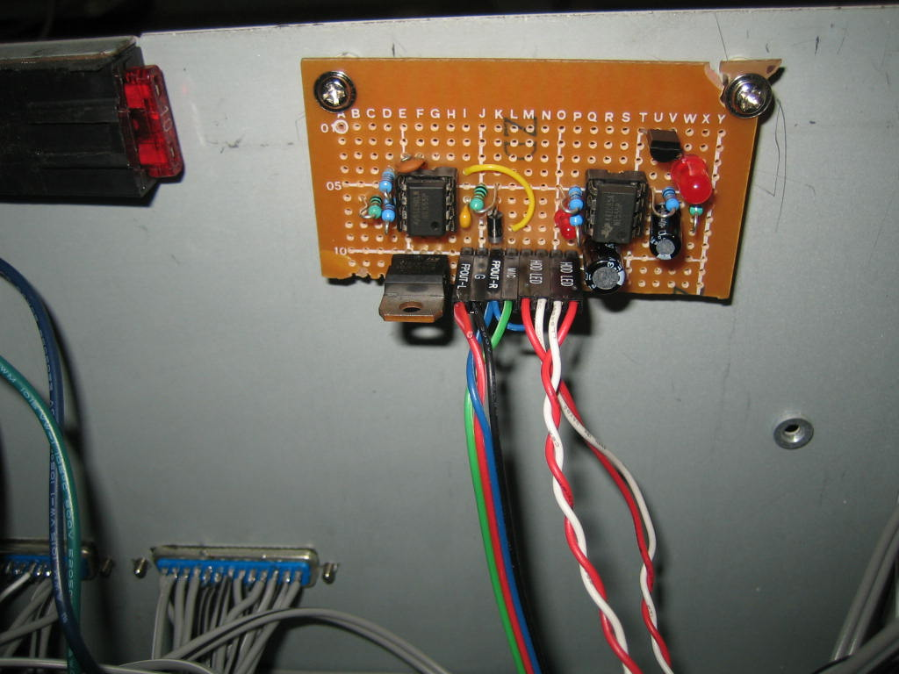
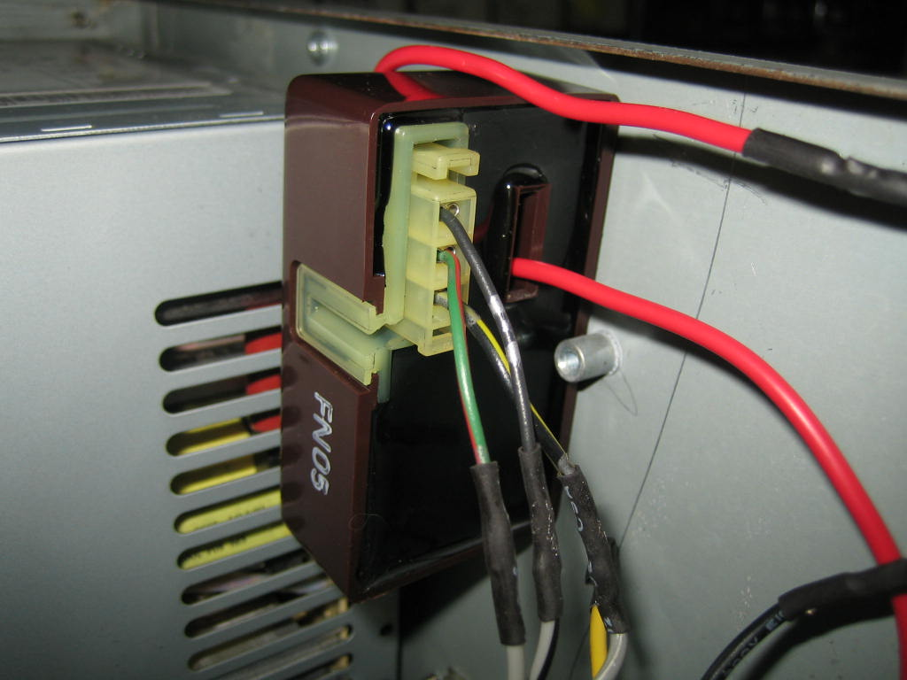
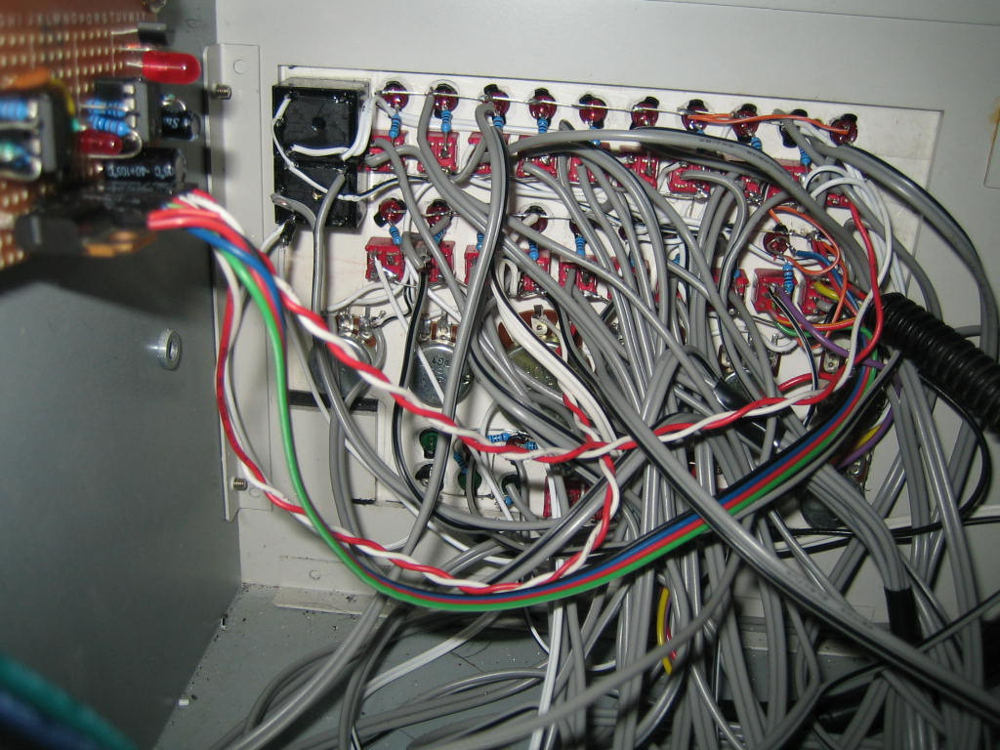
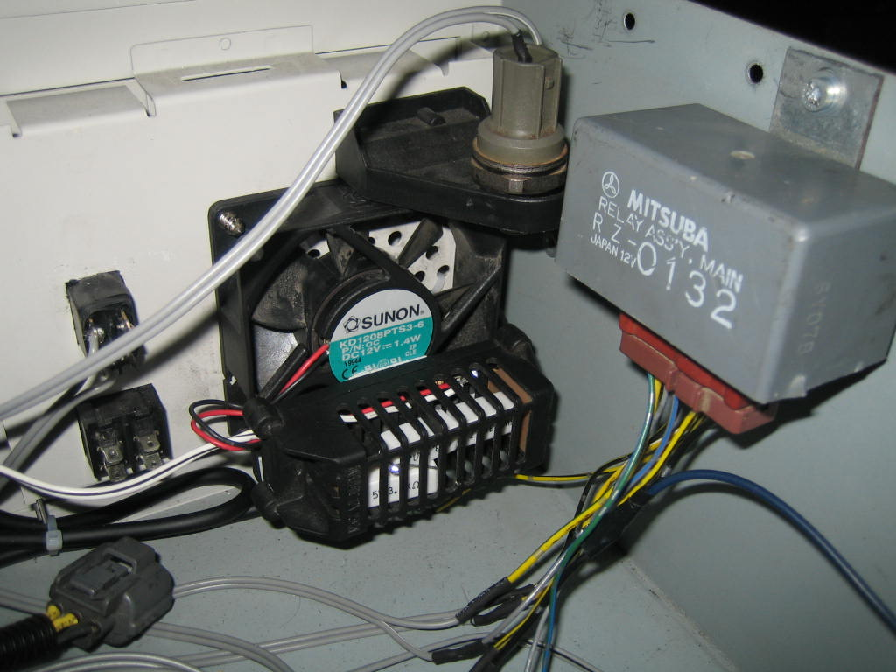
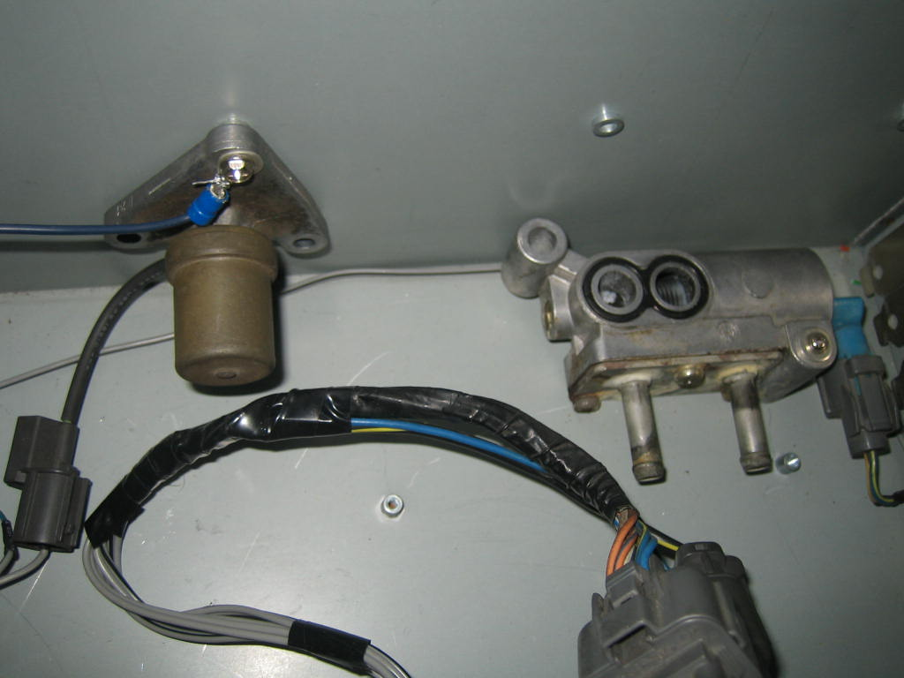

# DIY Engine Simulator for ECU Bench Testing

An **Engine Simulator** (often referred to as an ECU stimulator or bench jig) is an invaluable piece of test equipment for hardware developers and tuners. It simulates the electrical loads and sensor signals of a running vehicle, enabling you to run an ECU on a workbench to test custom firmware, diagnose component-level hardware failures, or verify circuit modifications without risking damage to a vehicle.

This guide details a comprehensive rack-mountable engine simulator design built by community member *b16a2*. It utilizes a combination of real automotive components, load-simulating power resistors, and variable signal generators to simulate a complete Honda OBD1 PGM-FI engine harness.


*Completed DIY Engine Simulator housed in a rackmount computer chassis.*

---

## Simulator Subsystems & Load Components

To keep the ECU from triggering error codes, the simulator must closely mimic the electrical behaviors and loads of real solenoids, heaters, and injectors.

### 1. Actuator & Load Simulation
* **Injectors**: Real fuel injectors have low resistance and pull significant current. The simulator uses four **12&Omega; 5W power resistors** to simulate the injector coils, preventing Code 16 (Fuel Injector System).
* **EACV / IACV**: An actual Idle Air Control Valve (EACV) is wired into the system to load the ECU's idle control circuit.
* **VTEC Solenoid (VTS)**: A real VTEC solenoid is mounted to the chassis. Hearing the physical "click" of the solenoid provides immediate confirmation that the ECU has successfully triggered VTEC.
* **VTEC Pressure Switch (VTP)**: Simulated using a standard relay coil driven directly by the VTS output signal, closing the switch to ground when VTEC activates.
* **Oxygen Sensor Heater**: The ECU checks for current draw on the O2 heater line. This is simulated using three **3.7k&Omega; 5W resistors** wired in parallel to dissipate heat safely.
* **Fuel Pump**: An inline bi-color LED is wired to the Fuel Pump relay output, changing color to show when the pump is primed and running.
* **Main Relay**: A standard Honda 7-pin Main Relay is integrated to distribute power to the board and ECU exactly like a factory harness.

### 2. Sensor Input Simulation
* **Analog Sensors (TPS, MAP, ECT, IAT, EGR)**: Simulated using high-quality variable rotary potentiometers. You can turn the knobs to sweep the voltages between `0V` and `5V`.
* **Electric Load Detector (ELD)**: An actual ELD unit extracted from a JDM Integra Type R fuse box is wired in series with the main +5V/12V power distribution lines. This allows the ECU (including P13 or P72 models) to read real-time current load fluctuations.
* **Knock Sensor**: A real knock sensor is mounted to the metal chassis of the simulator. Tapping on the chassis with a screwdriver triggers a mechanical vibration, allowing you to test knock board detection routines.

---

## Distributor & Engine Speed Simulation

Simulating engine speed (RPM) requires generating synchronized pulse inputs for the **CKP** (Crankshaft Position), **TDC** (Top Dead Center), and **CYP** (Cylinder Position) sensors. 

Rather than using complex digital signal generators, this simulator uses a physical OBD1 distributor driven by an electric motor:


*Distributor and motor assembly mounted on a custom alignment jig.*

### Assembly Details
* **Drive Motor**: A 12V motor salvaged from a cordless drill drives the distributor shaft.
* **Speed Control**: The trigger switch from the cordless drill is wired to a large rotary potentiometer, allowing you to vary the motor speed to simulate engine speeds from 500 RPM to 9,000+ RPM.
* **Coupling**: The distributor's camshaft drive key was removed and replaced with a 15-tooth RC car gear (Tamiya), coupled to the motor shaft using heavy-duty rubber fuel hose. This provides a flexible coupling that absorbs vibrations.
* **Ignition Coil & ICM**: The Ignition Control Module (ICM) and ignition coil are wired into the distributor housing. To prevent Code 15 (Ignition Output Signal), 12V power is supplied to the black/yellow lead from the main relay, and the distributor body is grounded.

> [!TIP]
> Physical distributors provide excellent mechanical feedback, but they can stall at very low speeds (under 500 RPM) if the motor lacks torque, simulating an engine stall.

---

## Control Panel Interface

The user interface panel allows the operator to manipulate sensor inputs and intentionally inject faults into the system.


*Control panel layout showing sensor dials and fault-injection switches.*

### Control Panel Features
* **Sensor Adjustment Knobs**: Dials for ECT, IAT, RPM, VSS, TPS, MAP, and EGR. 
* **Fault Toggles (Top Rows)**: SPST switches wired in series with each critical sensor line. Toggling a switch cuts the signal trace, instantly triggering the corresponding Diagnostic Trouble Code (DTC) on the ECU to verify diagnostics.
* **Indicator LEDs**: Bi-color LEDs display circuit status. For example, the A/C switch LED changes when the ECU commands the A/C clutch relay to engage.
* **Ignition Switches (Bottom Row)**: Emulates the standard vehicle key positions (Accessory, Ignition, Start). Engaging the Start switch automatically engages the distributor drive motor.

---

## ECU & Harness Interface

To make the simulator universal, the chassis features an modular interface connector scheme on the side panel:


*DB25 harness connectors on the side of the chassis.*

* **DB25 Connectors**: The side of the chassis features three DB25 computer sub-D ports, mapped directly to standard OBD1 ECU pins for Plugs A, B, and D.
* **Interchangeable Harnesses**: Custom adapter harnesses (DB25 to OBD0, OBD1, OBD2a, or OBD2b plugs) allow any generation of Honda ECU to be connected to the simulator in seconds.

---

## Detailed Components & Subassemblies

````carousel

<!-- slide -->

<!-- slide -->

<!-- slide -->

<!-- slide -->

<!-- slide -->

````

---

## Wiring Schematics

The simulator is wired according to the standard OBD1 Civic/Integra PGM-FI pinouts:


*OBD1 PGM-FI ECU Pinout Schematic - Outputs and Power Distribution.*


*OBD1 PGM-FI ECU Pinout Schematic - Sensors and Distributor Inputs.*
