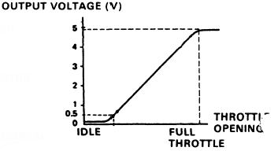

# Throttle Position Sensor (TPS)

The Throttle Position Sensor (TPS) determines the angle of the throttle plate inside the throttle body. The ECU uses this data alongside inputs from the MAP sensor, oxygen sensor, and other engines sensors to calculate engine load and fuel/ignition adjustments.

## Overview

The TPS is a simple potentiometer (a variable resistor) that receives a 5V reference signal from the ECU. As the throttle valve rotates, the internal resistance changes, returning a variable voltage to the ECU.

*   **Idle:** ~0.5V (reported as 0% throttle angle)
*   **Wide Open Throttle (WOT):** ~4.5V (reported as 100% throttle angle)

Honda service literature indicates that a TPS voltage above a certain threshold (often cited as 4.0V) triggers open-loop operation, where the ECU ignores feedback from the oxygen sensor and uses pre-set fuel tables for maximum power.

## Procedure

### Calibrating and Adjusting the TPS

If you have replaced your throttle body, installed an aftermarket TPS, or are experiencing poor throttle response or off-idle stumbles, you must calibrate the TPS.

#### Step 1: Remove the Anti-Tamper Bolts
The factory TPS is held in place by two shear bolts that look like rivets. These bolts break off their heads when tightened at the factory to prevent tampering.
1.  Use a rotary tool (Dremel) with a cutoff wheel to cut a straight groove into the head of `each` shear bolt.
2.  Use a flathead screwdriver to loosen and remove the bolts.
3.  *Alternative:* Use a pair of small locking pliers (Vise-Grips) to grab the edges of the bolt head and turn them, though this carries a risk of damaging the sensor housing.
4.  Replace these factory bolts with new M5 screws (Allen head bolts are highly recommended, as they are much easier to access in the tight space behind the intake manifold).

#### Step 2: Calibrate Using a Multimeter
1.  Loosen the two mounting screws slightly so the TPS can rotate.
2.  Turn the ignition key to the ON position (engine off).
3.  Set your digital multimeter (DVOM) to DC Volts.
4.  Probe the middle wire (typically Red/Blue or Red/White - the signal return wire) and a ground source (typically the Green/White wire on the TPS harness, or chassis ground).
5.  With the throttle fully closed, rotate the TPS until the multimeter reads exactly **0.50V**.
6.  Open the throttle fully (Wide Open Throttle) and verify the voltage sweeps smoothly up to **4.50V**.
7.  Tighten the mounting screws. 

> **Note:** The TPS can easily rotate slightly as you tighten the screws, shifting the calibration. Always double-check your readings after final tightening.

#### Step 3: Calibrate Using Datalogging
If you have a working datalogger (e.g., Crome, Uberdata, Hondata):
1.  Connect your datalogger and view the TPS percentage channel.
2.  With the engine off and the key in the ON position, verify the throttle reads **0%** at idle.
3.  Press the throttle pedal to the floor and verify it reads **99%** or **100%**. If it stops short (e.g., around 90%), you may need to adjust the throttle cable slack or rotate the sensor body.

## Notes and Gotchas

*   **Threadlock:** Since the TPS does not require routine adjustment, you may want to apply a tiny drop of blue (medium) Loctite to the mounting threads to prevent them from backing out due to engine vibration.
*   **Smooth Sweep:** When testing the TPS, watch the multimeter display or datalog graph closely as you slowly open and close the throttle. The voltage must rise and fall smoothly. Any sudden jumps, drops, or dead spots indicate a failing sensor that needs replacement.

## Related

*   [MAP Sensor](/cars/electronics/map-sensor)
*   [Oxygen Sensor](/cars/electronics/oxygen-sensor)
*   [ECU](/cars/electronics/ecu)
