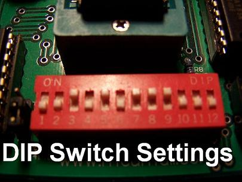
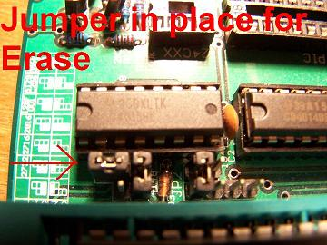
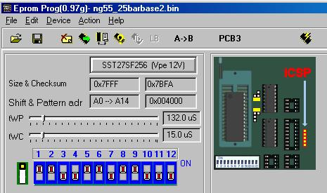

# Willem EPROM Programmer Guide

The **Willem EPROM Programmer** is a popular, open-hardware design ROM burner that has been a budget favorite of the Honda tuning community for socketing and burning custom ECU maps. Because it is an open-design board, it is sold under many names (such as "Enhanced Willem", "Dual Powered Willem", etc.) and manufactured by various sellers. 

While highly cost-effective and capable of burning standard Honda ROM chips like the `27C256` (OTP), `29C256` (EEPROM), and SST `27SF256` / `27SF512` (flash), the programmer relies on a legacy parallel (LPT) port and can be challenging to configure.

> **Warning:**
> **Parallel Port (LPT) and OS Requirements**: 
> The Willem programmer requires a true hardware parallel port (standard base address `0x378h` or `0x278h`) to communicate with the PC. Simple USB-to-Parallel printer adapter cables **do not work** because they do not support direct I/O port mapping. To run the Willem software, you must use a motherboard with an onboard LPT header or a dedicated PCI/PCI-e parallel card, and a compatible Windows OS (often requiring 32-bit versions or legacy port drivers like `UserPort` / `io.dll` to permit direct hardware access).

---

## Programming SST 27SF512 Chips (512k Flash)

The SST **27SF512** is a 512kbit (64 Kilobyte) flash memory chip that is commonly used to emulate or replace standard 256kbit (32 Kilobyte) EPROMs. Because it is twice the size of a standard OBD0/OBD1 Honda ROM (`32KB`), you must configure the software to write the bin file to the upper half of the chip using a hardware or software **offset**.

### Step-by-Step Programming Guide

1. **Connect and Initialize**: Connect the parallel cable and power source (USB power or DC adapter) to the Willem board. Ensure your parallel port drivers (e.g., DLPortIO) are active.
2. **Configure DIP Switches**: Set the board's DIP switches according to the software's visual representation for the `SST27SF512` device.
3. **Insert the Chip**: Insert the SST 27SF512 into the ZIF socket. Align the chip so that Pins 14 and 15 are at the bottom slots (closest to the ZIF handle) with the notch facing upward (away from the lever).
4. **Erase the Chip**: In the software, click the **Erase** icon (depicted as a chip with an eraser). 
   * *If the erase operation fails*, verify that the board's mode jumper is set to the **Erase** position as shown in the hardware settings screenshot.
5. **Set Jumper for Programming**: Swap the board mode jumper from the Erase configuration to the **Program/Normal** configuration.
6. **Apply the 32KB Offset**: In the bottom right corner of the Willem software window, locate the **Offset (Hex)** input field. Change the default value of `0` to `8000` (which corresponds to `32,768` bytes in decimal). This shifts the data to the upper `32KB` of the chip.
7. **Load and Burn**: Load your compiled `.bin` file. Click the **Program** icon (complete chip illustration). When the popup appears asking if you want to use the specified hex offset, select **Yes**.
8. **Verify**: The software will burn the data and automatically run a verification pass. Ensure both operations complete successfully with a `100%` status.
9. **Final Verification**: Insert the chip into your ECU's socket. Turn the ignition switch to the RUN position (engine off). The main relay should click and the Check Engine Light (CEL) should turn off after 2 seconds. If the CEL stays solid, the chip was not burned or offset correctly.

### Configuration Screenshots (27SF512)

*Willem Software Device Configuration*

*Willem Software Buffer and Offset Configuration*

*Willem Board DIP Switch Configuration*

*SST 27SF512 Chip Placement in ZIF Socket*

*Willem Board Jumper Position for Chip Erasing*

*Willem Board Jumper Position for Chip Programming*

---

## Programming SST `27SF256` Chips (256k Flash)

The SST **`27SF256`** is a native 256kbit (32 Kilobyte) chip, meaning it matches the standard Honda ROM size perfectly. No software offsets are required, but the board configuration jumpers must be adjusted.

### Erasing the SST `27SF256`

Unlike standard EPROMs which require UV light to erase, the SST `27SF256` is electrically erasable. However, specific jumpers must be repositioned to permit the high erase voltage to route correctly:

*Willem Board Jumper Configuration for Erasing SST `27SF256`*

### Burning the SST `27SF256`

To burn the SST `27SF256`, return the jumpers to the PCB3 burn position (do not leave them in Willem mode):

*Willem Board Jumper Configuration for Burning SST `27SF256`*
