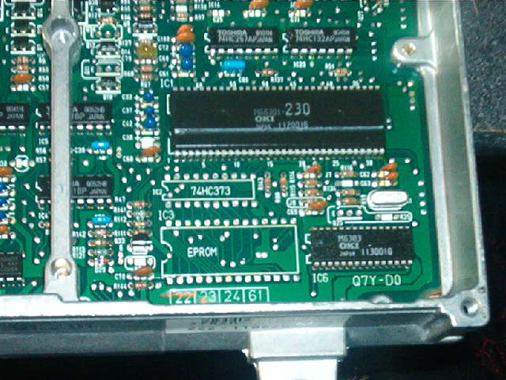
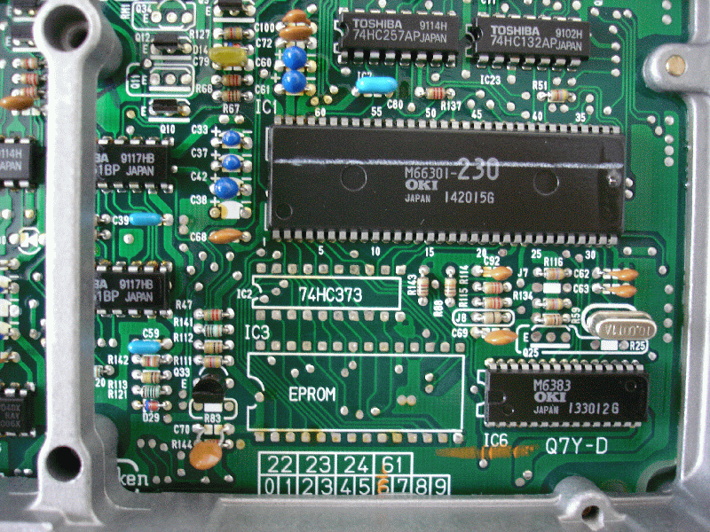
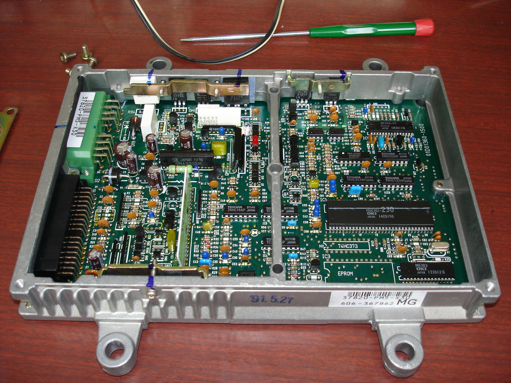

# Honda PM5 ECU Technical Reference

The PM5 ECU was utilized in 1988–1991 Honda Civic base models and CRX DX trims equipped with the DPFI D15B engine. There are two distinct hardware revisions of this ECU, differentiated primarily by the Microcontroller Unit (MCU).

## Hardware Revisions

The PM5 exists in two primary configurations, likely corresponding to the 1988–1989 and 1990–1991 production years:

*   **Early Revision:** Features an 83C154 MCU.
*   **Late Revision:** Features a 66201 MCU.

## Hardware Identification

Use the following image gallery to identify specific board revisions and component layouts.

```carousel

*Early PM5 DX ECU featuring the 83C154 MCU*
<!-- slide -->

*Close-up of the ROM area on a 90-91 PM5 board*
<!-- slide -->

*Detailed view of the 90-91 PM5 ROM chips*
<!-- slide -->

*90-91 PM5 board layout for comparison with P04 ECUs*
```

> [!NOTE]
> The PM5 is a DPFI (Dual Point Fuel Injection) system. Ensure all diagnostic procedures and tuning efforts account for the specific sensor and injector wiring requirements of the DPFI architecture.
