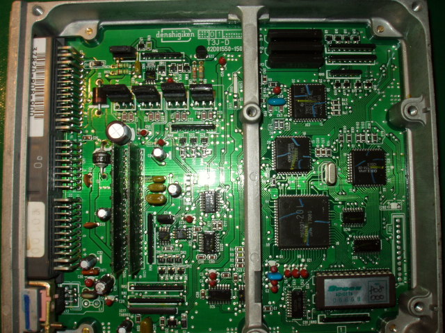

# OBD1P08 Auto Manual

| | RP17 and RP18 values | | :--- | :--- | | | **Automatic** | | RP17 | 2.7K | | RP18 | 4.7K | this is for board pn: 02d01550-1500 Auto to Manual: remove rp17 remove rp18 add a jumper to rp18 Manual to Auto:

- remove jumper at RP18 (Not sure what will be here)
- add 4.7kOhm +/- 5% at RP18 SMD
- add 2.7kOhm +/- 5% at RP17 SMD
- add `IC15` & `IC16` [5050 S](/cars/rom/515x-high-side-switch) or equiv.
- add Caps at `C73`, c74, c75, c76 (values??? 0.1 uf ? should be ceramic)
- add Diodes to D13 and D12 (1A Surface mount will work)
- add q29 q28
- add c57

- Not sure about any transistors yet... If someone has a Manual P08 and can take a high quality picture of the top and bottom, Please email them to me.. CRXSi RVtec (mailto:[email protected]) 
<figure>
 
 <figcaption>[JDM](/cars/sensors/jdm) P08 [ECU](/cars/ecu/ecu)s (auto)</figcaption>
</figure>
