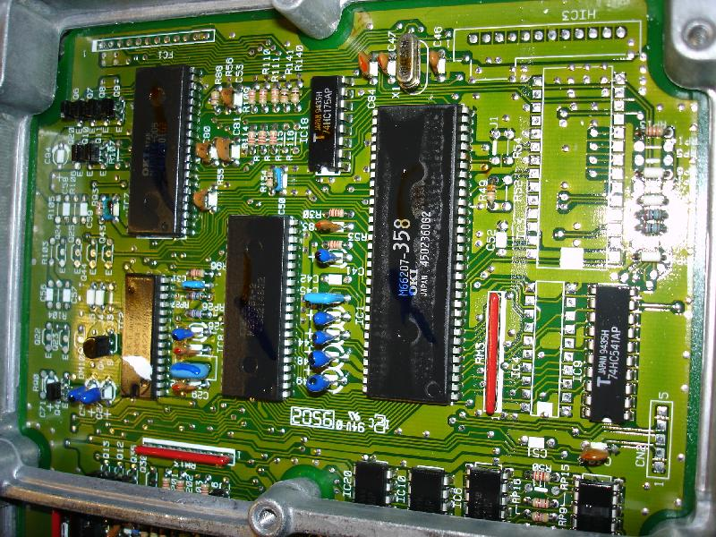
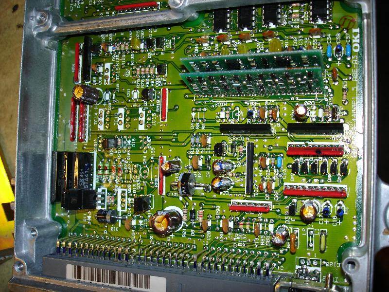
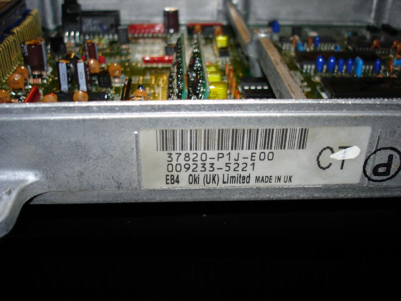

# P1J and P1K ECU Technical Reference

The P1J and P1K ECUs are factory-equipped in 1996–2000 UK Honda Civic models featuring the D14 engine series. Despite the production years, these units utilize an OBD1 architecture.

> [!NOTE]
> While these units are physically installed in OBD2-era vehicles, the internal architecture is OBD1.

## PCB Identification
These ECUs utilize a specific board layout identified by the marking: **2PU6098-4460P1 5 A8E-A3**. 

The hardware is compatible with standard OBD1 chipping procedures. For detailed visual references of the PCB layout and component placement, refer to the [P1K ECU documentation](/cars/honda/civic/ek/tuning/p1k).

## Component Gallery

```carousel

*Top view of the P1J PCB assembly*
<!-- slide -->

*Bottom view of the P1J PCB assembly*
<!-- slide -->

*Connector interface side of the P1J*
<!-- slide -->

*Detailed view of onboard components*
<!-- slide -->

*External view of the P1J ECU housing*
```

## VTEC Conversion
The P1J and P1K boards are candidates for VTEC conversion. While the board layout supports the necessary modifications common to OBD1 platforms, VTEC functionality on these specific variants remains unverified. 

> [!CAUTION]
> VTEC conversion on P1J/P1K units is experimental. Ensure all traces are verified against standard OBD1 VTEC schematics before attempting operation.
