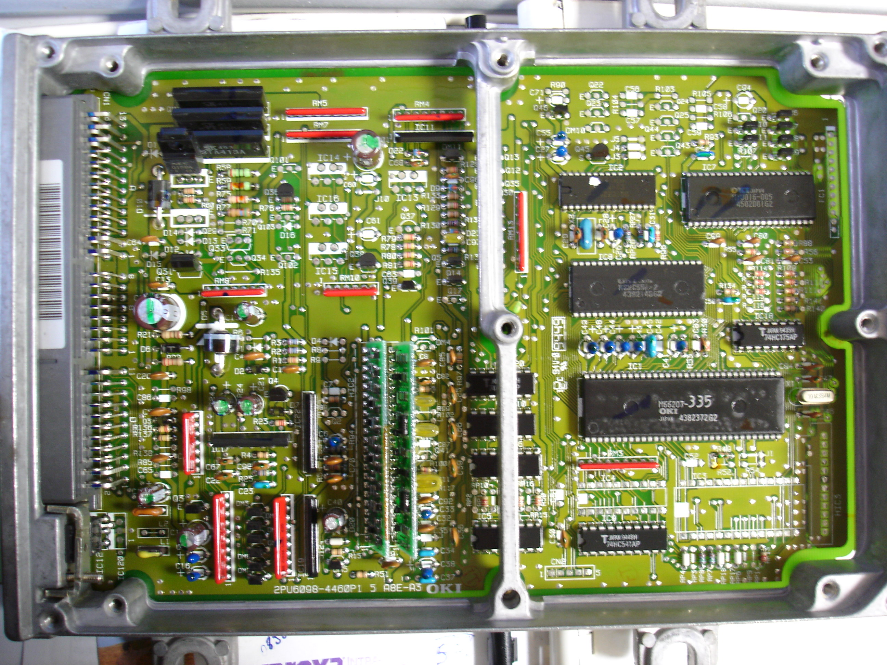

# P1K and P1J ECU Technical Reference

The P1J and P1K ECUs were utilized in 1996–2000 UK Honda Civic models equipped with the D14 engine series. Despite the production years overlapping with the OBD2 era, these units utilize OBD1 architecture.

## Hardware Identification
These ECUs feature a distinct board layout identified by the PCB marking: **2PU6098-4460P1 5 A8E-A3**.

> [!NOTE]
> While these units are physically OBD1, they are found in chassis typically associated with OBD2 wiring harnesses. Verify pinout compatibility before installation.

## Modification and VTEC Conversion
The P1K and P1J boards are compatible with standard OBD1 chipping procedures. While VTEC conversion is theoretically supported by the board architecture, it remains unverified in practical application.

```carousel

*Top view of the P1K/P1J PCB layout*
<!-- slide -->

*Bottom view of the P1K/P1J PCB*
<!-- slide -->

*Close-up of onboard components*
<!-- slide -->

*Detailed view of surface-mounted components*
<!-- slide -->

*Example of a modified/chipped P1K ECU*
```

> [!CAUTION]
> Ensure all soldering modifications are performed using appropriate anti-static precautions to prevent damage to the logic board.
