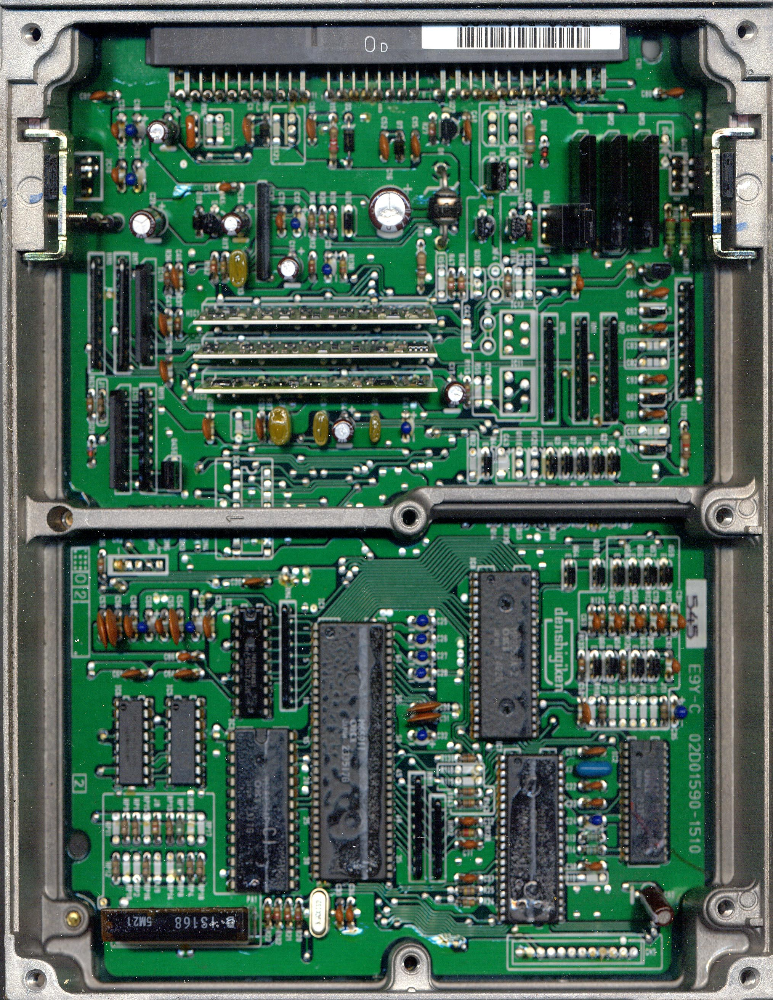

# P12 ECU Technical Reference

The P12 ECU is the factory engine control unit for the 1992–1995 Honda Prelude S, specifically configured for the F22A1 engine.

## Component Overview

The following image illustrates the internal PCB layout and component placement for the P12 ECU.

```carousel

*Internal PCB layout of the P12 ECU*
<!-- slide -->

*Close-up view of component placement on the P12 board*
```

> [!NOTE]
> The P12 ECU utilizes the standard OBD1 architecture common to the 1992–1995 Honda chassis. Ensure proper grounding and power supply when performing diagnostics or modifications.