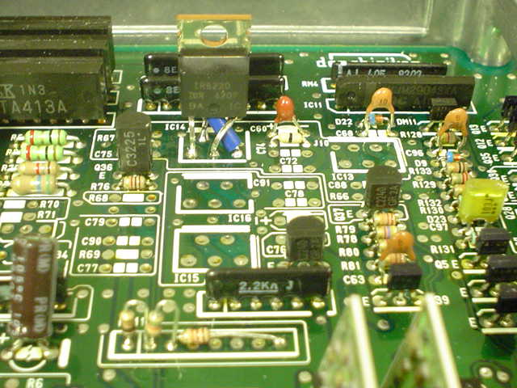

# 515X High Side Switch

Honda uses a 5 pin high side switch in a lot of their [OBD1](/cars/wiring/obd1) and [OBD2](/cars/wiring/obd2) [ECU](/cars/ecu/ecu)s to control solenoids like auto trans and VTEC solenoids. Allegro / Sanken is the OEM for this part. The following parts are known to work: SK-5050S (original - 1720 boards usually)
 SK-5151S (higher current version of 5050 - 11F0/1980 boards usually)
 SK-5154S (higher current version of 5151 - [OBD2](/cars/wiring/obd2) boards usually)
 SI-5151S (part number change on SK-5151S)
 SI-5154S (part number change on SK-5154S)
 SI-5151SG (part number change on SI-5151S)
 SI-5154SG (part number change on SI-5154S)
 These parts are often quite difficult to get ahold of due to Allegro not selling less than 500pcs@$1.50ea and few electroncs distributors stocking them. Look for periodic groupbuys on the forum. There have been [reports]() of an [International Rectifier]() part that is a replacement. New forum link: [Replacement for SI-5151S](/pgmfi/forum/topic.php?id=181) (Please log in to see pics in forum) Edit this if you know more. Tried a pair of ir6220 in a known good P13. Worked fine! [http://web.archive.org/web/20260612163410/https://www.digikey.com/](http://web.archive.org/web/20260612163410/https://www.digikey.com/) and type IR6220-ND on the parts search, they are $4.63/ea All you do is move the #3 leg to the #5 spot in the board and move pin #5 into #3 spot on the board. It's really easy to do.. just use some heat shrink or insulation on leg 3 to avoid contact between legs...refer to this post for a picture: [https://web.archive.org/web/http://forum.pgmfi.org/viewtopic.php?t=181](/pgmfi/forum/topic.php?id=181)a picture is worth more than a thousand words ( That would be the actual ir6220 replacement: IPS521 ) search bait: SK5050 SK5151 SK-5050 SK-5151
