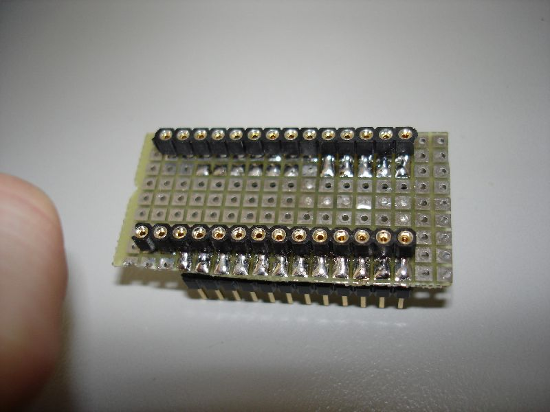
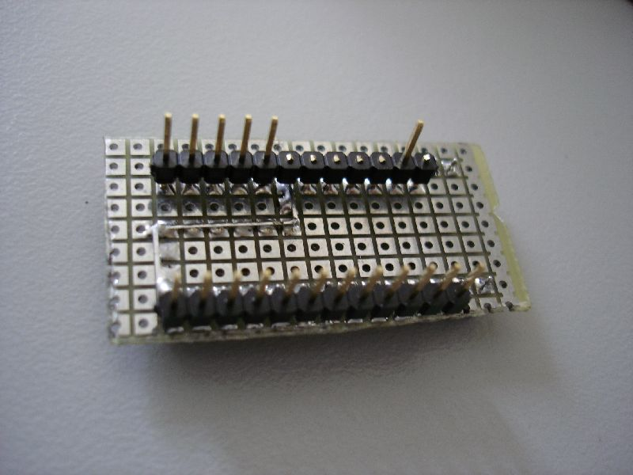
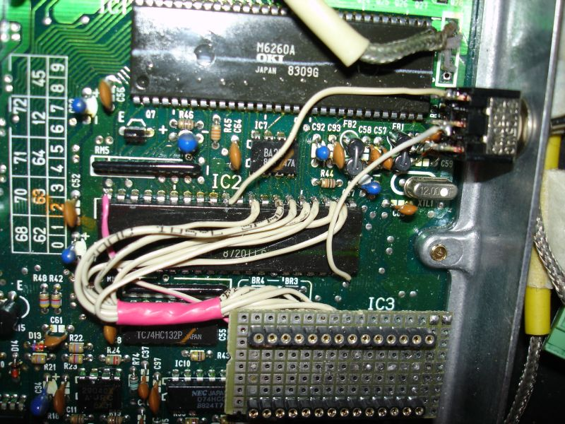

# Chipping 1988-1989 OBD0 ECUs

Most 1990-1991 OBD0 MPFI ECUs utilize an external 38256-compatible ROM that is easily socketed. However, many 1988-1989 ECUs, including all USDM PM8 HF units, utilize an OKI M83C154 processor with internal ROM. Modifying these units requires specific hardware interventions to force the MCU to execute code from an external source.

> [!WARNING]
> Disconnect the ECU from the vehicle before soldering. Verify every connection with a continuity tester and check for shorts before applying power.

## Enabling External ROM Access

To force the M83C154 MCU to execute code from an external ROM, Pin 31 (the external-access `_EA` pin) must be connected to Pin 20 (ground).

> [!IMPORTANT]
> On PM7-B020 boards, MCU Pin 31 must be physically disconnected from the PCB trace before being grounded. Failure to isolate the pin may result in a solid Check Engine Light (CEL) and intermittent ECU operation. Only apply this isolation if standard jumpering fails to initiate external ROM execution.

## Modification Approaches

### 1. MCU Replacement
Replace the 40-pin OKI MCU with an Intel 8051-compatible MCU containing internal ROM. This requires modifying the ECU program to remove `A5` instruction dependencies and ensuring full Intel 8051 compatibility. This method requires a dedicated MCU programmer.

### 2. MCU Daughterboard
Replace the 40-pin MCU with a daughterboard assembly containing:
* A socket for the original OKI MCU.
* A `74HC373` address latch.
* An external EPROM socket.
* Logic to configure the `_EA` pin for external ROM access.

This approach retains the original OKI MCU, eliminating the need for program code modifications, though it requires significant board-level fabrication.

### 3. External EPROM Wiring
Install a 28-pin EPROM socket and interface it with the MCU and address latch using either a direct flywire method or an XRAM piggyback method.

## Flywire Mapping Reference

| EPROM Pin | M83C154 MCU Pin | 74HC373 Pin |
| :--- | :--- | :--- |
| 1 | 40 | - |
| 2 | 25 | - |
| 3 | - | 19 |
| 4 | - | 2 |
| 5 | - | 16 |
| 6 | - | 5 |
| 7 | - | 15 |
| 8 | - | 6 |
| 9 | - | 12 |
| 10 | - | 9 |
| 11 | 39 | - |
| 12 | 38 | - |
| 13 | 37 | - |
| 14 | 20 | - |
| 15 | 36 | - |
| 16 | 35 | - |
| 17 | 34 | - |
| 18 | 33 | - |
| 19 | 32 | - |
| 20 | - | 10 |
| 21 | 23 | - |
| 22 | 29 | - |
| 23 | 24 | - |
| 24 | 22 | - |
| 25 | 21 | - |
| 26 | 26 | - |
| 27 | 27 | - |
| 28 | 40 | - |

> [!NOTE]
> EPROM Pins 28 and 1 must be connected to MCU Pin 40 (+5 V). Pin 20 is the ground reference.

## XRAM Piggyback Mapping

This method involves mounting the EPROM socket on a prototyping board stacked above the external RAM.

| EPROM Pin | M83C154 MCU Pin | External RAM Pin |
| :--- | :--- | :--- |
| 1 | 40 | - |
| 2 | 25 | - |
| 3–19 | - | 1–17 |
| 20 | Connect to EPROM Pin 14 | - |
| 21 | 23 | - |
| 22 | 29 | - |
| 23 | 24 | - |
| 24 | 22 | - |
| 25 | - | 23 |
| 26 | 26 | - |
| 27 | 27 | - |
| 28 | 40 | - |

> [!CAUTION]
> The stacked assembly can cause clearance issues within the ECU housing. Ensure all connections are insulated to prevent shorts against the ECU lid.

## Installation Gallery

```carousel

*Daughterboard socket, top view.*
<!-- slide -->

*Daughterboard socket, bottom view.*
<!-- slide -->

*Header pins soldered to the external RAM.*
<!-- slide -->

*Completed XRAM connections.*
<!-- slide -->

*Completed piggyback installation stacked on the ECU board.*